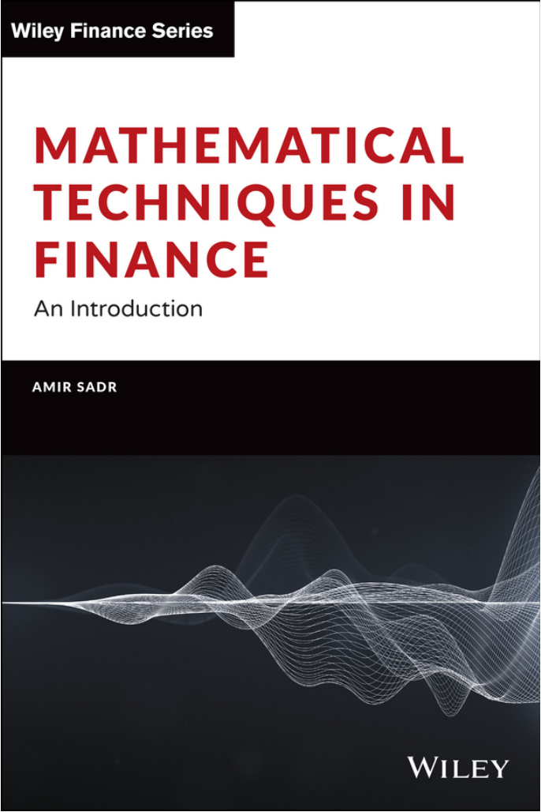
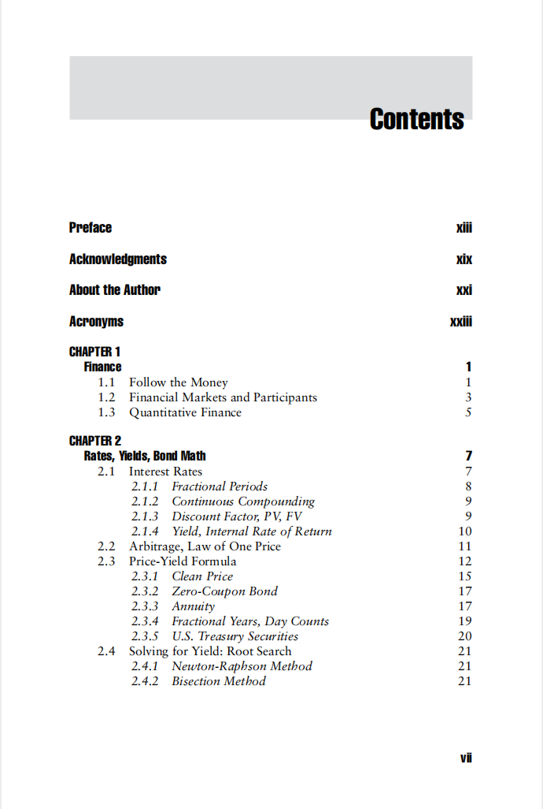
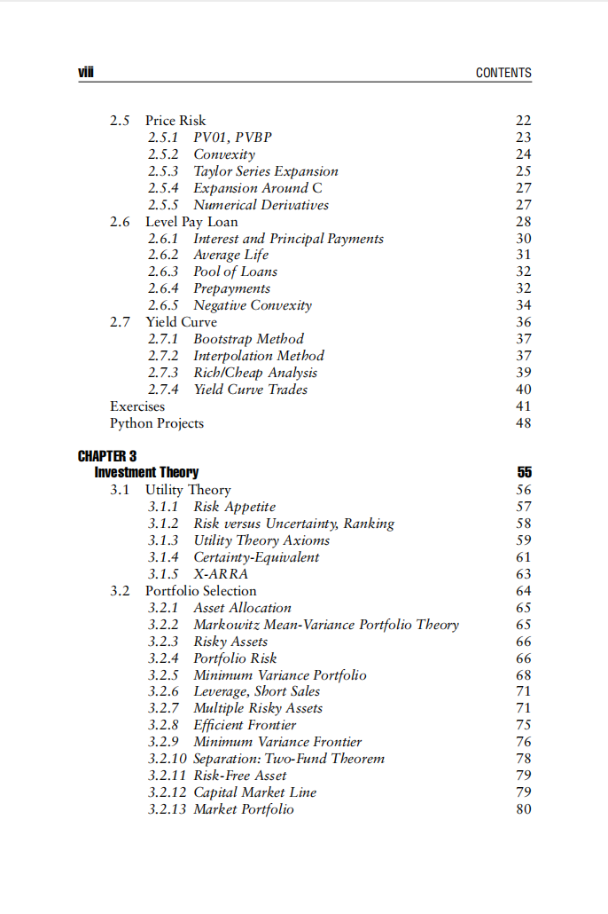
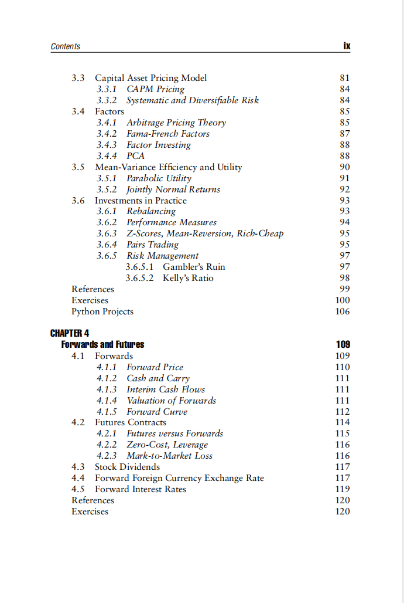
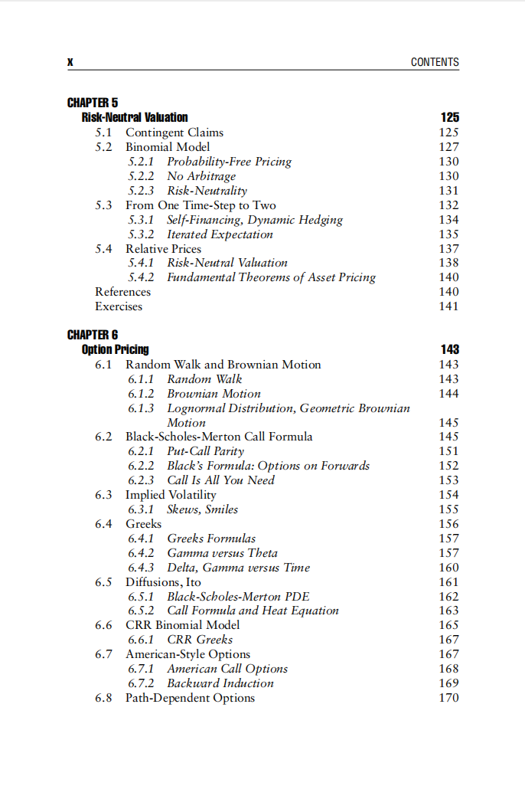
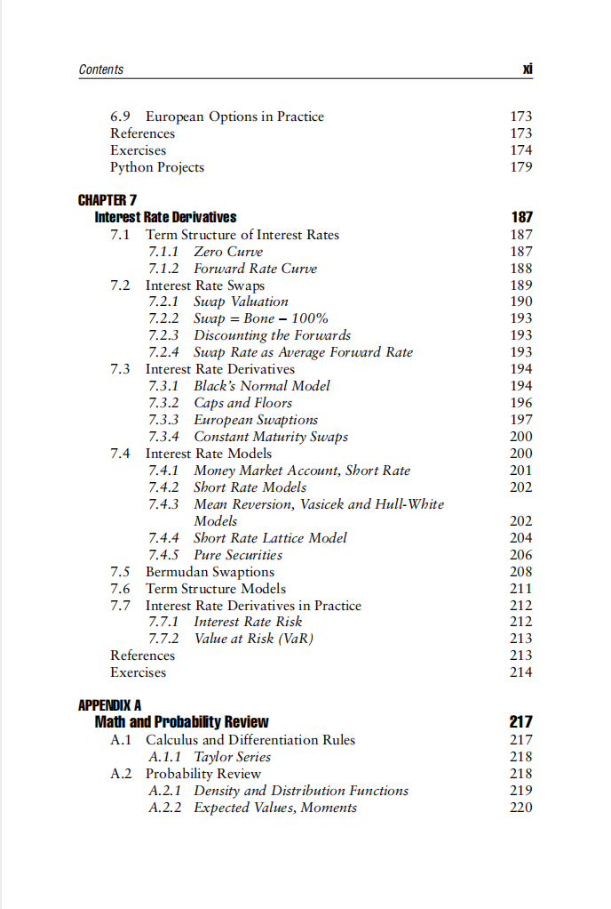
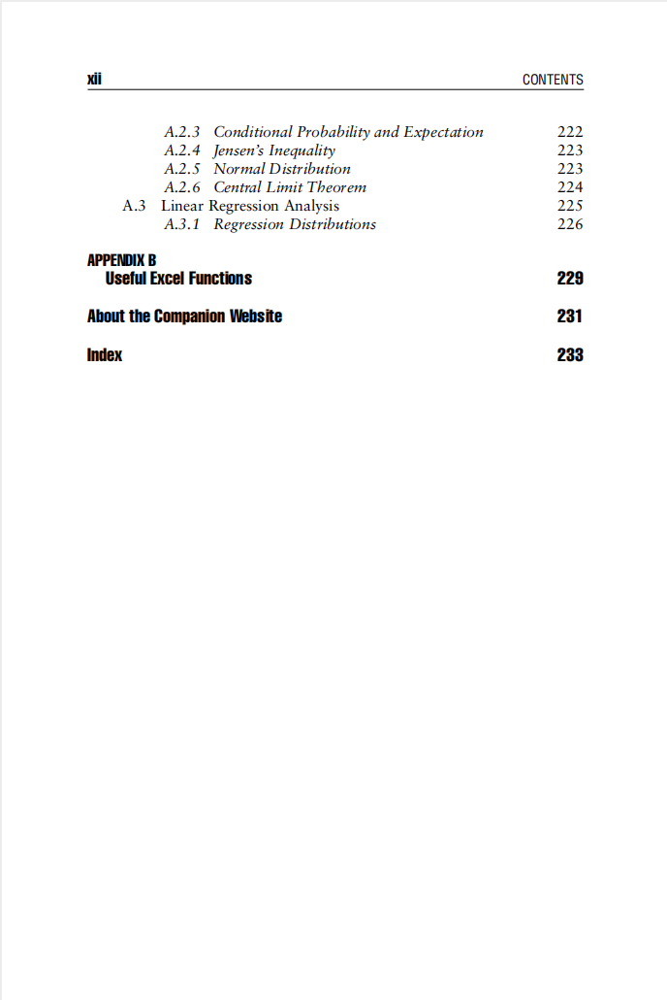

# Mathematical Techniques in Finance

本书籍由[LLMQuant社区](https://llmquant.com/)整理, 并提供PDF下载, 只供学习交流使用, 版权归原作者所有。

- **作者**: Amir Sadr
- **出版社**: Wiley
- **出版年份**: 2022
- **难度**: ⭐⭐⭐⭐
- **推荐指数**: ⭐⭐⭐⭐⭐
- **PDF下载**: [点击下载](https://asset.quant-wiki.com/pdf/%20Mathematical%20Techniques%20in%20Finance_%20An%20Introduction%20%282022%2C%20Wiley%29.pdf)

### 内容简介

Mathematical Techniques in Finance 是一本关于量化金融的专业书籍，涵盖了现代金融的数学基础。本书由金融专业人士Amir Sadr撰写，旨在为读者提供一个直观且实用的指南，深入探讨公司金融、投资、风险管理等多个金融领域的数学原理。书中系统地介绍了微积分、概率论、优化方法等数学技术，并构建了一个强大的工具包，用于处理债券、股票、期权和利率等主要资产类别。具体内容包括投资理论（如效用理论、均值-方差理论、资产配置和资本资产定价模型）、衍生品（如远期、期权、随机游走和布朗运动）以及利率曲线（如收益率曲线、利率互换曲线和利率衍生品）。此外，本书还涵盖了线性代数、随机过程和数值方法等核心数学技术，并提供了实用的Excel函数和Python代码片段，以帮助读者将理论应用于实际金融问题.

### 核心章节

以下是本书的主要章节预览：

### 主要特点

- 理论与实践结合
- 包含详细示例
- 配套代码和资源
- 适合实际应用

### 适合人群

- 量化分析师
- 算法交易员
- 金融工程师
- 数据科学家

### 配套资源

- 示例代码
- 数据集
- 在线补充材料