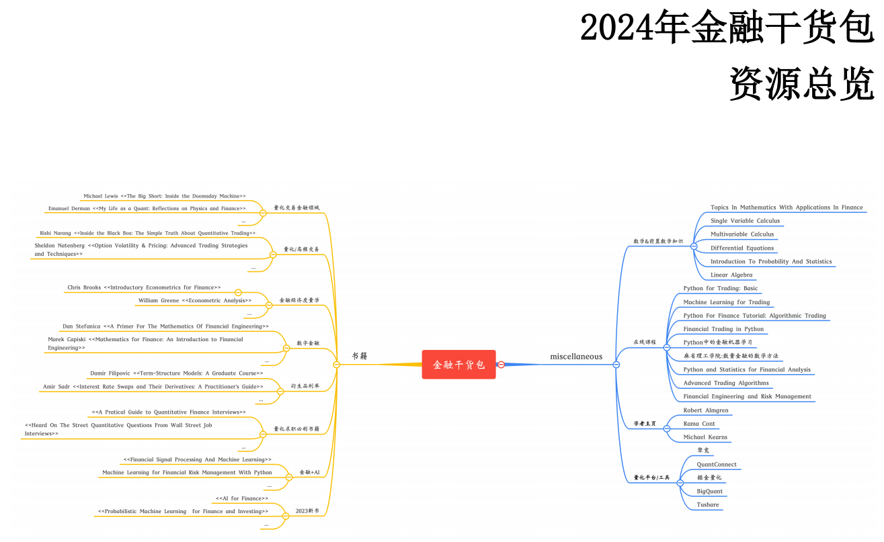
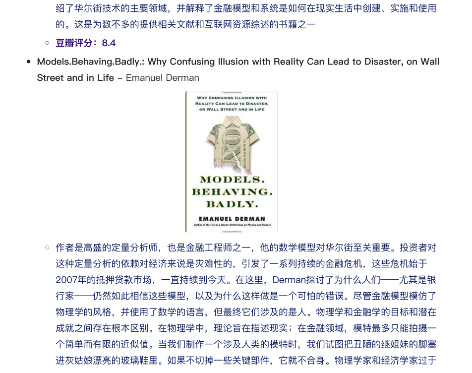
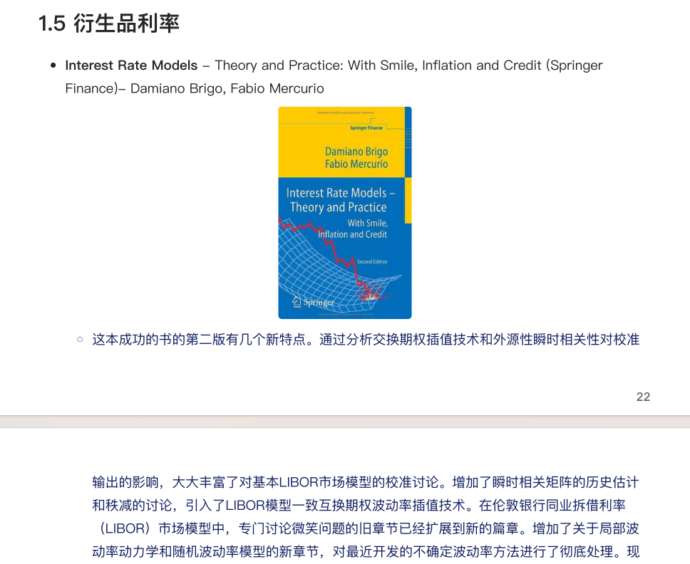
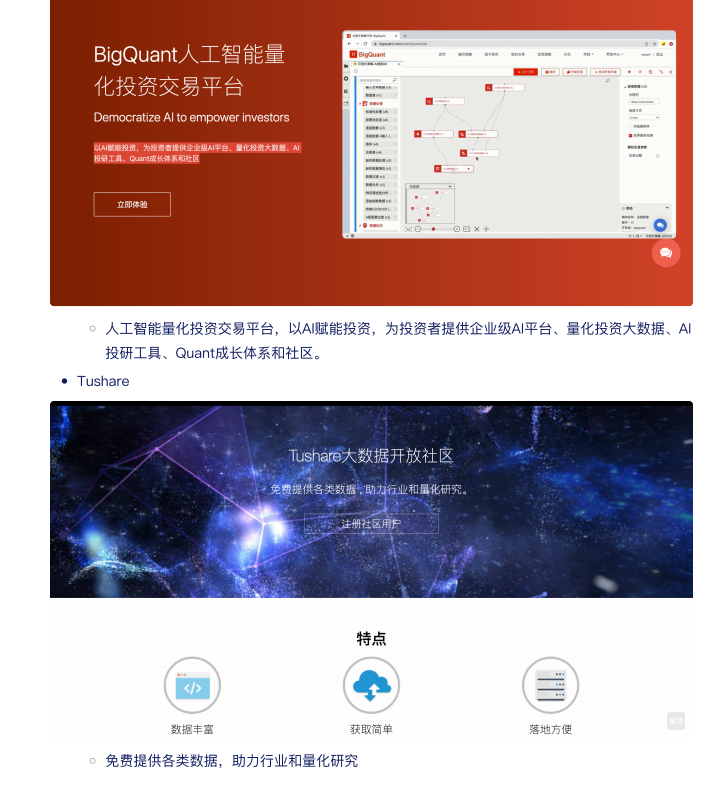

# 2024独家金融干货包

本书籍由[LLMQuant社区](https://llmquant.com/)整理, 并提供PDF下载, 只供学习交流使用, 版权归原作者所有。

**书名**: 金融数学引论
**作者**: 吴岚, 黄海, 何洋波
**出版社**: 北京大学出版社
**出版年份**: 2013
**内容简介**: 《金融数学引论》是一本面向金融数学方向本科生的专业基础教材。本书系统介绍了金融数学的基本概念、工具和方法，涵盖了利息计算、年金、投资收益分析、本金利息分离技术以及固定收益证券等基础金融产品的数学模型与计算方法。此外，本书还深入探讨了金融实务中的应用问题、利率风险分析，并对随机情形下的金融收益计算问题进行了基础性介绍。本书着重于提炼和综合金融计算分析中的数学模型和方法，旨在训练学生的定量分析和计算能力，并帮助他们理解这些计算的金融背景。

# 目录

