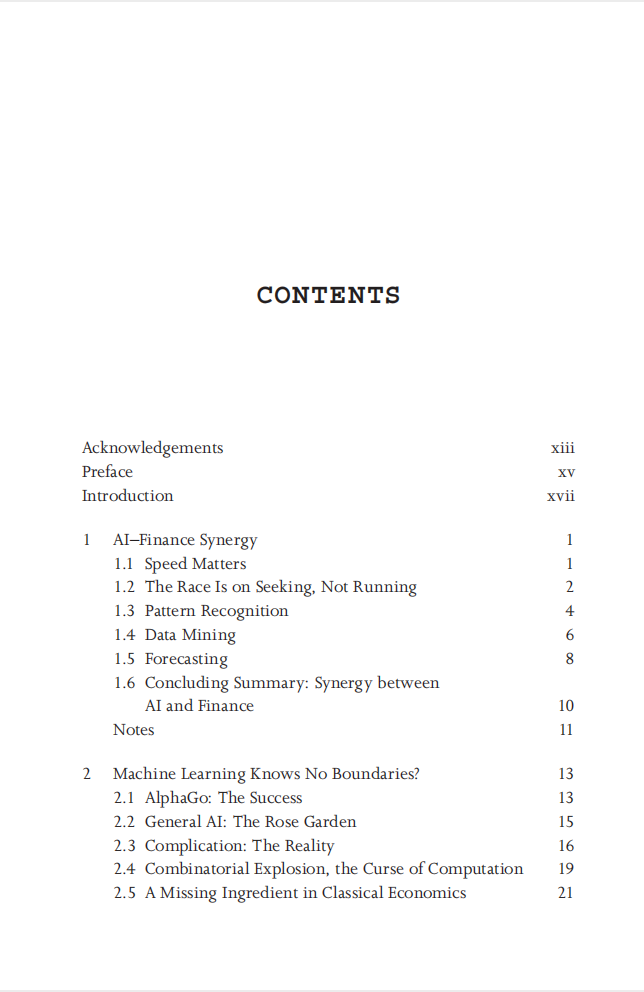
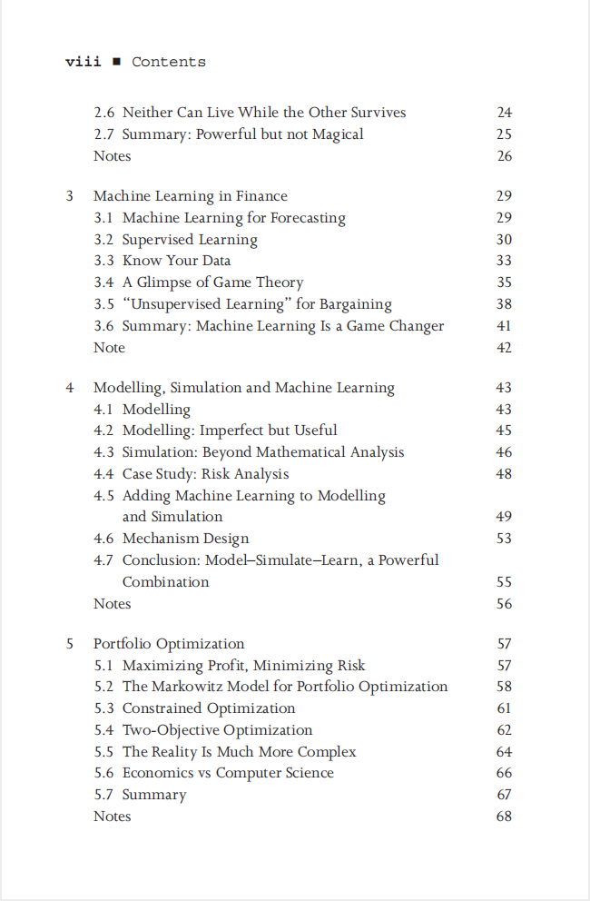
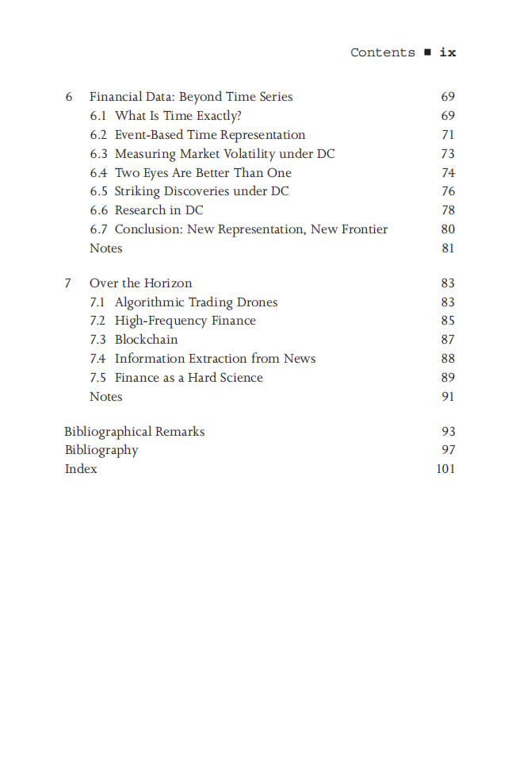

# AI for Finance

本书籍由[LLMQuant社区](https://llmquant.com/)整理, 并提供PDF下载, 只供学习交流使用, 版权归原作者所有。

- **作者**: Yves Hilpisch
- **出版社**: O'Reilly
- **出版年份**: 2020
- **难度**: ⭐⭐⭐⭐
- **推荐指数**: ⭐⭐⭐⭐⭐
- **PDF下载**: [点击下载](https://asset.quant-wiki.com/pdf/AI for Finance.pdf)

### 内容简介

AI for Finance 是一本关于量化金融的专业书籍，涵盖了人工智能和机器学习在金融领域的实际应用。本书深入探讨了如何利用机器学习、深度学习和强化学习等先进的数学技术来发现金融市场中的统计低效率，并通过算法交易进行利用。书中详细介绍了如何将这些技术应用于金融时间序列分析，包括使用神经网络进行预测和优化交易策略。此外，本书还涉及风险管理、回测以及AI驱动的交易系统部署等关键主题，旨在帮助量化分析师、算法交易员、金融工程师和数据科学家掌握AI在金融实践中的核心概念和应用方法.

### 核心章节

以下是本书的主要章节预览：

### 主要特点

- 理论与实践结合
- 包含详细示例
- 配套代码和资源
- 适合实际应用

### 适合人群

- 量化分析师
- 算法交易员
- 金融工程师
- 数据科学家

### 配套资源

- 示例代码
- 数据集
- 在线补充材料