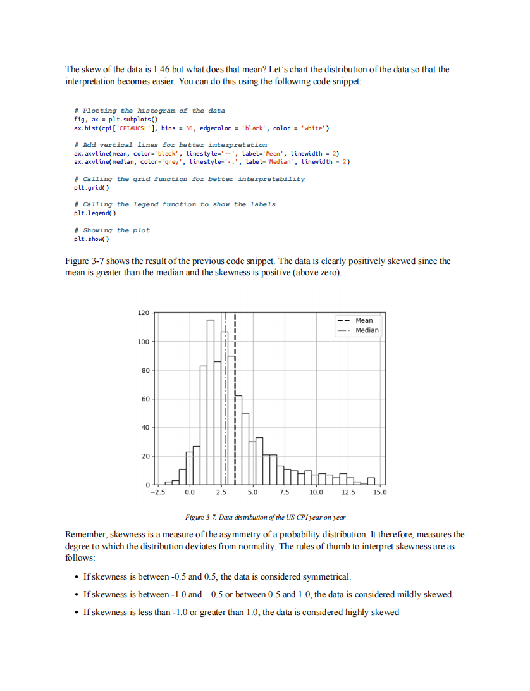

# Deep Learning for Finance

本书籍由[LLMQuant社区](https://llmquant.com/)整理, 并提供PDF下载, 只供学习交流使用, 版权归原作者所有。

- **作者**: Sofien Kaabar
- **出版社**: O'Reilly Media
- **出版年份**: 2024
- **难度**: ⭐⭐⭐⭐
- **推荐指数**: ⭐⭐⭐⭐⭐
- **PDF下载**: [点击下载](https://github.com/LLMQuant/asset/blob/main/Deep Learning for Finance.pdf)

### 内容简介

Deep Learning for Finance 是一本关于量化金融的专业书籍，涵盖了深度学习在金融和交易领域的应用。本书旨在教授读者如何使用Python从零开始开发深度学习交易模型，并结合机器学习和强化学习的概念。书中深入探讨了深度学习基础知识，以及其在时间序列预测、期权定价、投资组合优化、算法交易、风险管理、信用评分和欺诈检测等方面的具体应用。本书融合了深度学习与技术分析和量化分析，为金融专业人士提供了实用的指导。

### 核心章节

以下是本书的主要章节预览：

### 主要特点

- 理论与实践结合
- 包含详细示例
- 配套代码和资源
- 适合实际应用

### 适合人群

- 量化分析师
- 算法交易员
- 金融工程师
- 数据科学家

### 配套资源

- 示例代码
- 数据集
- 在线补充材料