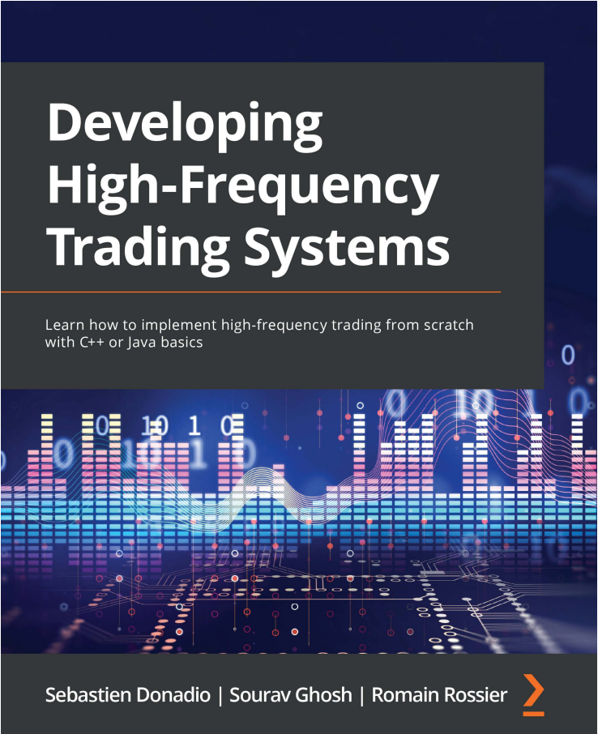
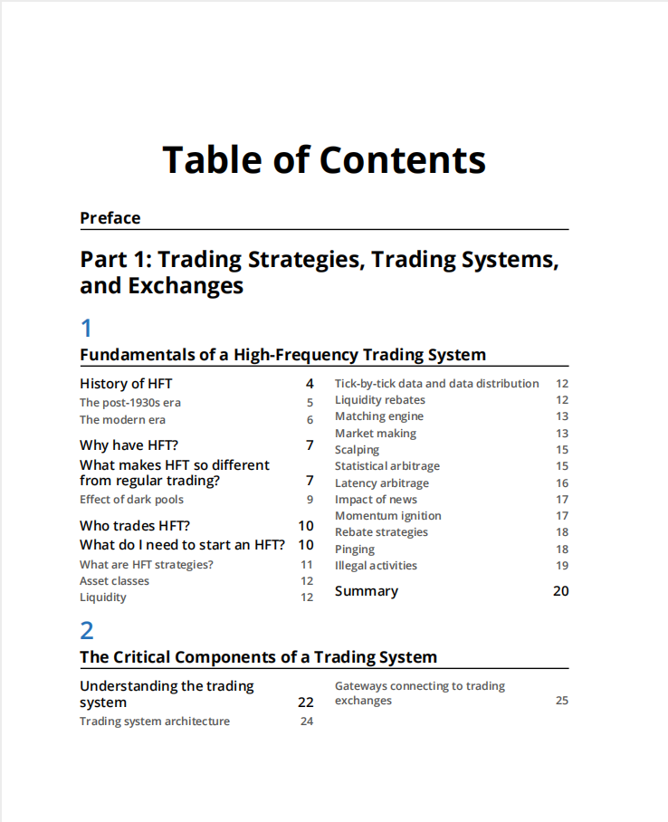
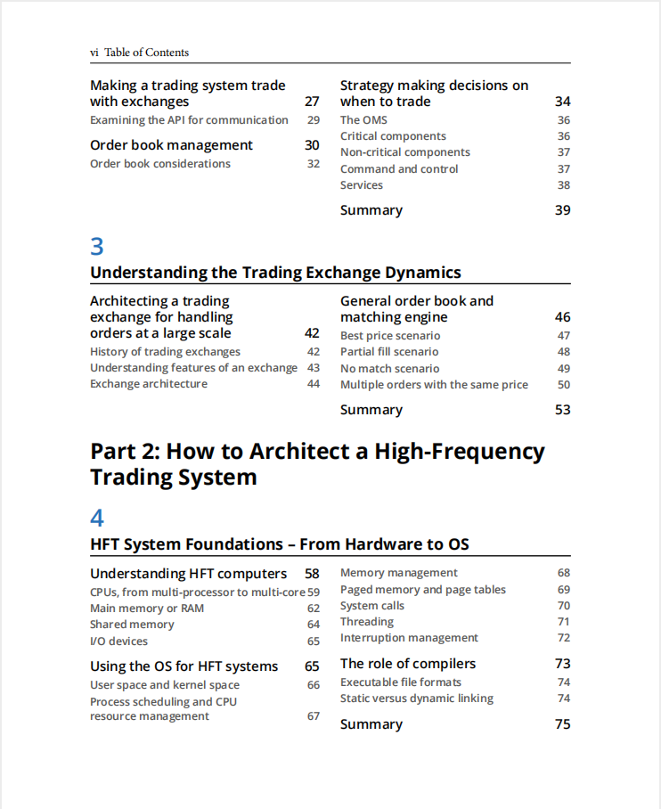
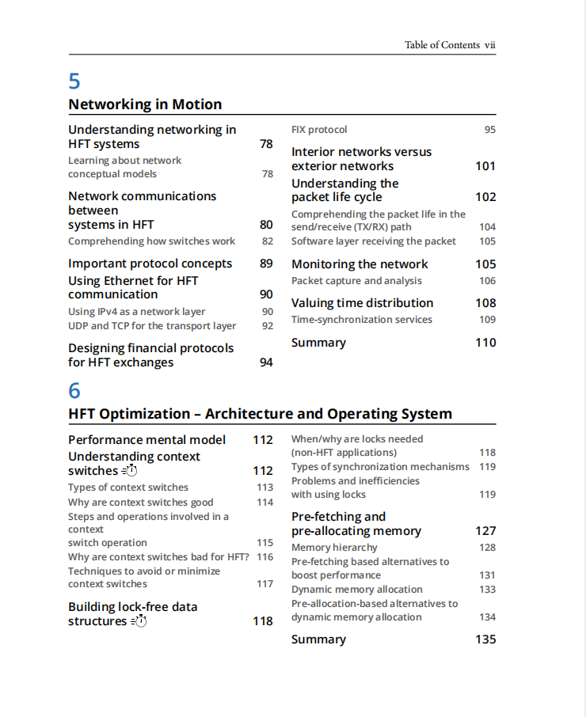
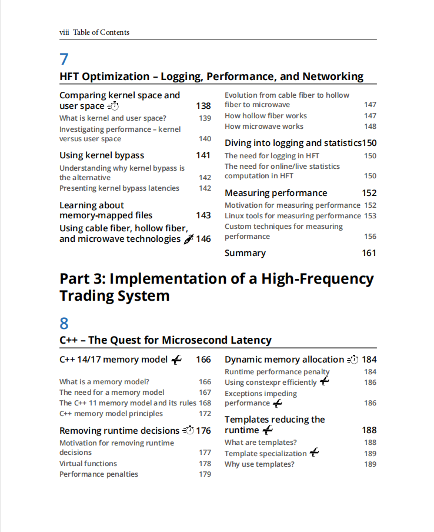
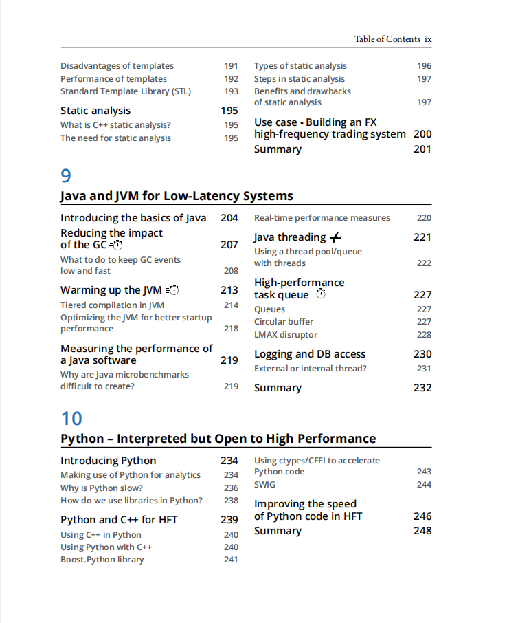
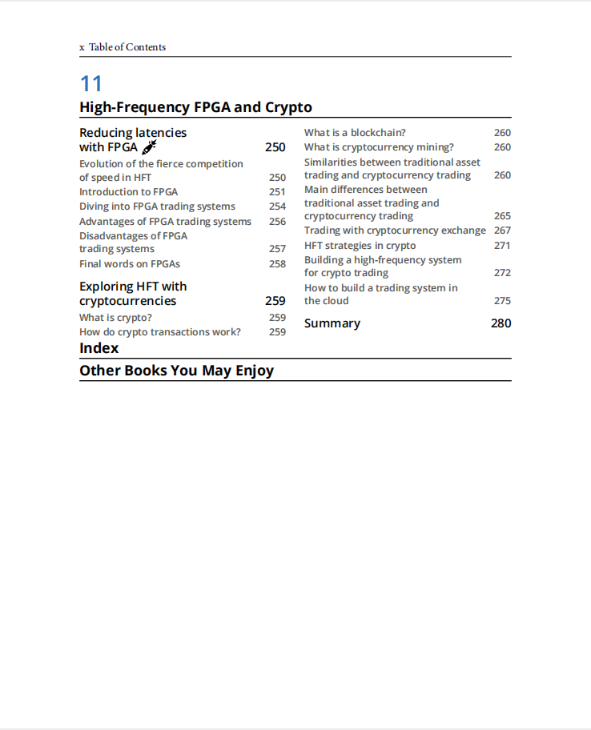

# Developing High Frequency Trading Systems

本书籍由[LLMQuant社区](https://llmquant.com/)整理, 并提供PDF下载, 只供学习交流使用, 版权归原作者所有。

- **作者**: Sebastien Donadio, Sourav Ghosh, Romain Rossier
- **出版社**: Packt Publishing
- **出版年份**: 2022
- **难度**: ⭐⭐⭐⭐
- **推荐指数**: ⭐⭐⭐⭐⭐
- **PDF下载**: [点击下载](https://asset.quant-wiki.com/pdf/Developing%20High%20Frequency%20Trading%20Systems.pdf)

### 内容简介

Developing High Frequency Trading Systems 是一本关于量化金融的专业书籍，涵盖了构建和优化高频交易（HFT）系统的关键技术和实践。本书旨在帮助读者利用Java、C++和Python等编程语言，从零开始构建超低延迟的交易系统。

本书深入探讨了高频交易系统的架构，包括市场微观结构、数据处理与存储、策略开发与回测、执行系统、风险管理以及性能评估等核心章节。读者将学习如何通过优化硬件和操作系统（如绕过内核、内存分配等）来提升系统性能，实现最低延迟。此外，本书还介绍了如何利用C++模板和Java多线程技术实现超低延迟，并探讨了Python在高性能交易中的应用。书中还涵盖了加密货币高频交易的实践应用。

### 核心章节

以下是本书的主要章节预览：

### 主要特点

- 理论与实践结合
- 包含详细示例
- 配套代码和资源
- 适合实际应用

### 适合人群

- 量化分析师
- 算法交易员
- 金融工程师
- 数据科学家

### 配套资源

- 示例代码
- 数据集
- 在线补充材料