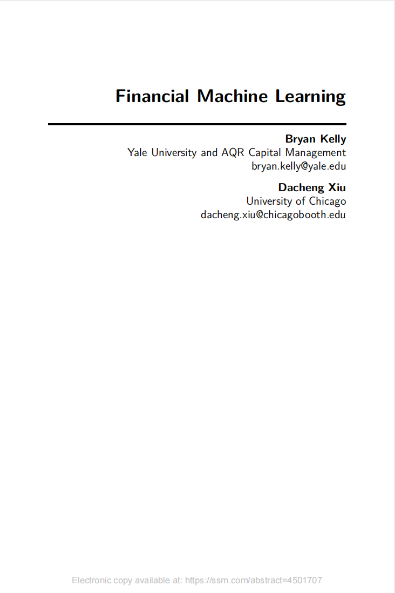
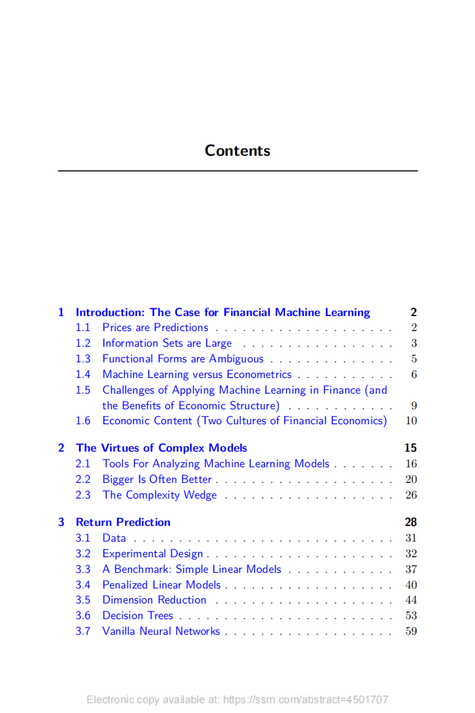
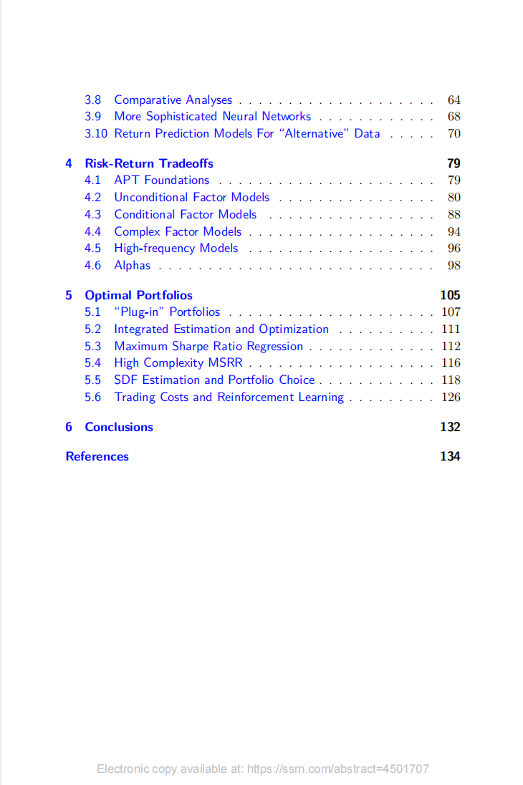

# Financial Machine Learning

本书籍由[LLMQuant社区](https://llmquant.com/)整理, 并提供PDF下载, 只供学习交流使用, 版权归原作者所有。

- **作者**: Marcos López de Prado
- **出版社**: Wiley
- **出版年份**: 2018
- **难度**: ⭐⭐⭐⭐
- **推荐指数**: ⭐⭐⭐⭐⭐
- **PDF下载**: [点击下载](https://asset.quant-wiki.com/pdf/Financial%20Machine%20Learning.pdf)

### 内容简介

Financial Machine Learning 是一本关于量化金融的专业书籍，涵盖了机器学习技术在金融领域的应用。本书深入探讨了如何应对金融数据的独特挑战，例如非平稳性、市场微观结构效应和噪声，并提供了构建适用于机器学习算法的大数据结构的方法。书中详细介绍了金融数据采样、交叉验证（如净化交叉验证和元标签）、金融特征工程（如分数微分特征）以及高级集成方法等关键数学技术。此外，本书还讨论了市场影响、微观结构效应以及如何有效避免模型过拟合。通过结合理论与实践，本书提供了科学严谨的解决方案，并辅以数学推导、代码示例和实际案例，旨在帮助量化分析师、算法交易员、金融工程师和数据科学家等专业人士，利用机器学习提升投资表现和构建稳健的交易策略。

### 核心章节

以下是本书的主要章节预览：

### 主要特点

- 理论与实践结合
- 包含详细示例
- 配套代码和资源
- 适合实际应用

### 适合人群

- 量化分析师
- 算法交易员
- 金融工程师
- 数据科学家

### 配套资源

- 示例代码
- 数据集
- 在线补充材料