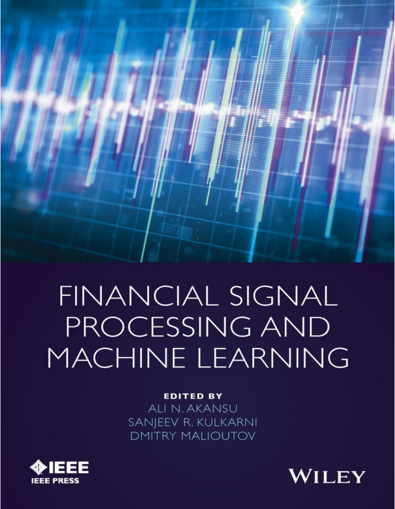
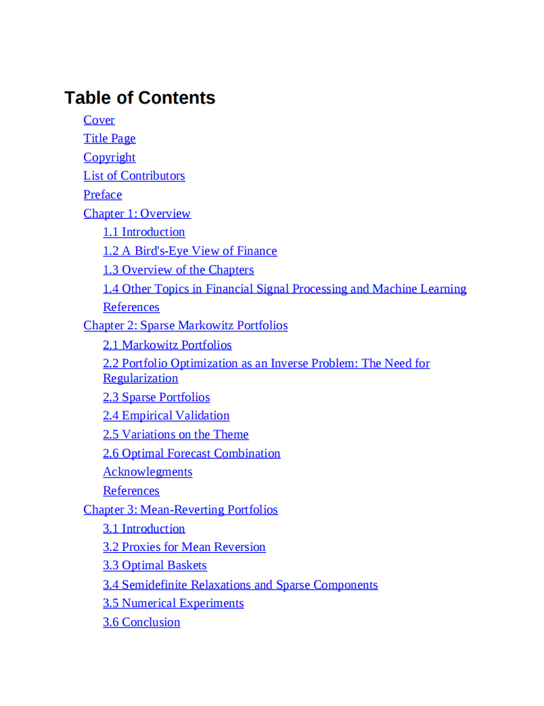
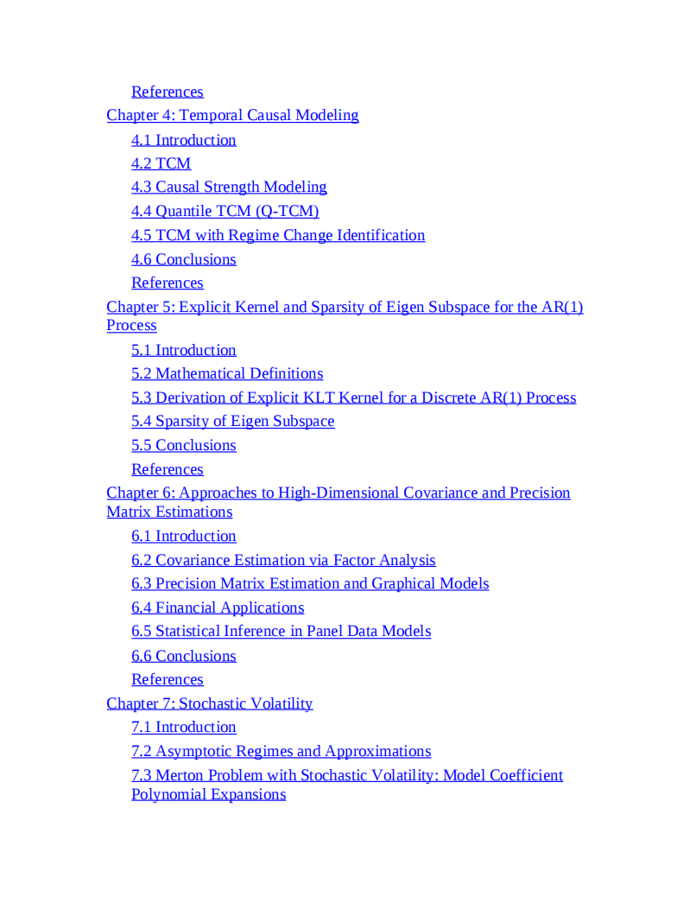
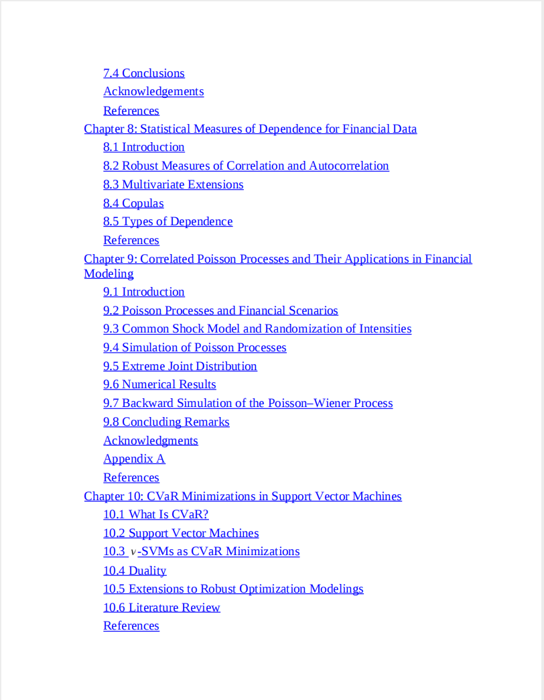
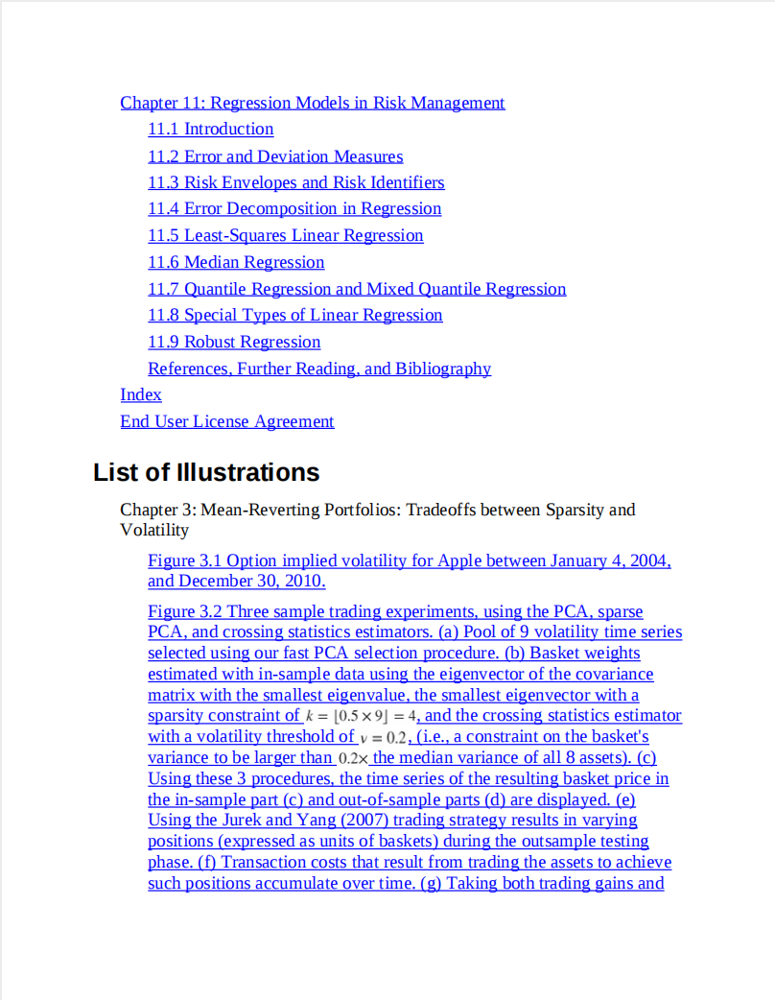

# Financial Signal Processing and Machine Learning

本书籍由[LLMQuant社区](https://llmquant.com/)整理, 并提供PDF下载, 只供学习交流使用, 版权归原作者所有。

- **作者**: Ali N. Akansu, Sanjeev R. Kulkarni, Dmitry M. Malioutov, Ilya Pollak
- **出版社**: Wiley-IEEE Press
- **出版年份**: 2016
- **难度**: ⭐⭐⭐⭐
- **推荐指数**: ⭐⭐⭐⭐⭐
- **PDF下载**: [点击下载](https://github.com/LLMQuant/asset/blob/main/Financial Signal Processing and Machine Learning.pdf)

### 内容简介

Financial Signal Processing and Machine Learning 是一本关于量化金融的专业书籍，涵盖了信号处理和机器学习在投资组合设计与管理以及金融工程中的最新进展。本书旨在弥合这些学科之间的鸿沟，提供关于高维统计依赖和相关性表征、构建有效且稳健的风险度量及其在投资组合优化和再平衡中应用的关键信息。书中重点介绍了利用信号处理方法对收益、动量和均值回归进行建模，并探讨了理论和实现方面的问题。它强调了投资组合理论、稀疏学习与压缩感知、稀疏特征投资组合、鲁棒优化、非高斯数据驱动风险度量、图模型、通过时间因果建模进行的因果分析以及大规模基于Copula的方法之间的联系。本书涵盖了统计信号处理、机器学习、深度学习和强化学习等主要数学技术在金融领域的应用，例如稀疏Markowitz投资组合、均值回归投资组合和时间因果建模等。

### 核心章节

以下是本书的主要章节预览：

### 主要特点

- 理论与实践结合
- 包含详细示例
- 配套代码和资源
- 适合实际应用

### 适合人群

- 量化分析师
- 算法交易员
- 金融工程师
- 数据科学家

### 配套资源

- 示例代码
- 数据集
- 在线补充材料