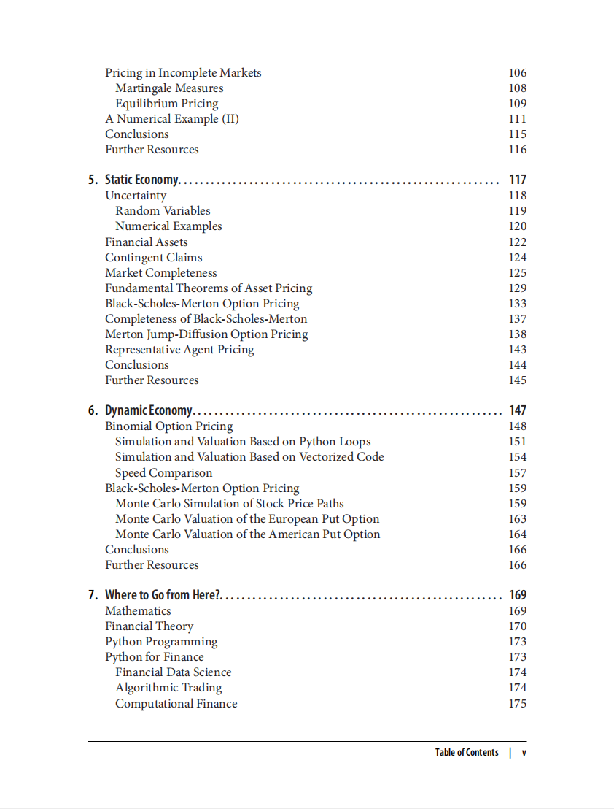

# Financial Theory with Python

本书籍由[LLMQuant社区](https://llmquant.com/)整理, 并提供PDF下载, 只供学习交流使用, 版权归原作者所有。

- **作者**: Yves Hilpisch
- **出版社**: O'Reilly Media
- **出版年份**: 2021
- **难度**: ⭐⭐⭐⭐
- **推荐指数**: ⭐⭐⭐⭐⭐
- **PDF下载**: [点击下载](https://asset.quant-wiki.com/pdf/Financial%20Theory%20with%20Python.pdf)

### 内容简介

Financial Theory with Python 是一本关于量化金融的专业书籍，涵盖了金融、数学和编程（特别是Python）之间的内在联系，旨在为读者提供进入计算金融世界所需的基础工具。本书采用一种独特的方法，将数学概念作为共同背景，在此基础上学习金融思想和编程技术。

本书深入探讨了金融理论、金融数据建模以及Python在计算金融中的应用。它通过静态和动态金融建模来解决金融中的基本问题，例如定价、决策、均衡和资产配置。书中涵盖了随机微积分、鞅论、布朗运动和伊藤引理等核心数学技术，并将其应用于期权和其他衍生品的估值（如复制投资组合或风险中性定价）以及资本资产定价模型等金融模型。此外，本书还介绍了NumPy、pandas、Matplotlib和SymPy等在金融建模中常用的Python库。

### 核心章节

以下是本书的主要章节预览：

### 主要特点

- 理论与实践结合
- 包含详细示例
- 配套代码和资源
- 适合实际应用

### 适合人群

- 量化分析师
- 算法交易员
- 金融工程师
- 数据科学家

### 配套资源

- 示例代码
- 数据集
- 在线补充材料