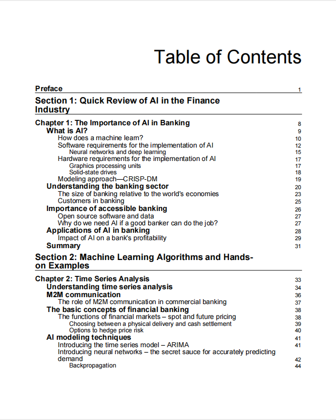

# Hands-On Artificial Intelligence for Banking

本书籍由[LLMQuant社区](https://llmquant.com/)整理, 并提供PDF下载, 只供学习交流使用, 版权归原作者所有。

- **作者**: Jeffrey Ng, Subhash Shah
- **出版社**: Packt Publishing
- **出版年份**: 2020
- **难度**: ⭐⭐⭐⭐
- **推荐指数**: ⭐⭐⭐⭐⭐
- **PDF下载**: [点击下载](https://github.com/LLMQuant/asset/blob/main/Hands-On Artificial Intelligence for Banking.pdf)

### 内容简介

Hands-On Artificial Intelligence for Banking 是一本关于量化金融的专业书籍，涵盖了如何利用人工智能（AI）和机器学习技术构建智能金融应用。本书旨在帮助读者深入了解AI在银行业的实际应用，包括使用机器学习进行信用风险评估、欺诈检测、算法交易和客户分析。此外，它还探讨了自然语言处理（NLP）在银行领域的应用以及强化学习在自动化银行决策中的作用，旨在使银行服务更顺畅、更高效、更易于客户访问。

### 核心章节

以下是本书的主要章节预览：

### 主要特点

- 理论与实践结合
- 包含详细示例
- 配套代码和资源
- 适合实际应用

### 适合人群

- 量化分析师
- 算法交易员
- 金融工程师
- 数据科学家

### 配套资源

- 示例代码
- 数据集
- 在线补充材料