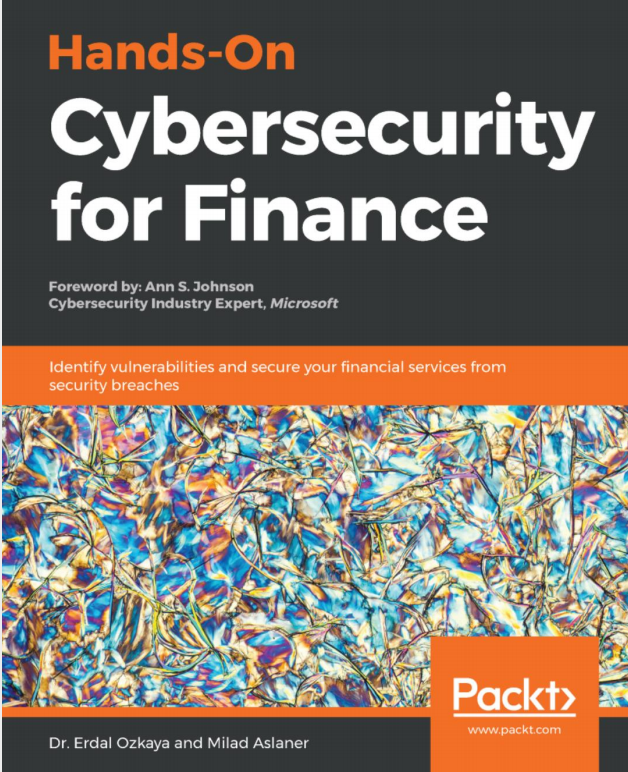
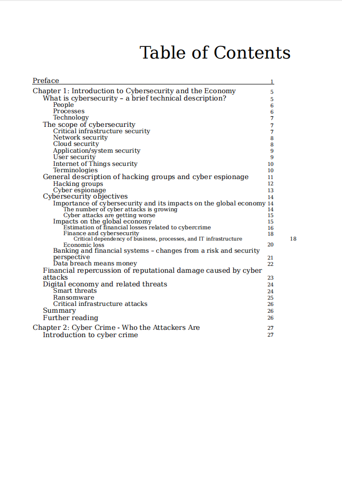
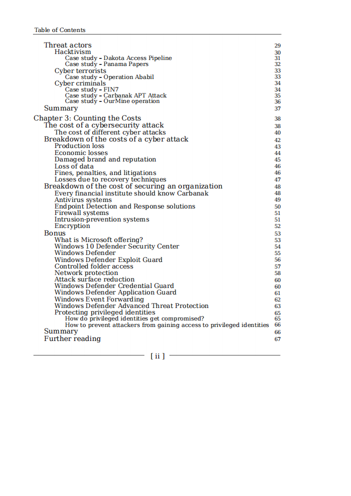
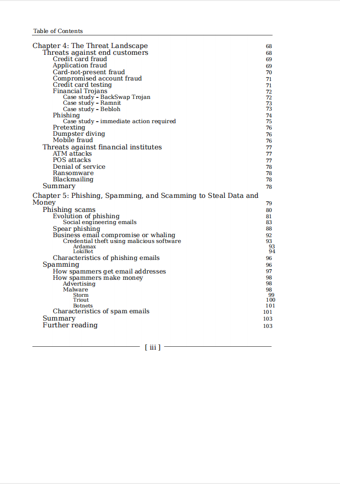
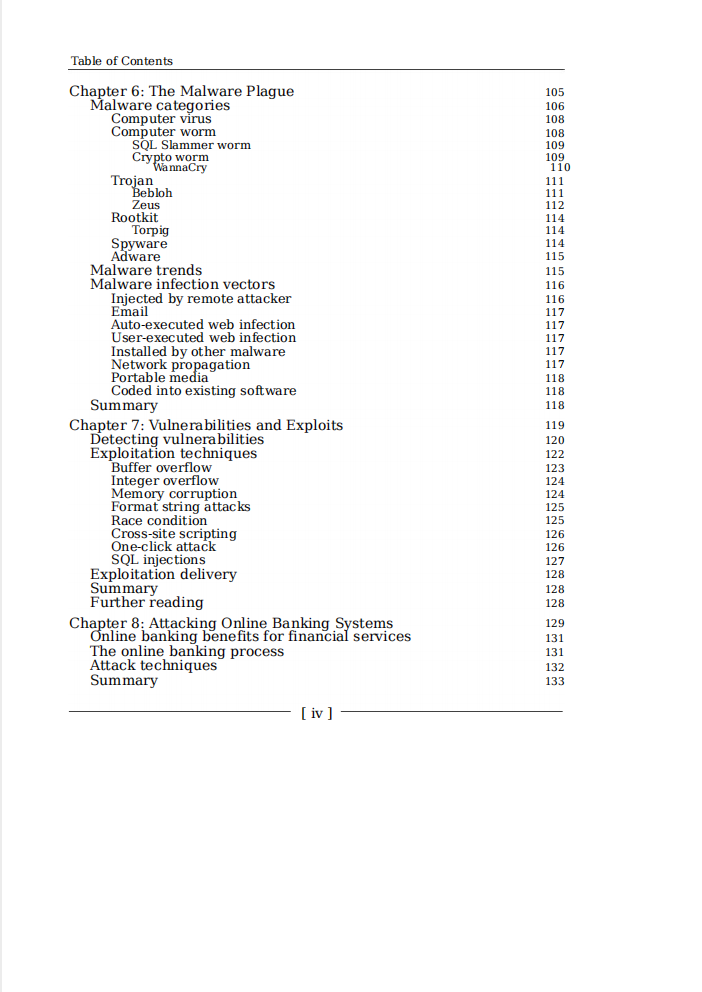
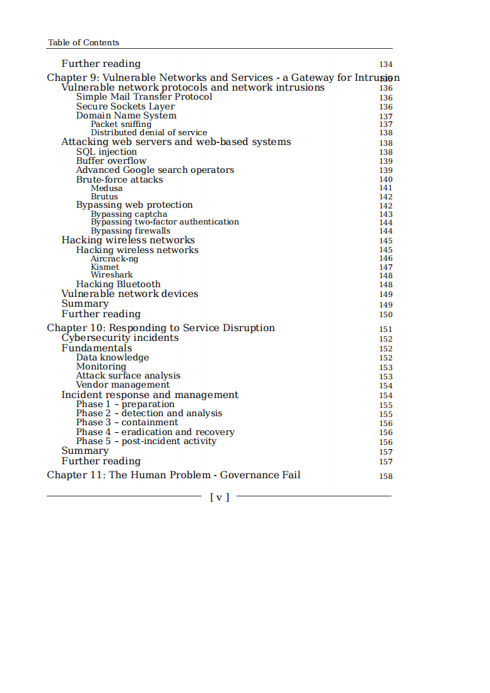
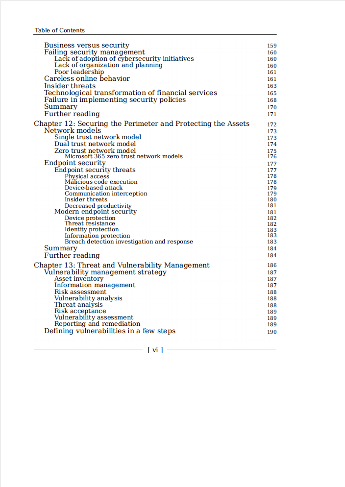
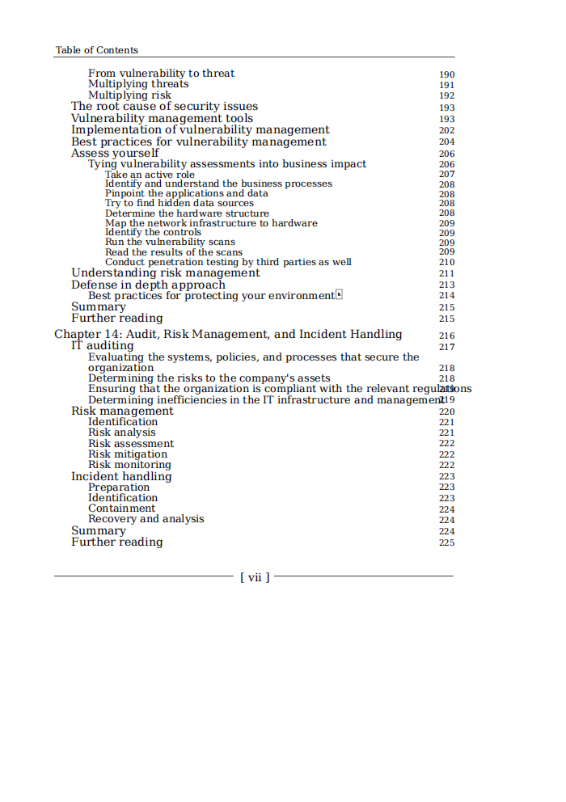
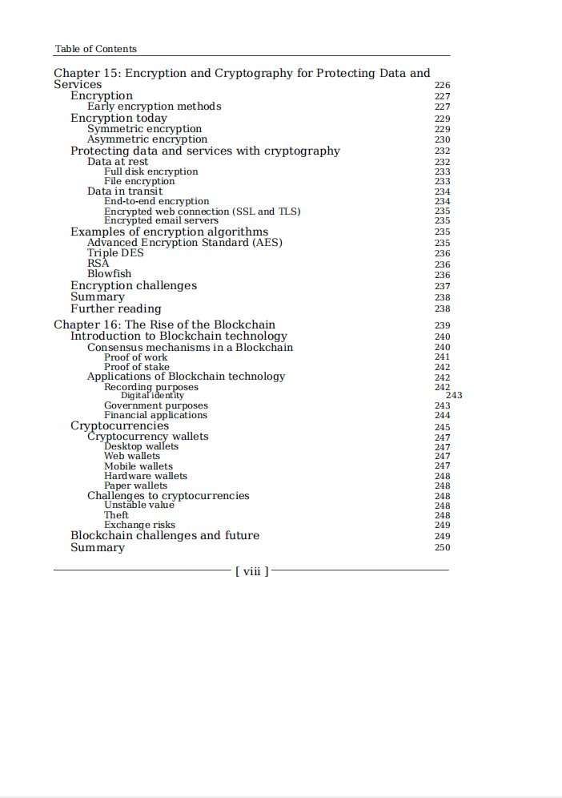

# Hands-On Cybersecurity for Finance

本书籍由[LLMQuant社区](https://llmquant.com/)整理, 并提供PDF下载, 只供学习交流使用, 版权归原作者所有。

- **作者**: Dr. Erdal Ozkaya, Milad Aslaner
- **出版社**: Packt Publishing
- **出版年份**: 2019
- **难度**: ⭐⭐⭐⭐
- **推荐指数**: ⭐⭐⭐⭐⭐
- **PDF下载**: [点击下载](https://asset.quant-wiki.com/pdf/Hands-On%20Cybersecurity%20for%20Finance.pdf)

### 内容简介

Hands-On Cybersecurity for Finance 是一本关于金融网络安全的专业书籍，旨在教授读者如何成功防御常见的网络威胁，确保金融服务在安全性方面领先一步。本书首先概述了网络安全，引导读者了解当前面临网络威胁的一些最重要的服务和技术。随后，通过案例研究和真实场景，探讨了具体的网络技术和威胁，并深入分析了漏洞和缺陷（包括人为风险因素），让读者对最新威胁有专家级的认识。书中还详细介绍了如何实现数据和基础设施保护，并涵盖了事件响应与取证、监管合规与治理等关键主题。在最后章节，本书讨论了网络安全研究与开发在IT金融服务中的最新进展和未来趋势。通过阅读本书，读者将对信息安全的未来有一个基本了解，并能够保护金融服务及其相关基础设施免受安全漏洞的侵害。

### 核心章节

以下是本书的主要章节预览：

### 主要特点

- 理论与实践结合
- 包含详细示例
- 配套代码和资源
- 适合实际应用

### 适合人群

- 量化分析师
- 算法交易员
- 金融工程师
- 数据科学家

### 配套资源

- 示例代码
- 数据集
- 在线补充材料