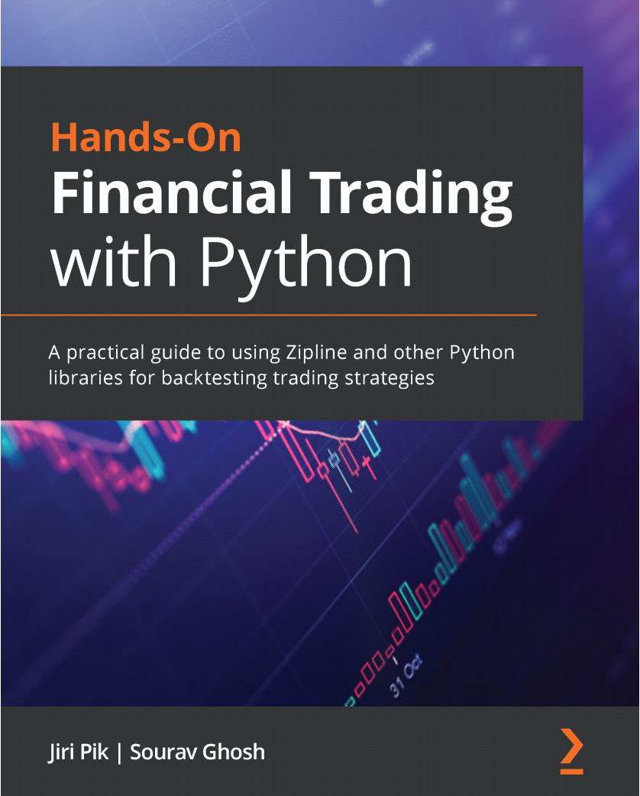
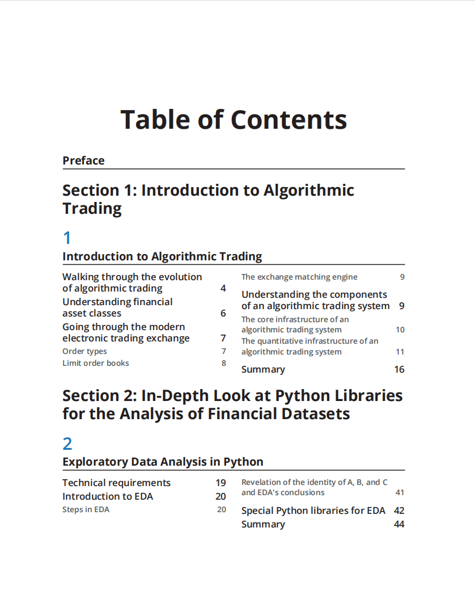
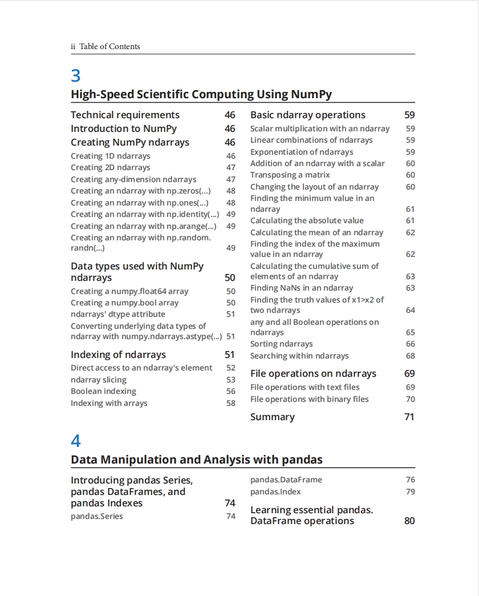
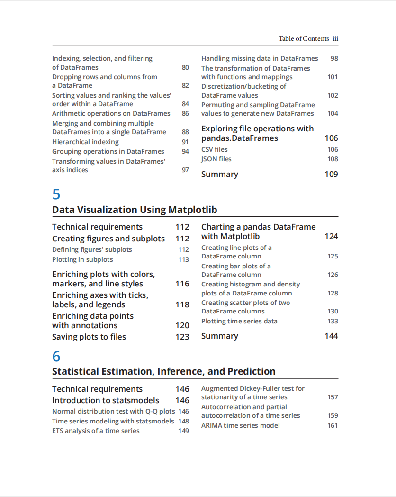
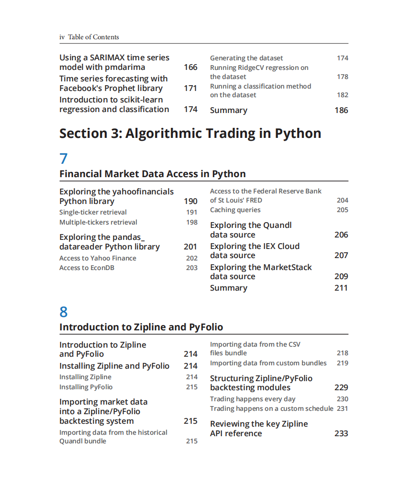
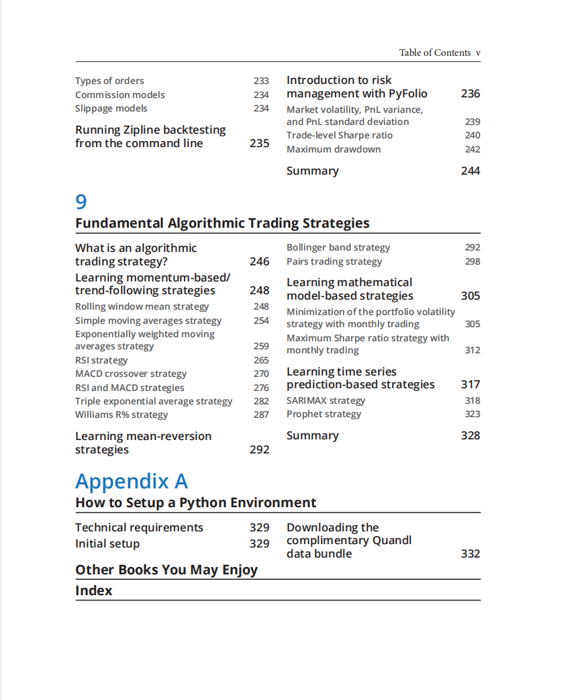

# Hands-On Financial Trading with Python

本书籍由[LLMQuant社区](https://llmquant.com/)整理, 并提供PDF下载, 只供学习交流使用, 版权归原作者所有。

- **作者**: Jiri Pik, Sourav Ghosh
- **出版社**: Packt Publishing
- **出版年份**: 2021
- **难度**: ⭐⭐⭐⭐
- **推荐指数**: ⭐⭐⭐⭐⭐
- **PDF下载**: [点击下载](https://asset.quant-wiki.com/pdf/Hands-On%20Financial%20Trading%20with%20Python.pdf)

### 内容简介

Hands-On Financial Trading with Python 是一本关于量化金融的专业书籍，旨在指导读者使用Python构建和回测算法交易策略。本书首先介绍算法交易的基础知识，随后深入探讨金融数据获取、预处理和探索性数据分析。书中详细讲解了如何利用Python的核心库（如NumPy、pandas和Matplotlib）进行高效的科学计算、数据操作与可视化。在金融应用方面，本书涵盖了技术分析、交易策略的开发与实现，并引入机器学习技术（如时间序列预测，包括ARIMA、pmdarima和Facebook Prophet）来构建预测性交易信号。此外，本书还重点介绍了使用Zipline和PyFolio进行策略回测与优化，以及进行风险管理和投资组合优化。通过理论与实践相结合的方式，本书旨在帮助量化分析师、算法交易员、金融工程师和数据科学家掌握量化研究、策略生成和实际交易系统部署的关键技能。

### 核心章节

以下是本书的主要章节预览：

### 主要特点

- 理论与实践结合
- 包含详细示例
- 配套代码和资源
- 适合实际应用

### 适合人群

- 量化分析师
- 算法交易员
- 金融工程师
- 数据科学家

### 配套资源

- 示例代码
- 数据集
- 在线补充材料