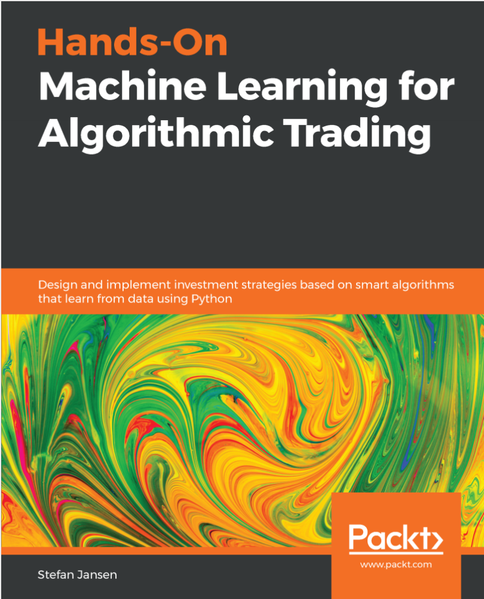
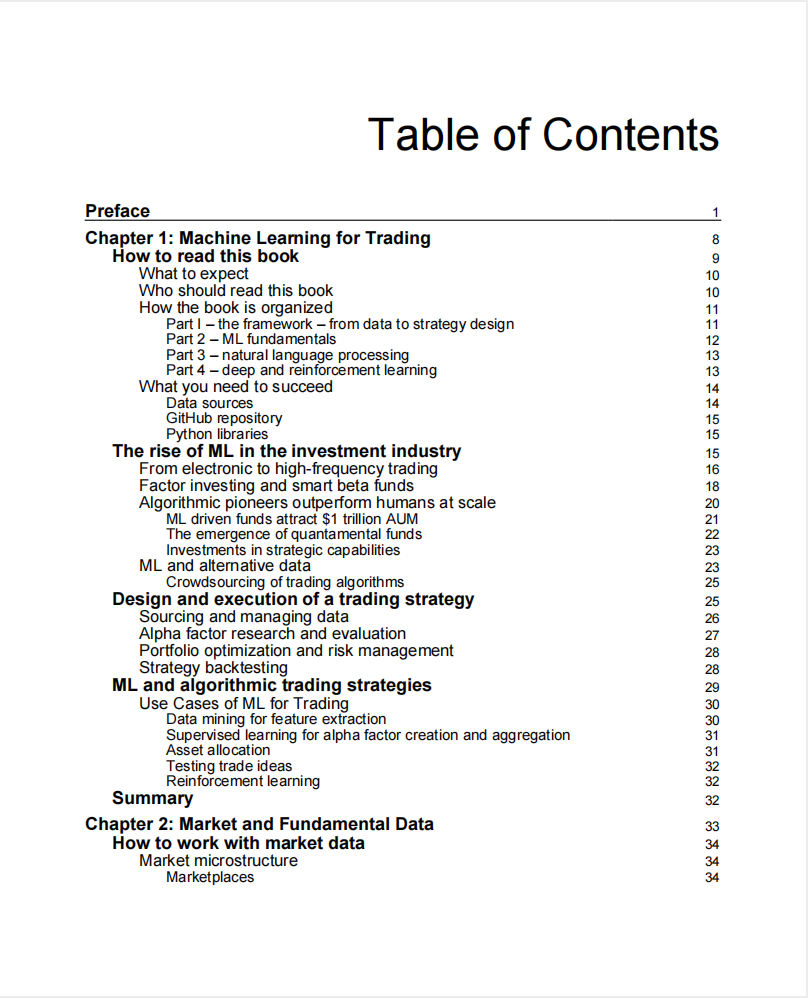
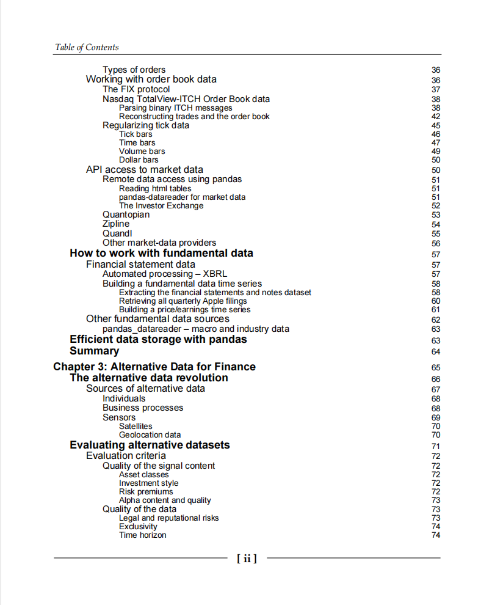
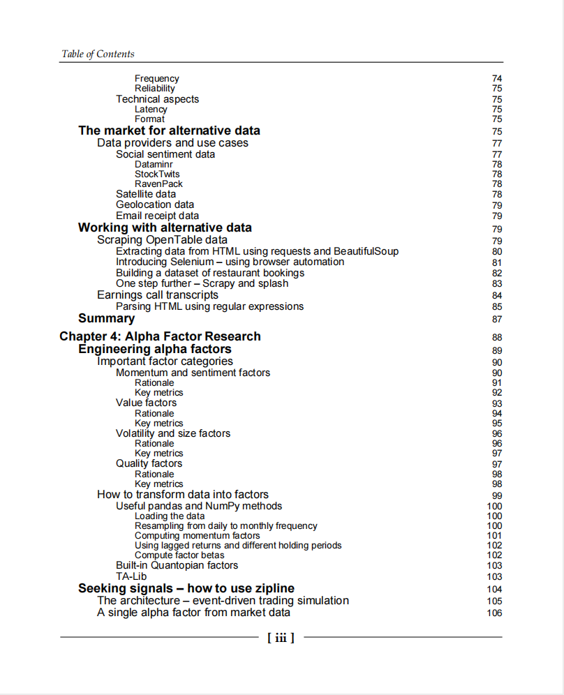
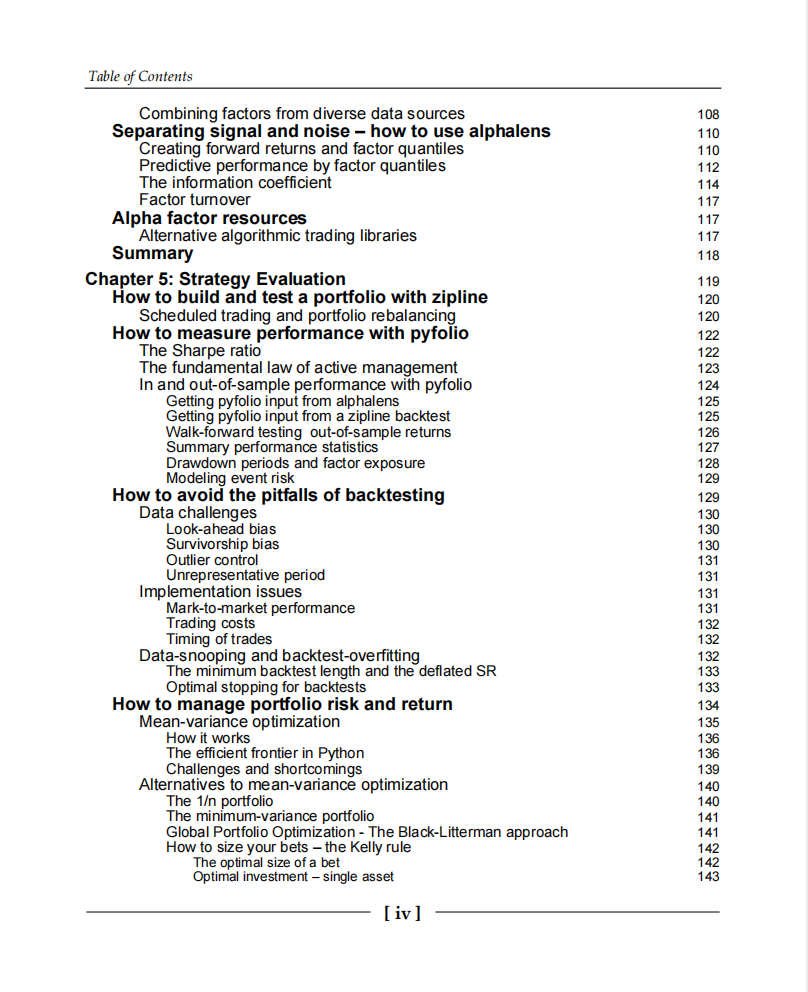
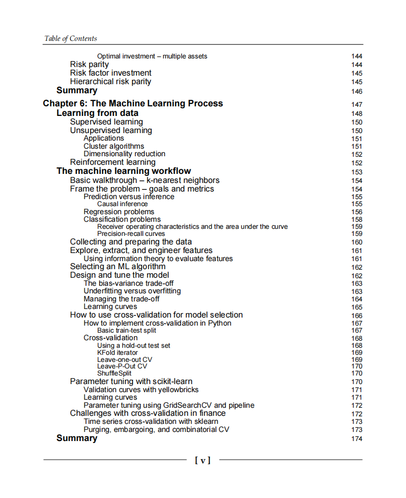
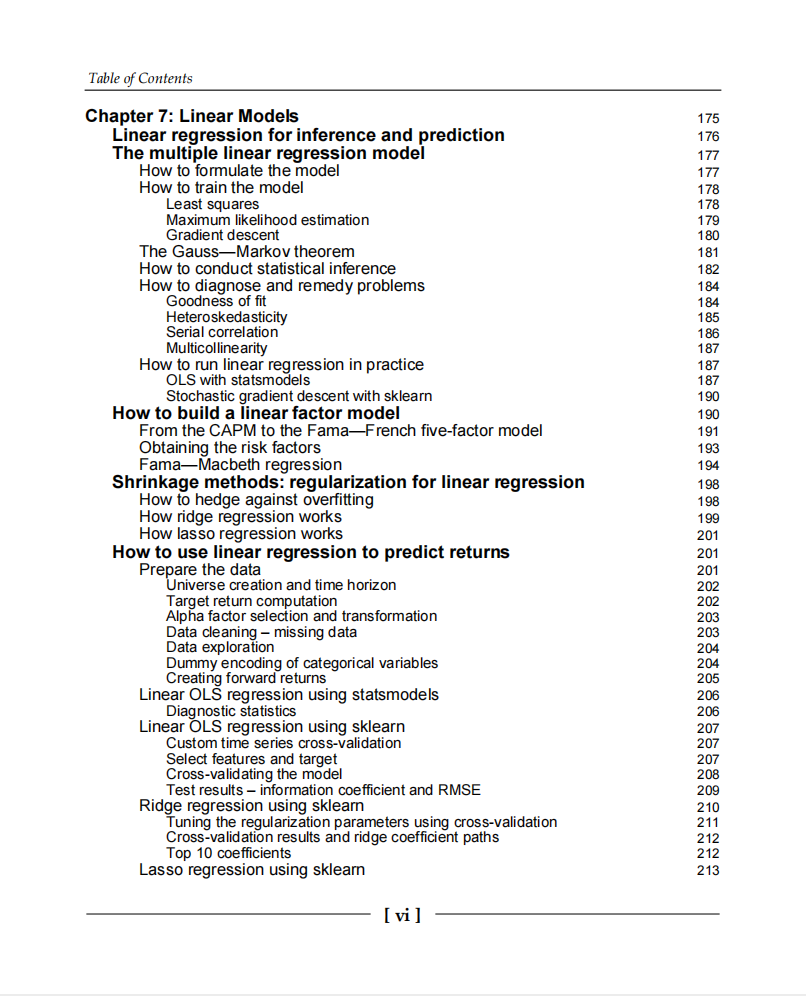
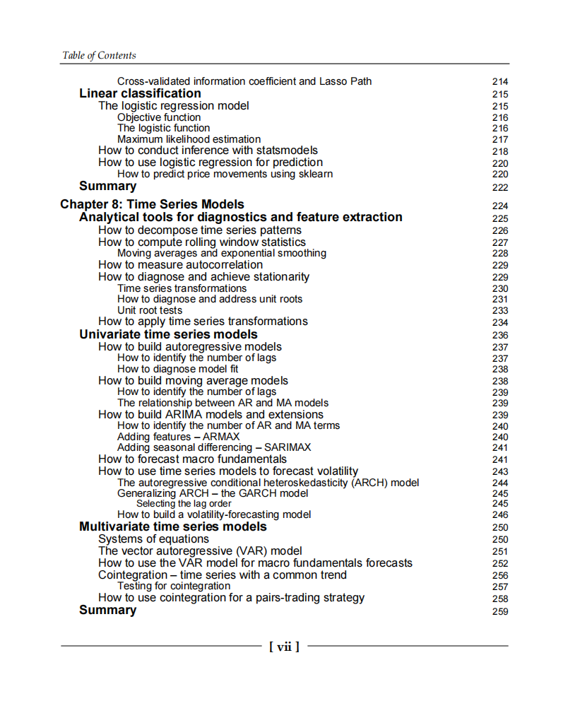
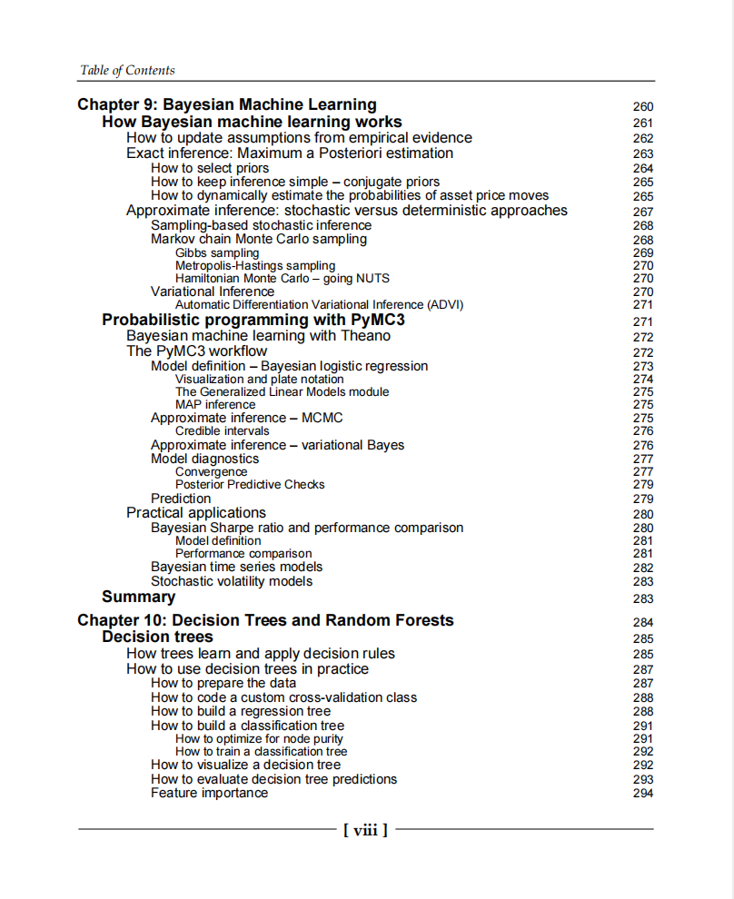

# Hands-On Machine Learning for Algorithmic Trading

本书籍由[LLMQuant社区](https://llmquant.com/)整理, 并提供PDF下载, 只供学习交流使用, 版权归原作者所有。

- **作者**: Stefan Jansen
- **出版社**: Packt Publishing
- **出版年份**: 2018
- **难度**: ⭐⭐⭐⭐
- **推荐指数**: ⭐⭐⭐⭐⭐
- **PDF下载**: [点击下载](https://asset.quant-wiki.com/pdf/Hands-On%20Machine%20Learning%20for%20Algorithmic%20Trading.pdf)

### 内容简介

Hands-On Machine Learning for Algorithmic Trading 是一本关于量化金融的专业书籍，涵盖了如何设计和实现基于智能算法的投资策略，这些算法能够从数据中学习并应用于算法交易。本书深入探讨了市场、基本面和另类数据（如行情数据、SEC文件、金融新闻、卫星图像）的获取与利用，并详细介绍了如何进行金融特征工程和Alpha因子研究，以生成可交易的信号。

书中涵盖了广泛的机器学习技术及其在金融领域的应用，包括监督学习、无监督学习、强化学习、线性模型、时间序列模型、贝叶斯机器学习、决策树、随机森林、梯度提升机以及深度学习（如循环神经网络RNN和卷积神经网络CNN）。 此外，本书还讲解了自然语言处理（NLP）技术，用于从文本数据中提取交易信号。 读者将学习如何使用Python及其强大的库（如pandas, NumPy, scikit-learn, Keras, PyTorch, TensorFlow, spaCy, Gensim, LightGBM等）来构建、训练和验证算法模型，优化投资组合风险和绩效，并通过可靠的回测方法（如Zipline和Backtrader）评估策略，最终将机器学习模型整合到实盘交易策略中。

### 核心章节

以下是本书的主要章节预览：

### 主要特点

- 理论与实践结合
- 包含详细示例
- 配套代码和资源
- 适合实际应用

### 适合人群

- 量化分析师
- 算法交易员
- 金融工程师
- 数据科学家

### 配套资源

- 示例代码
- 数据集
- 在线补充材料