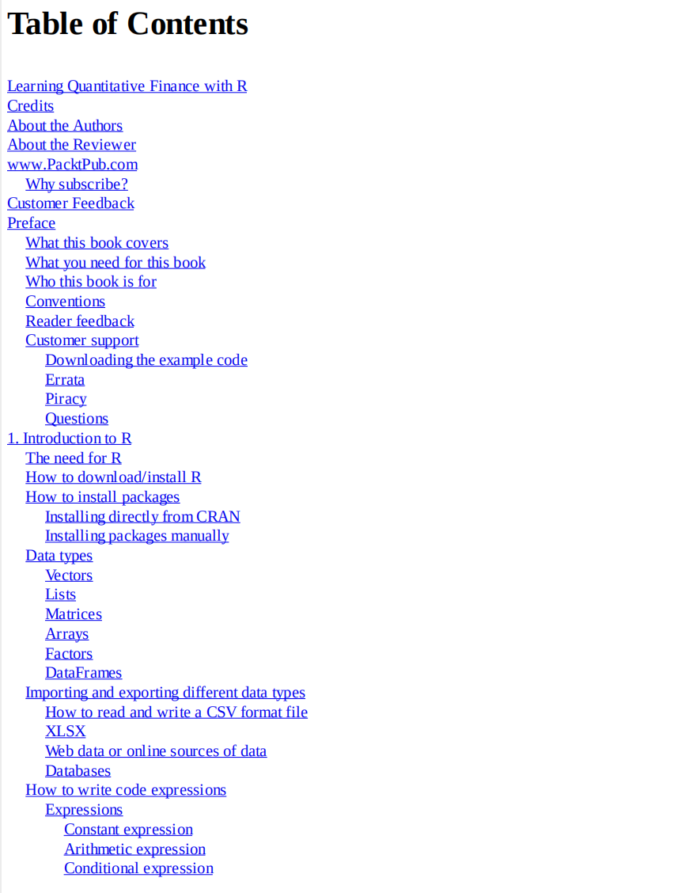

# Learning Quantitative Finance with R

本书籍由[LLMQuant社区](https://llmquant.com/)整理, 并提供PDF下载, 只供学习交流使用, 版权归原作者所有。

- **作者**: Dr. Param Jeet, Prashant Vats
- **出版社**: Packt Publishing
- **出版年份**: 2017
- **难度**: ⭐⭐⭐⭐
- **推荐指数**: ⭐⭐⭐⭐⭐
- **PDF下载**: [点击下载](https://github.com/LLMQuant/asset/blob/main/Learning Quantitative Finance with R.pdf)

### 内容简介

Learning Quantitative Finance with R 是一本关于量化金融的专业书籍，涵盖了使用R语言进行量化金融分析的各个方面。本书从R语言的基础知识入手，逐步深入到统计建模、计量经济学和小波分析、时间序列建模、算法交易、机器学习在交易中的应用、风险管理、优化以及衍生品定价等核心主题。书中详细介绍了各种数学技术及其在金融领域的实际应用，旨在帮助读者掌握使用R构建和分析量化金融模型所需的技能，并通过实际案例和示例加深理解。

### 核心章节

以下是本书的主要章节预览：

### 主要特点

- 理论与实践结合
- 包含详细示例
- 配套代码和资源
- 适合实际应用

### 适合人群

- 量化分析师
- 算法交易员
- 金融工程师
- 数据科学家

### 配套资源

- 示例代码
- 数据集
- 在线补充材料