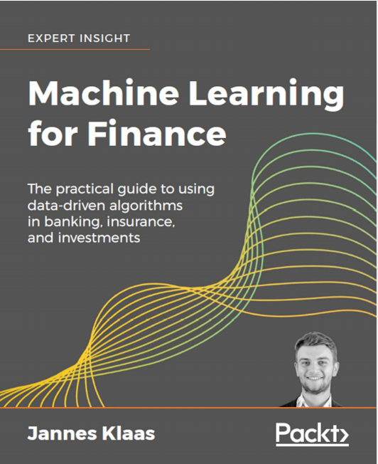
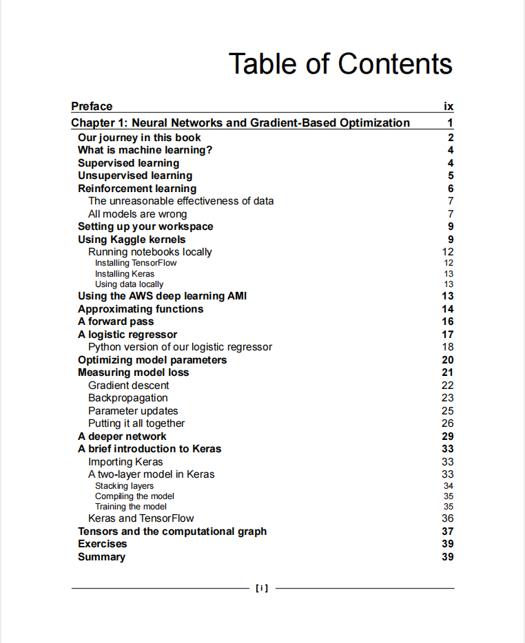
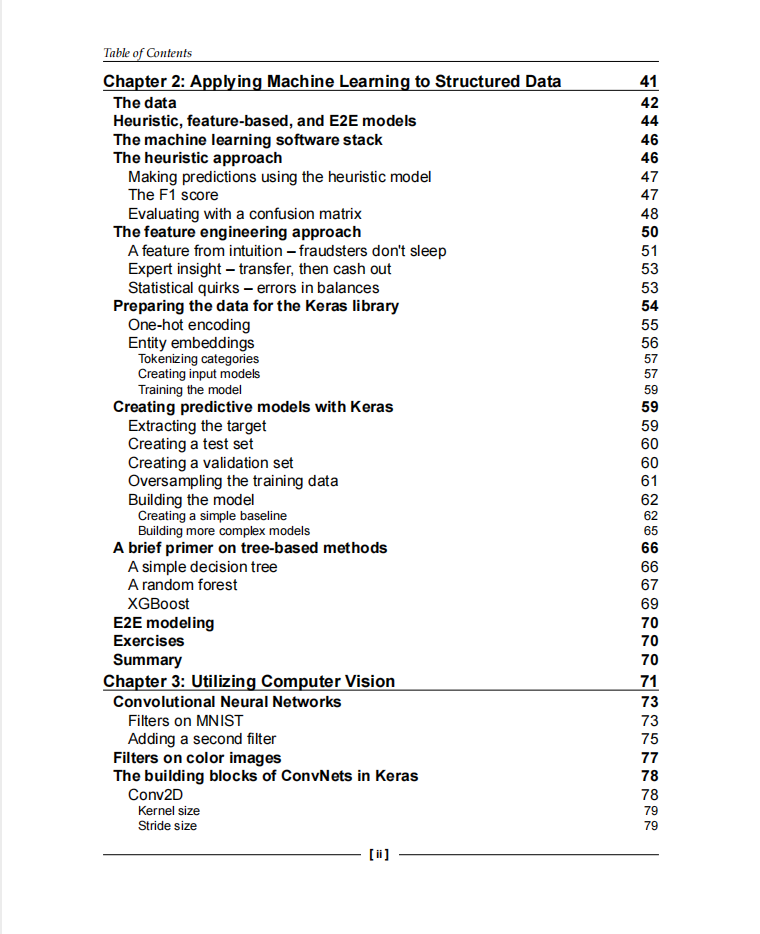
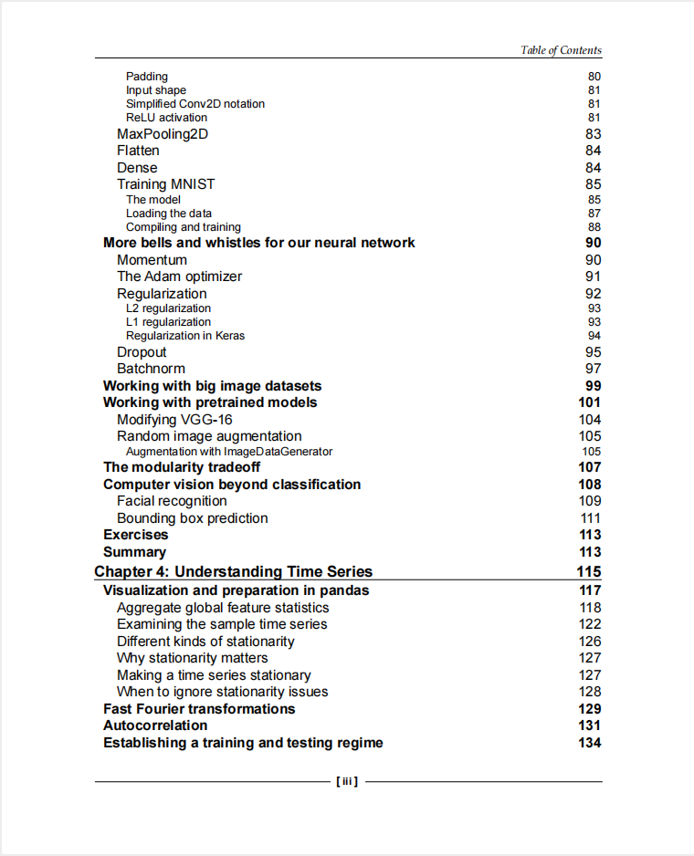
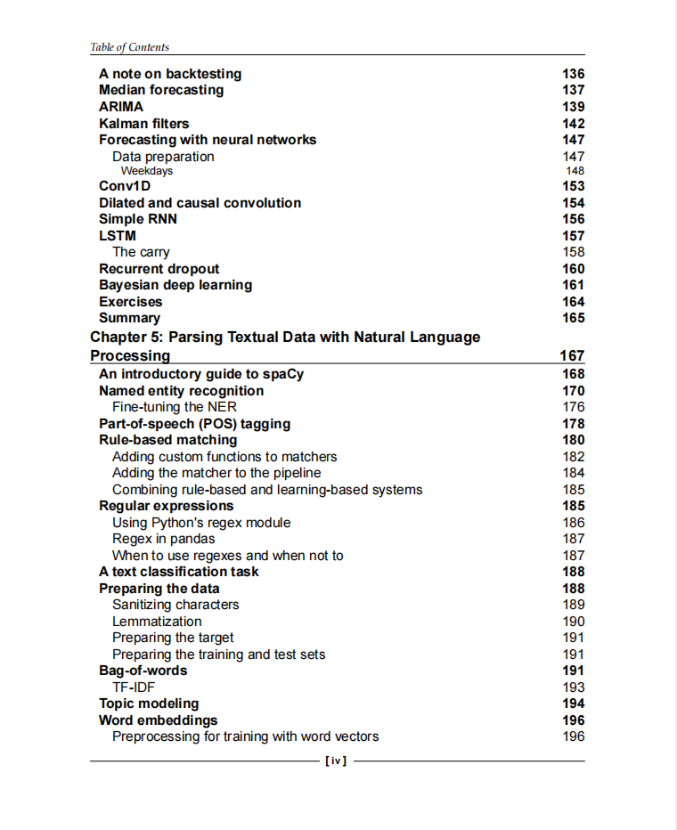
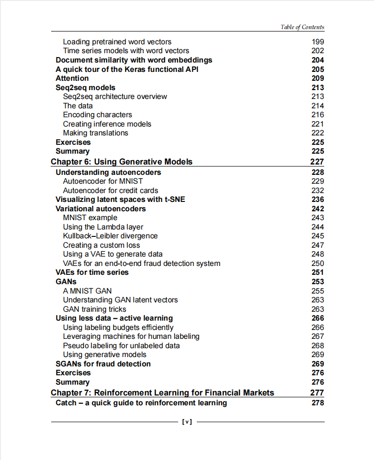
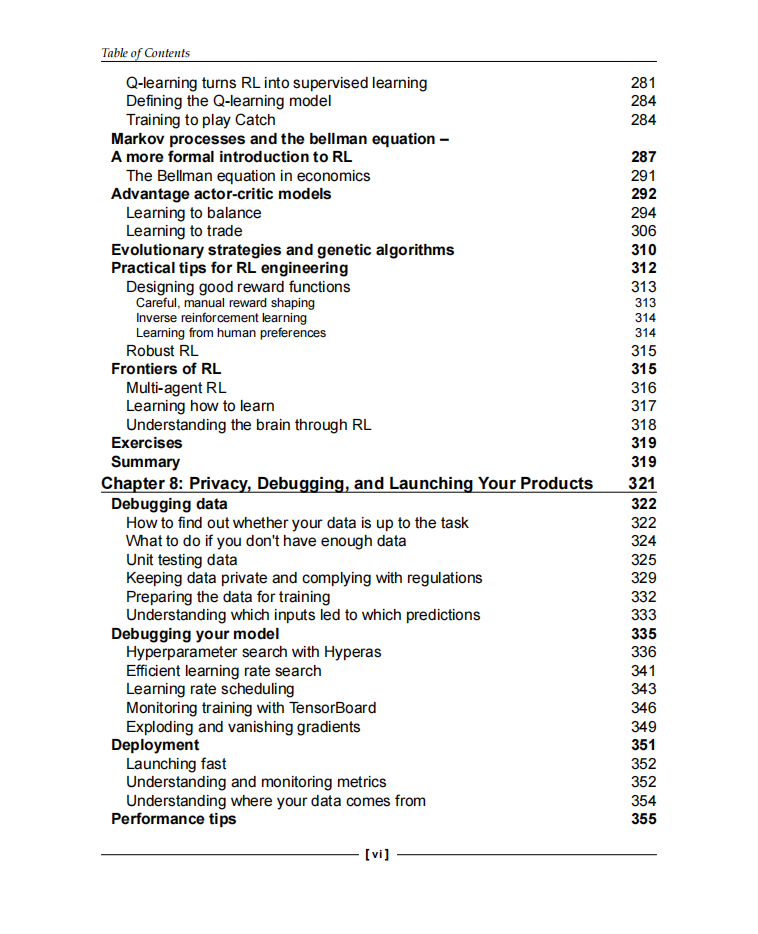
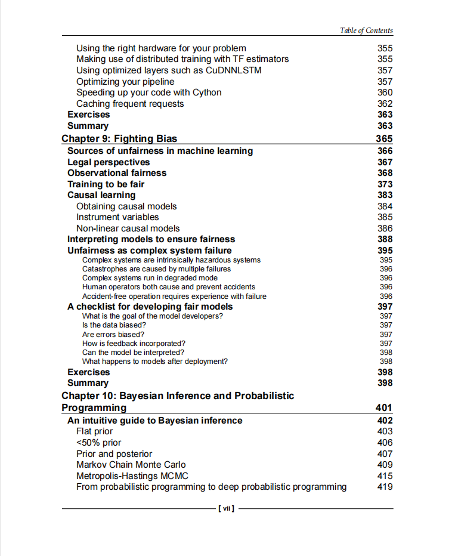
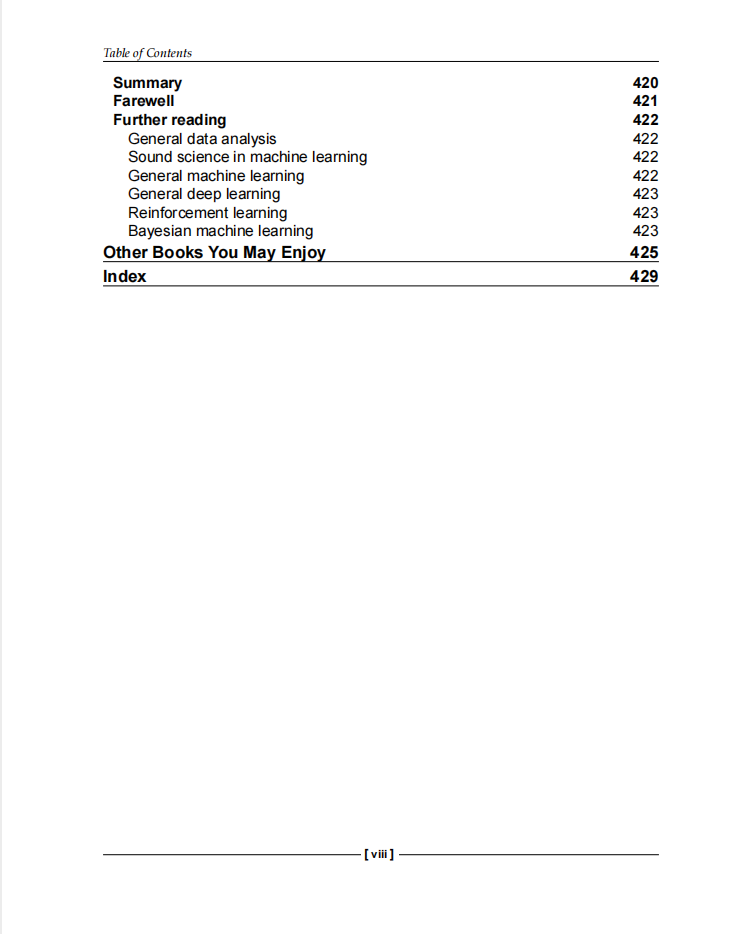

# Machine Learning for Finance

本书籍由[LLMQuant社区](https://llmquant.com/)整理, 并提供PDF下载, 只供学习交流使用, 版权归原作者所有。

- **作者**: Jannes Klaas
- **出版社**: Packt Publishing
- **出版年份**: 2019
- **难度**: ⭐⭐⭐⭐
- **推荐指数**: ⭐⭐⭐⭐⭐
- **PDF下载**: [点击下载](https://github.com/LLMQuant/asset/blob/main/Machine Learning for Finance.pdf)

### 内容简介

Machine Learning for Finance 是一本关于量化金融的专业书籍，深入探讨了机器学习在金融领域的应用。本书系统介绍了多种核心机器学习技术，包括监督学习、无监督学习、强化学习、深度学习，以及自然语言处理和时间序列分析等。书中详细阐述了这些数学技术在金融领域的具体应用，例如风险管理、投资组合优化、欺诈检测、金融趋势预测和客户情绪分析等。通过理论与实践相结合，并提供Python代码示例，本书旨在帮助量化分析师、算法交易员、金融工程师和数据科学家等专业人士掌握利用机器学习解决金融实际问题的能力。

### 核心章节

以下是本书的主要章节预览：

### 主要特点

- 理论与实践结合
- 包含详细示例
- 配套代码和资源
- 适合实际应用

### 适合人群

- 量化分析师
- 算法交易员
- 金融工程师
- 数据科学家

### 配套资源

- 示例代码
- 数据集
- 在线补充材料