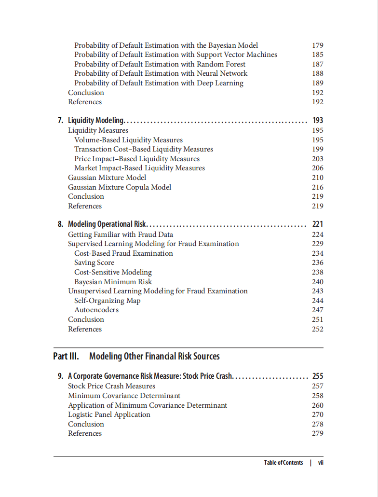

# Machine Learning for Financial Risk Management with Python

本书籍由[LLMQuant社区](https://llmquant.com/)整理, 并提供PDF下载, 只供学习交流使用, 版权归原作者所有。

- **作者**: Abdullah Karasan
- **出版社**: O'Reilly Media
- **出版年份**: 2021
- **难度**: ⭐⭐⭐⭐
- **推荐指数**: ⭐⭐⭐⭐⭐
- **PDF下载**: [点击下载](https://github.com/LLMQuant/asset/blob/main/Machine Learning for Financial Risk Management with Python.pdf)

### 内容简介

Machine Learning for Financial Risk Management with Python 是一本关于量化金融的专业书籍，涵盖了如何利用Python中的机器学习和深度学习模型来评估和管理金融风险。本书旨在帮助读者构建基于AI的金融建模实践技能，学习如何用机器学习模型替代传统的金融风险模型。书中深入探讨了多种数学技术及其在金融领域的应用，包括经典时间序列分析与深度学习模型的比较、使用支持向量回归、神经网络和深度学习进行波动率建模、利用机器学习技术改进市场风险模型（如VaR和ES），以及通过聚类和贝叶斯方法进行信用风险分析。此外，本书还涉及使用高斯混合模型和Copula模型捕捉流动性风险的不同方面，以及机器学习模型在欺诈检测和预测股价暴跌中的应用。

### 核心章节

以下是本书的主要章节预览：

### 主要特点

- 理论与实践结合
- 包含详细示例
- 配套代码和资源
- 适合实际应用

### 适合人群

- 量化分析师
- 算法交易员
- 金融工程师
- 数据科学家

### 配套资源

- 示例代码
- 数据集
- 在线补充材料