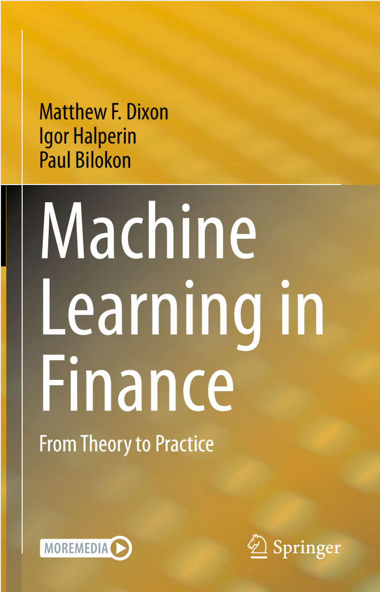
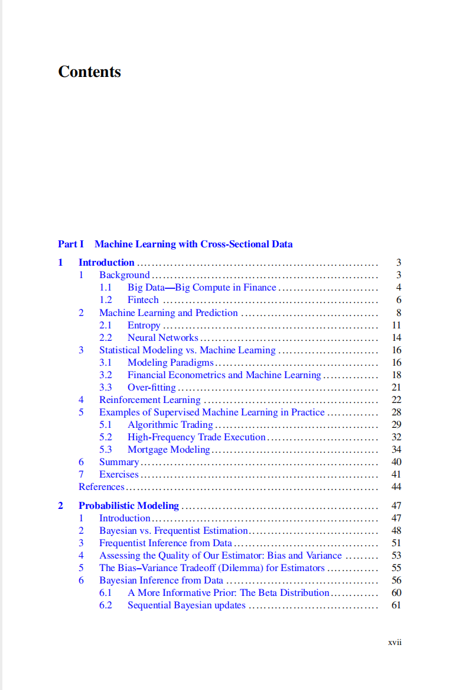
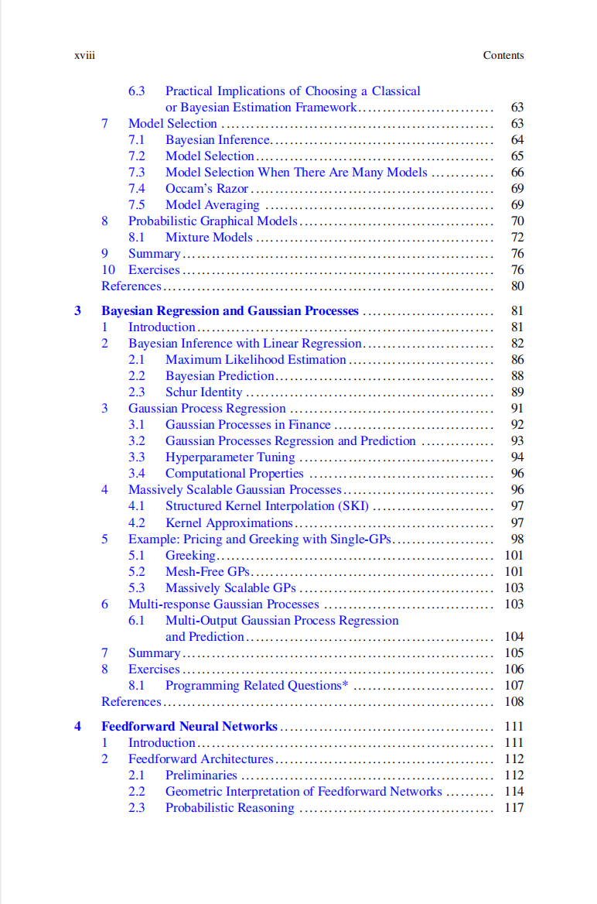
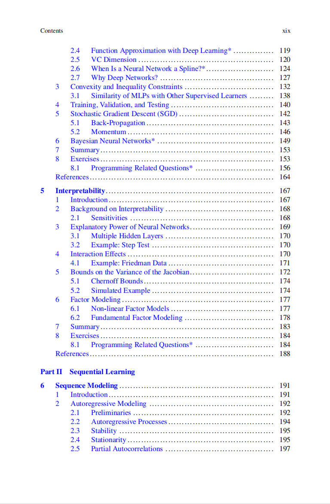
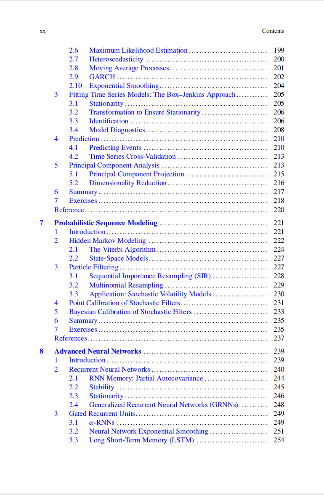
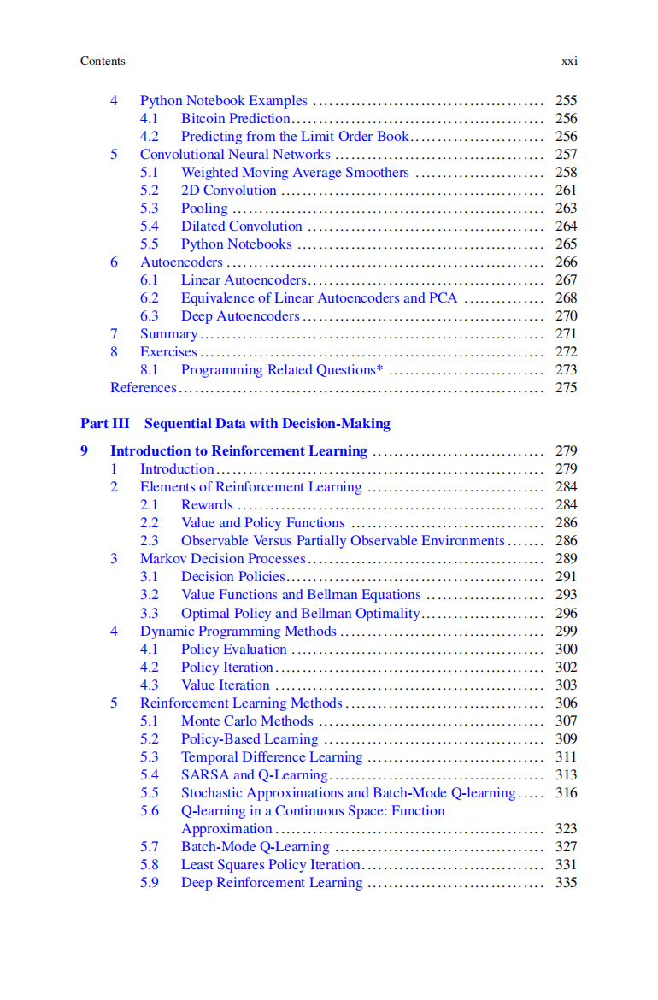
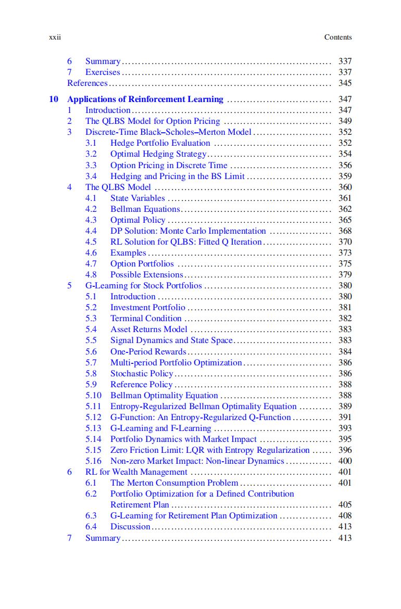
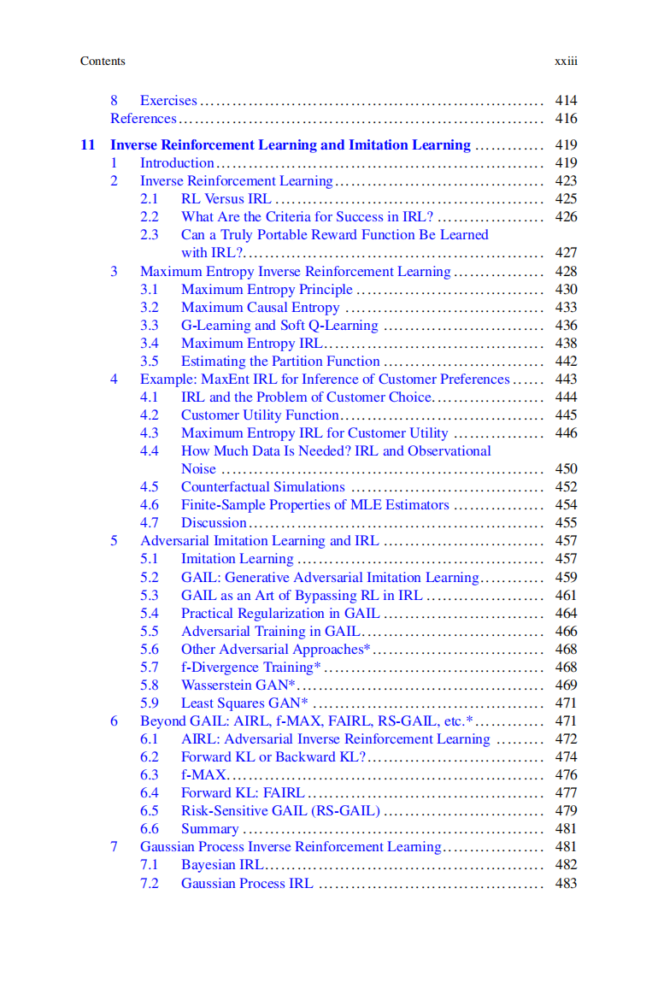

# Machine Learning in Finance- From Theory to Practice

本书籍由[LLMQuant社区](https://llmquant.com/)整理, 并提供PDF下载, 只供学习交流使用, 版权归原作者所有。

- **作者**: Matthew F. Dixon, Igor Halperin, Paul Bilokon
- **出版社**: Springer International Publishing
- **出版年份**: 2020
- **难度**: ⭐⭐⭐⭐
- **推荐指数**: ⭐⭐⭐⭐⭐
- **PDF下载**: [点击下载](https://asset.quant-wiki.com/pdf/Machine%20Learning%20in%20Finance_%20From%20Theory%20to%20Practice.pdf)

### 内容简介

《Machine Learning in Finance: From Theory to Practice》是一本关于量化金融的专业书籍，旨在介绍金融领域中的机器学习方法。本书将机器学习与金融计量经济学、离散时间随机控制等量化金融中的各种统计和计算学科进行统一处理，并强调理论和假设检验如何指导金融数据建模和决策中算法的选择。

本书分为三个主要部分，涵盖了理论和应用：
第一部分探讨了横截面数据的监督学习，包括贝叶斯和频率论视角，并重点介绍了神经网络（包括深度学习）和高斯过程，以及它们在投资管理和衍生品建模中的应用。
第二部分侧重于时间序列数据的监督学习，这是金融领域中最常见的数据类型之一，书中提供了在交易、随机波动率和固定收益建模方面的示例。
第三部分则介绍了强化学习及其在交易、投资和财富管理中的应用。

本书涵盖的主要数学技术包括概率建模、贝叶斯回归、高斯过程、前馈神经网络、循环神经网络以及强化学习。它还讨论了模型可解释性、因子建模以及机器学习在金融领域的前沿应用。 随着计算资源和数据集的不断增长，机器学习已成为金融行业的一项重要技能。

### 核心章节

以下是本书的主要章节预览：

### 主要特点

- 理论与实践结合
- 包含详细示例
- 配套代码和资源
- 适合实际应用

### 适合人群

- 量化分析师
- 算法交易员
- 金融工程师
- 数据科学家

### 配套资源

- 示例代码
- 数据集
- 在线补充材料