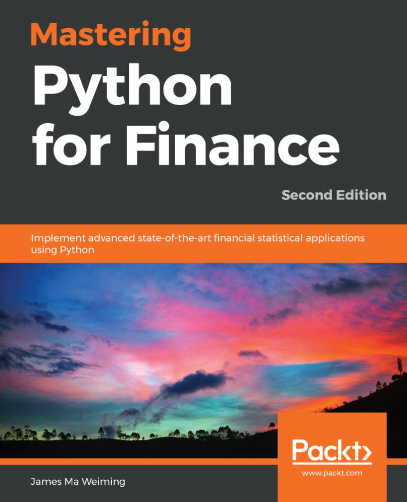
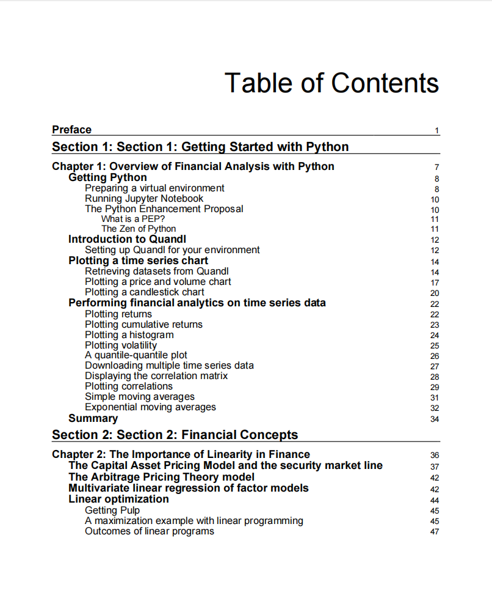
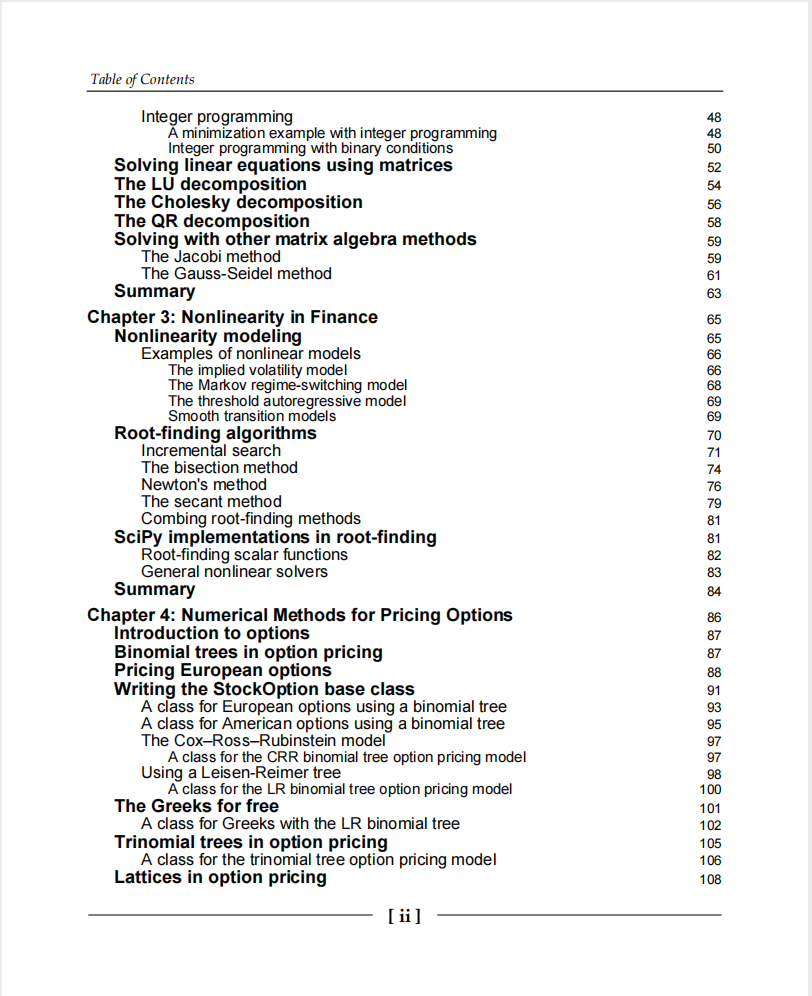
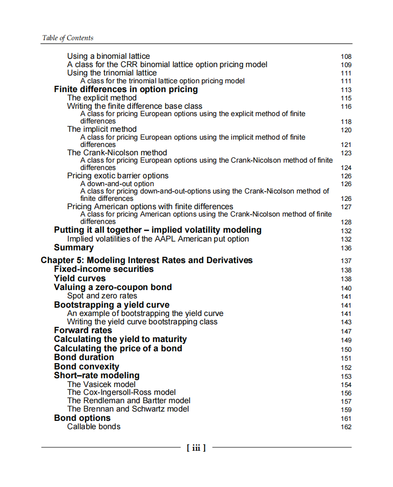
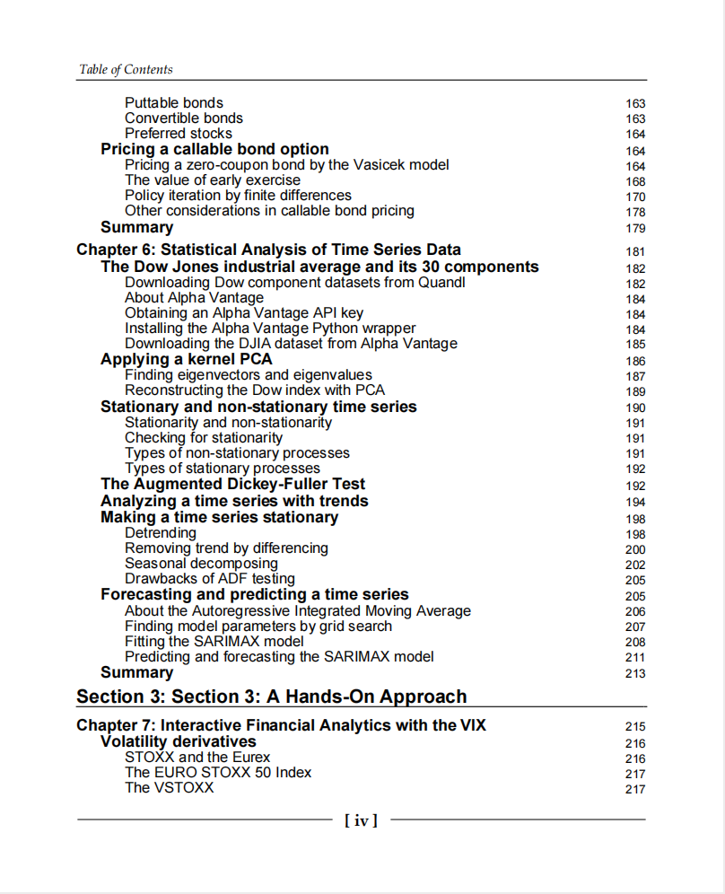
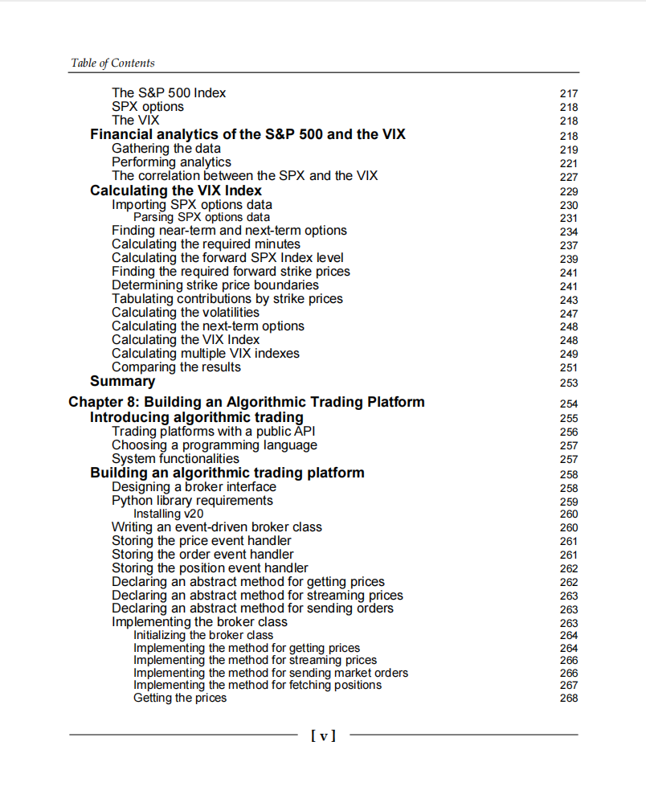
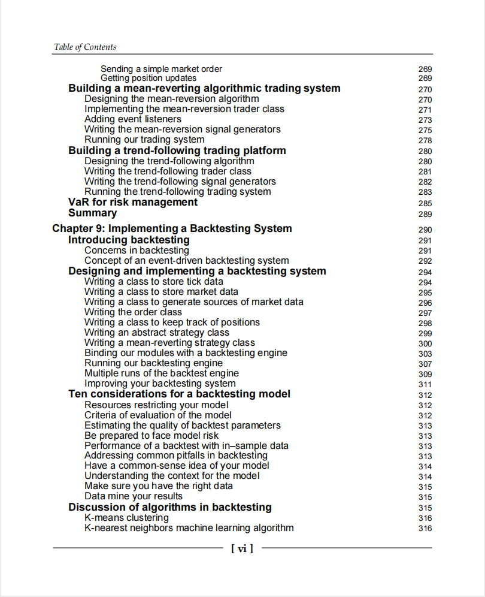
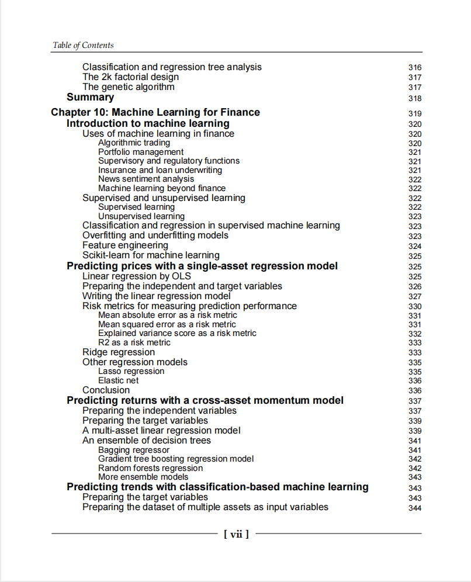
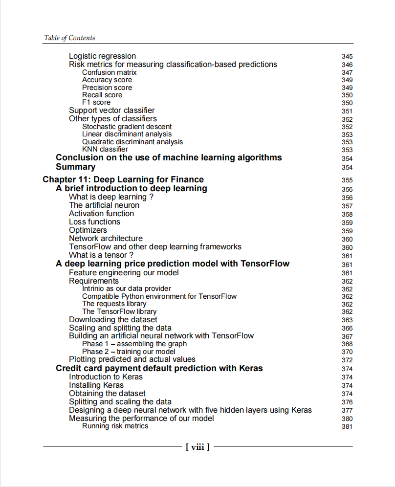

# Mastering Python for Finance- Implement advanced state-of-the-art financial statistical applications using Python

本书籍由[LLMQuant社区](https://llmquant.com/)整理, 并提供PDF下载, 只供学习交流使用, 版权归原作者所有。

- **作者**: James Ma Weiming
- **出版社**: Packt Publishing
- **出版年份**: 2019
- **难度**: ⭐⭐⭐⭐
- **推荐指数**: ⭐⭐⭐⭐⭐
- **PDF下载**: [点击下载](https://github.com/LLMQuant/asset/blob/main/Mastering Python for Finance_ Implement advanced state-of-the-art financial statistical applications using Python.pdf)

### 内容简介

Mastering Python for Finance- Implement advanced state-of-the-art financial statistical applications using Python 是一本关于量化金融的专业书籍，涵盖了使用Python进行复杂金融计算、研究、建模和风险管理的先进方法。本书旨在引导读者掌握Python生态系统，利用NumPy, SciPy, scikit-learn, TensorFlow和Keras等流行库进行数据驱动的金融决策。内容包括解决线性和非线性金融模型、对道琼斯指数及其成分股进行主成分分析、分析和预测时间序列过程、创建事件驱动的回测工具、构建高频算法交易平台，以及应用机器学习和深度学习技术于金融领域.

### 核心章节

以下是本书的主要章节预览：

### 主要特点

- 理论与实践结合
- 包含详细示例
- 配套代码和资源
- 适合实际应用

### 适合人群

- 量化分析师
- 算法交易员
- 金融工程师
- 数据科学家

### 配套资源

- 示例代码
- 数据集
- 在线补充材料