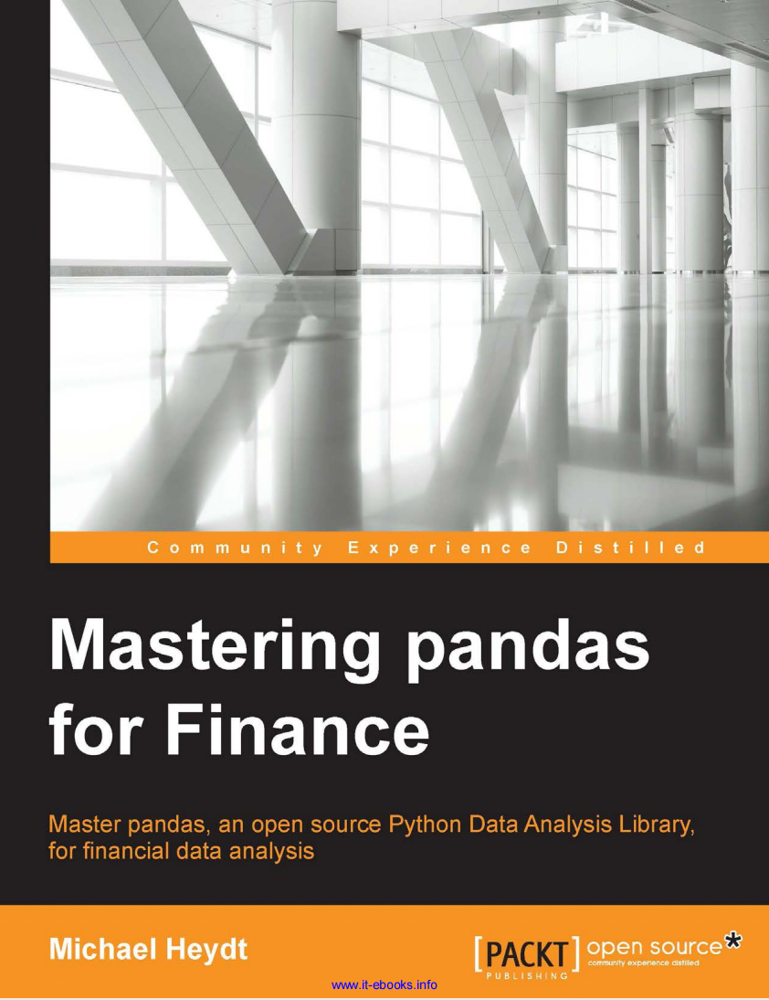
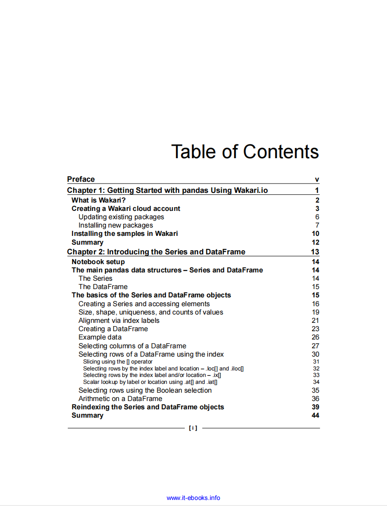
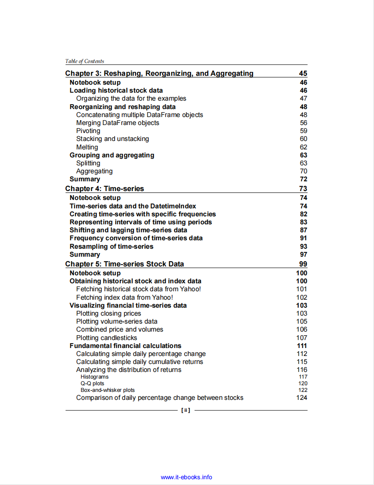
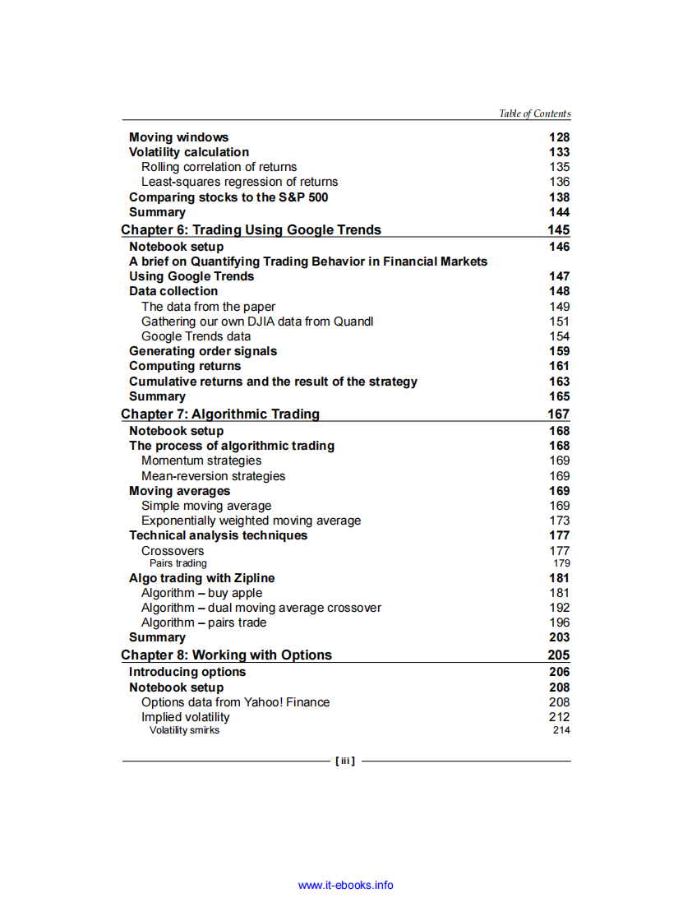
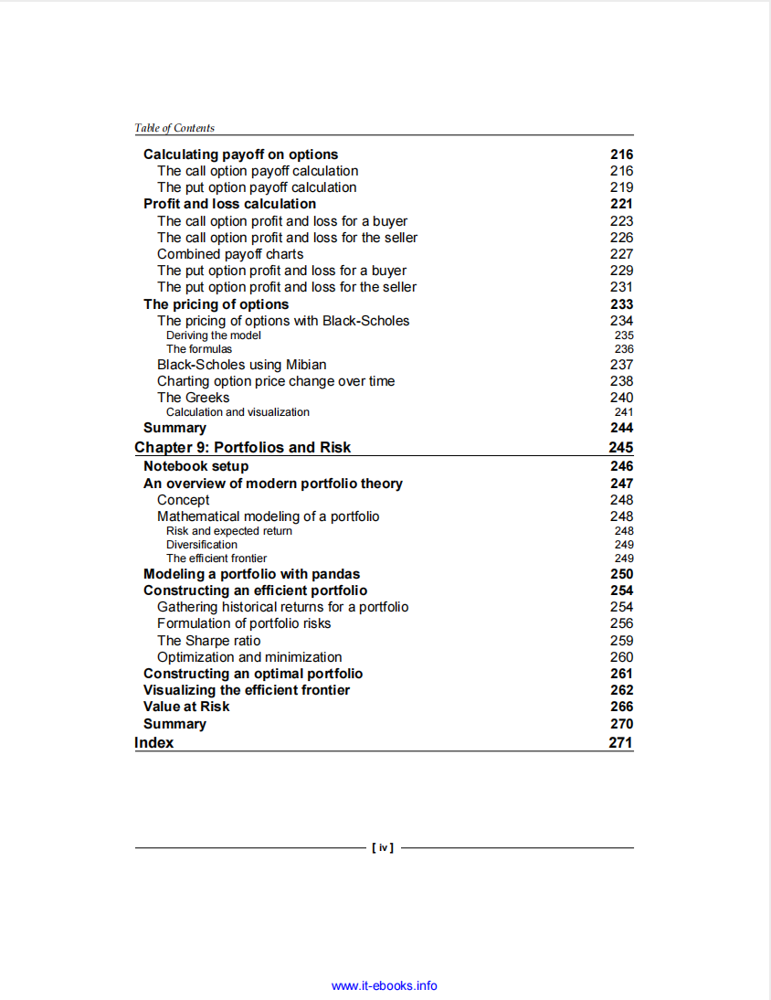

# Mastering pandas for Finance

本书籍由[LLMQuant社区](https://llmquant.com/)整理, 并提供PDF下载, 只供学习交流使用, 版权归原作者所有。

- **作者**: Michael Heydt
- **出版社**: Packt Publishing
- **出版年份**: 2015
- **难度**: ⭐⭐⭐⭐
- **推荐指数**: ⭐⭐⭐⭐⭐
- **PDF下载**: [点击下载](https://github.com/LLMQuant/asset/blob/main/Mastering pandas for Finance_ Master pandas, an open source Python Data Analysis Library, for financial data analysis.pdf)

### 内容简介

Mastering pandas for Finance 是一本关于量化金融的专业书籍，涵盖了如何使用Python及其强大的数据分析库pandas来解决实际金融问题。本书从pandas数据结构的基础入手，逐步深入到金融时间序列数据的加载、操作和常见金融指标的计算，并进一步探讨了使用固定窗口和移动窗口进行高级数据衍生。读者将学习如何利用pandas进行数据索引、分组和统计结果计算，以及如何计算累计收益并进行数据关联（例如与指数和社交数据）。书中还详细介绍了算法交易策略的构建与回测，包括动量和均值回归策略，以及期权定价（如Black-Scholes模型）和风险价值（VaR）的计算。此外，本书还涵盖了金融投资组合的建模与优化，包括现代投资组合理论和有效前沿的构建。所有概念都通过交互式Python和IPython Notebook中的渐进式示例进行演示，旨在帮助读者将pandas应用于金融领域的各种实际问题中。

### 核心章节

以下是本书的主要章节预览：

### 主要特点

- 理论与实践结合
- 包含详细示例
- 配套代码和资源
- 适合实际应用

### 适合人群

- 量化分析师
- 算法交易员
- 金融工程师
- 数据科学家

### 配套资源

- 示例代码
- 数据集
- 在线补充材料