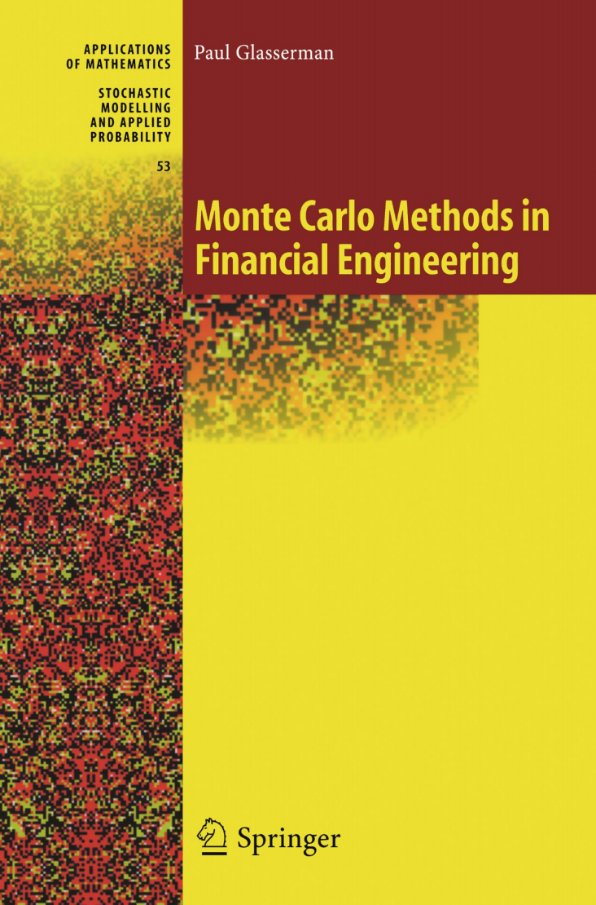
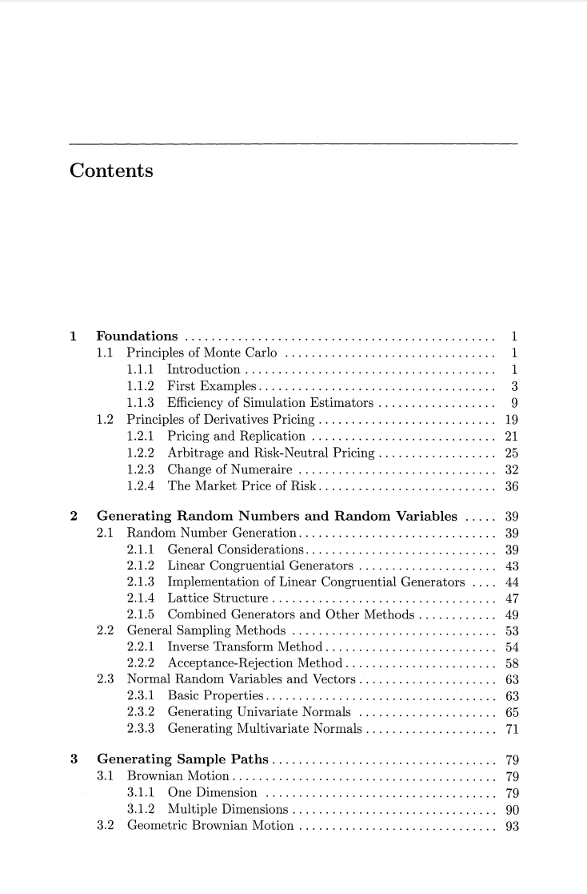
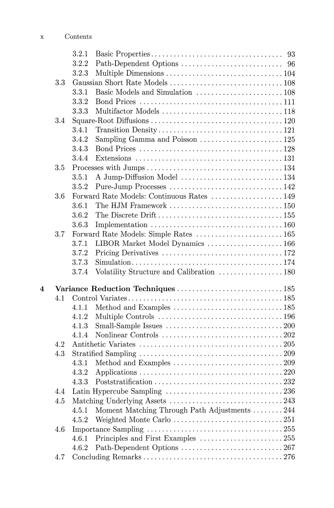
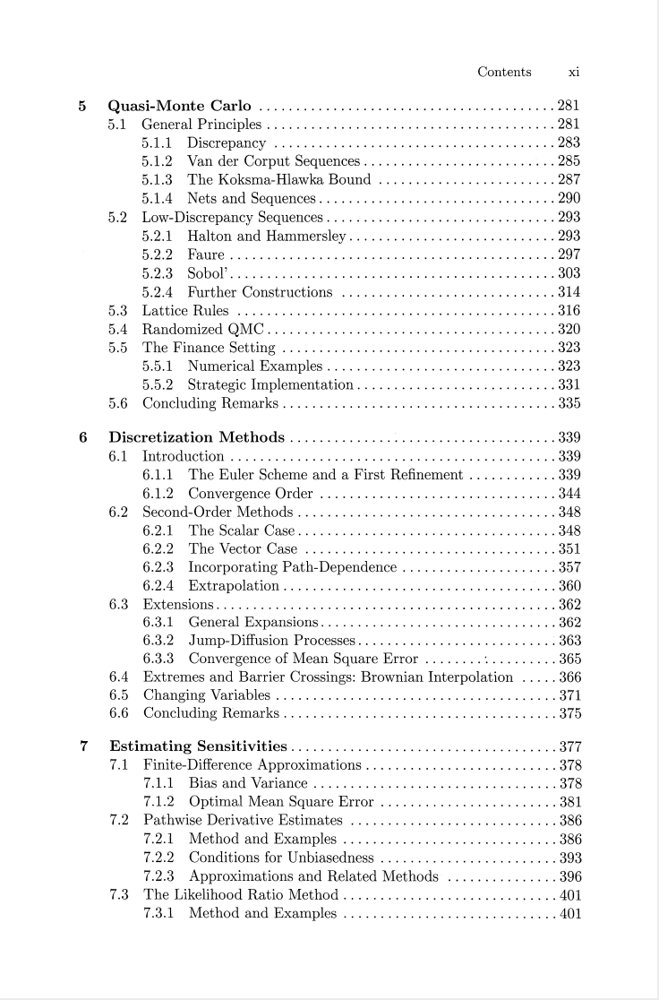
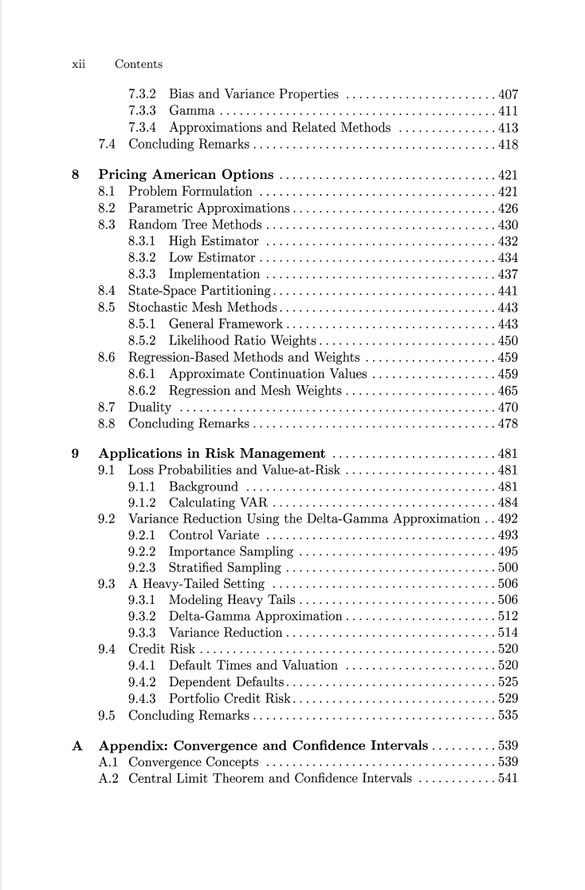
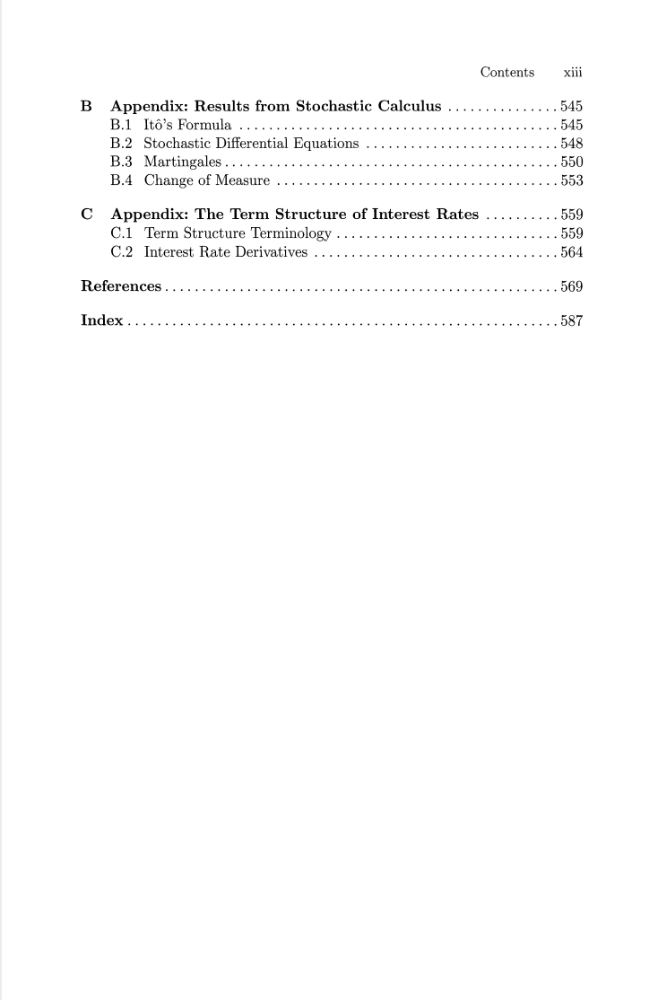

# Monte Carlo Methods in Financial Engineering

本书籍由[LLMQuant社区](https://llmquant.com/)整理, 并提供PDF下载, 只供学习交流使用, 版权归原作者所有。

- **作者**: Paul Glasserman
- **出版社**: Springer New York
- **出版年份**: 2003
- **难度**: ⭐⭐⭐⭐
- **推荐指数**: ⭐⭐⭐⭐⭐
- **PDF下载**: [点击下载](https://asset.quant-wiki.com/pdf/Monte%20Carlo%20Methods%20in%20Financial%20Engineering.pdf)

### 内容简介

Monte Carlo Methods in Financial Engineering 是一本关于量化金融的专业书籍，涵盖了蒙特卡洛方法在金融工程中的应用。本书首先介绍了蒙特卡洛方法的基础知识，包括随机数和随机变量的生成以及样本路径的生成。随后，深入探讨了提高模拟精度和效率的技术，如方差缩减技术和准蒙特卡洛方法。本书的核心在于将这些蒙特卡洛技术应用于金融领域，特别是衍生品定价（包括美式期权）和风险管理（如市场风险和信用风险）等实际问题。书中包含了详细的示例，并结合了理论与实践，适合需要将蒙特卡洛模拟应用于金融建模和分析的读者。

### 核心章节

以下是本书的主要章节预览：

### 主要特点

- 理论与实践结合
- 包含详细示例
- 配套代码和资源
- 适合实际应用

### 适合人群

- 量化分析师
- 算法交易员
- 金融工程师
- 数据科学家

### 配套资源

- 示例代码
- 数据集
- 在线补充材料