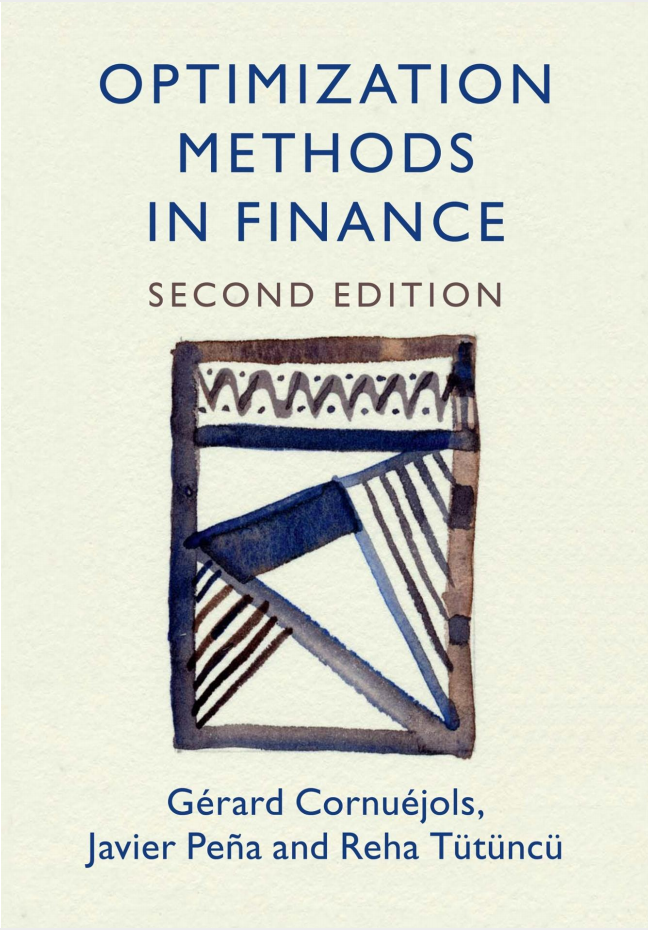
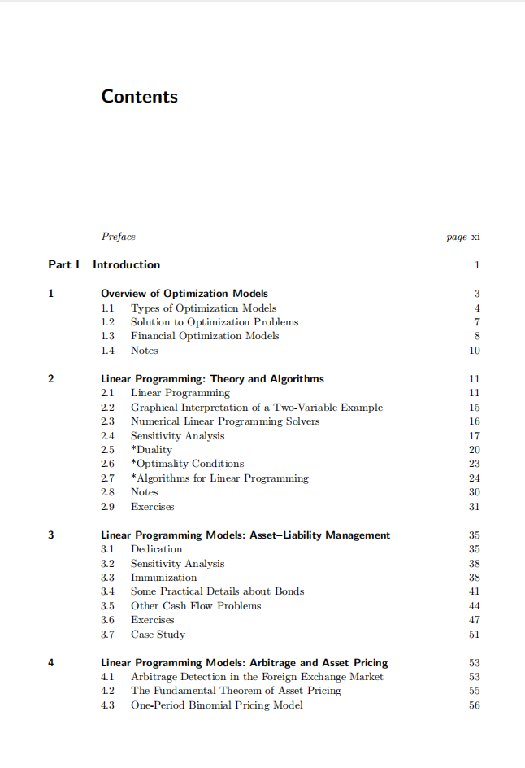
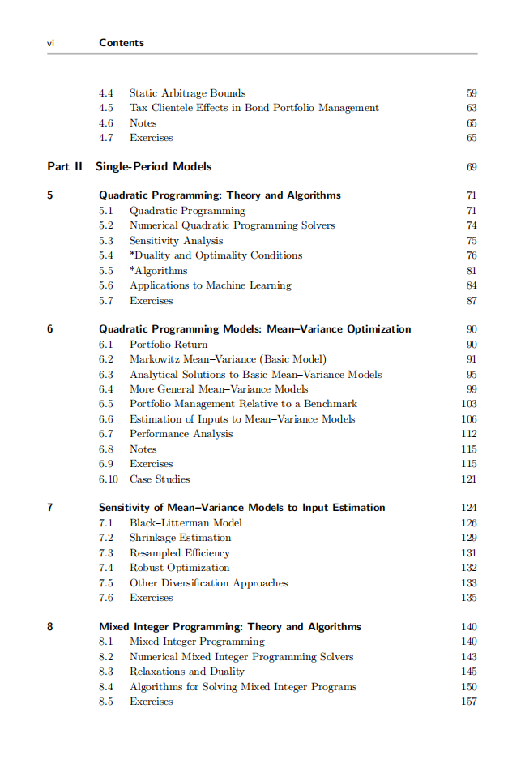
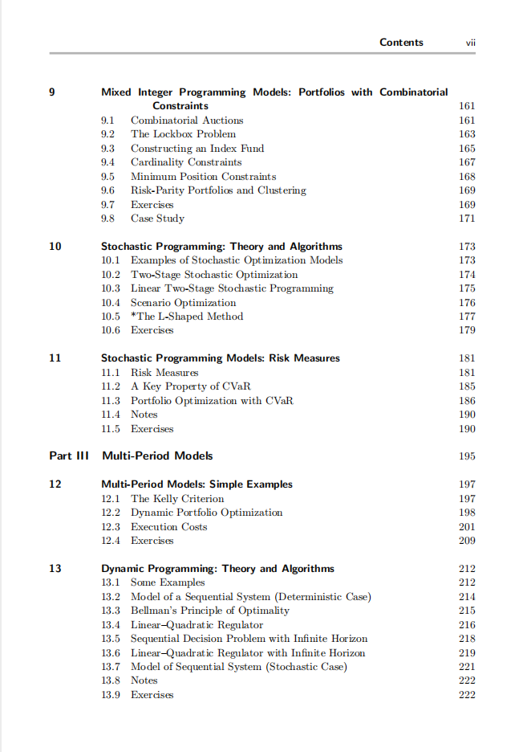
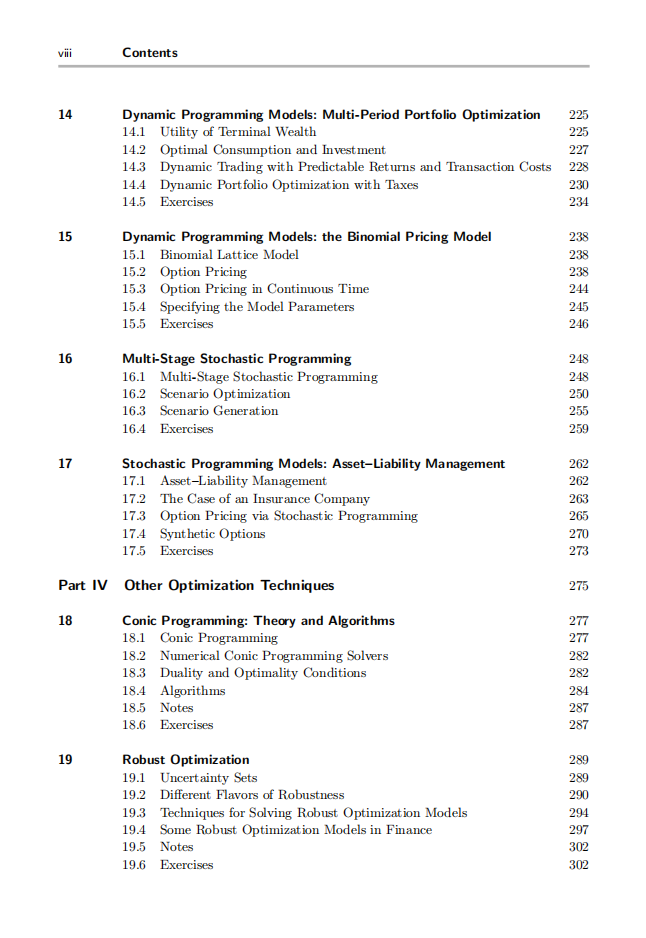
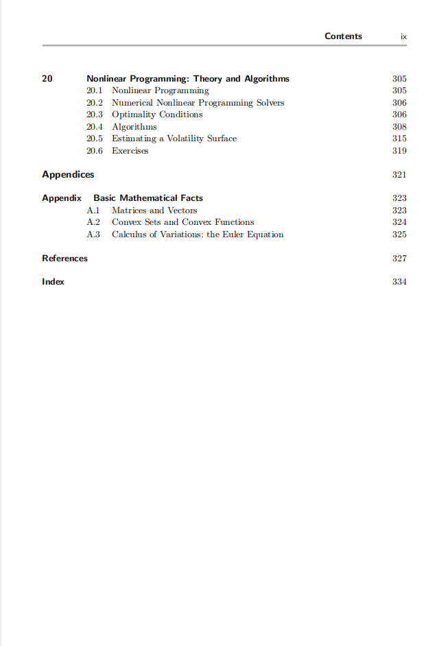

# Optimization Methods in Finance

本书籍由[LLMQuant社区](https://llmquant.com/)整理, 并提供PDF下载, 只供学习交流使用, 版权归原作者所有。

- **作者**: Gérard Cornuéjols, Javier Peña, Reha Tütüncü
- **出版社**: Cambridge University Press
- **出版年份**: 2018
- **难度**: ⭐⭐⭐⭐
- **推荐指数**: ⭐⭐⭐⭐⭐
- **PDF下载**: [点击下载](https://github.com/LLMQuant/asset/blob/main/Optimization Methods in Finance（第二版）.pdf)

### 内容简介

Optimization Methods in Finance 是一本关于量化金融的专业书籍，涵盖了优化理论、算法和软件如何高效地解决计算金融中的问题。本书深入探讨了多种优化方法，包括线性规划、二次规划、混合整数规划、随机规划、动态规划、锥规划、鲁棒优化和非线性规划等，并详细阐述了它们在金融领域的广泛应用。主要应用包括经典的均值-方差投资组合优化、多期模型、资产负债管理、风险管理（如VaR和CVaR）、期权定价、最优交易执行、以及考虑交易成本和税费的动态投资组合分配等。本书理论与实践相结合，旨在为数学、运筹学或金融工程背景的学生、学者和从业者提供一个坚实的优化技术基础及其在金融建模中的实际应用。

### 核心章节

以下是本书的主要章节预览：

### 主要特点

- 理论与实践结合
- 包含详细示例
- 配套代码和资源
- 适合实际应用

### 适合人群

- 量化分析师
- 算法交易员
- 金融工程师
- 数据科学家

### 配套资源

- 示例代码
- 数据集
- 在线补充材料