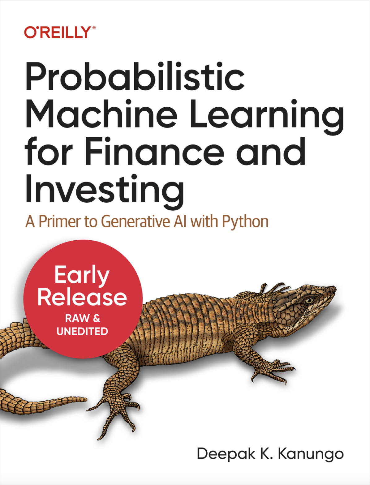
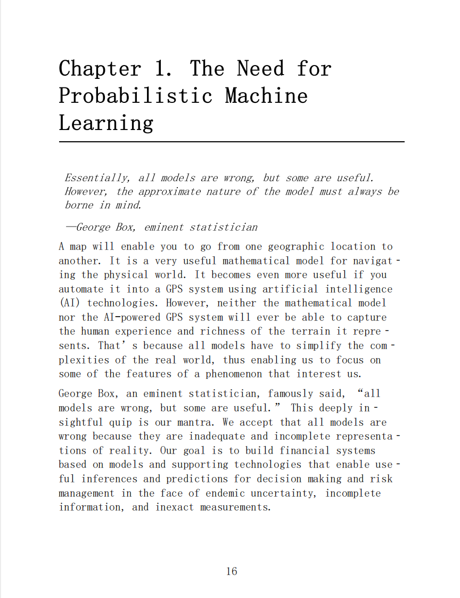
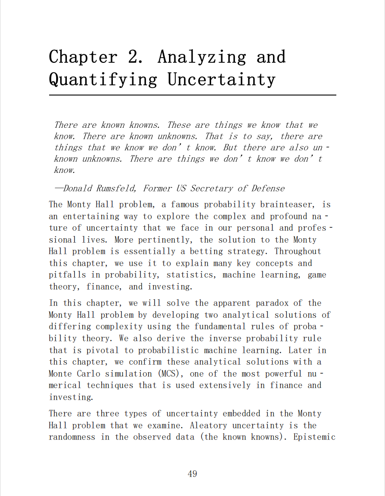
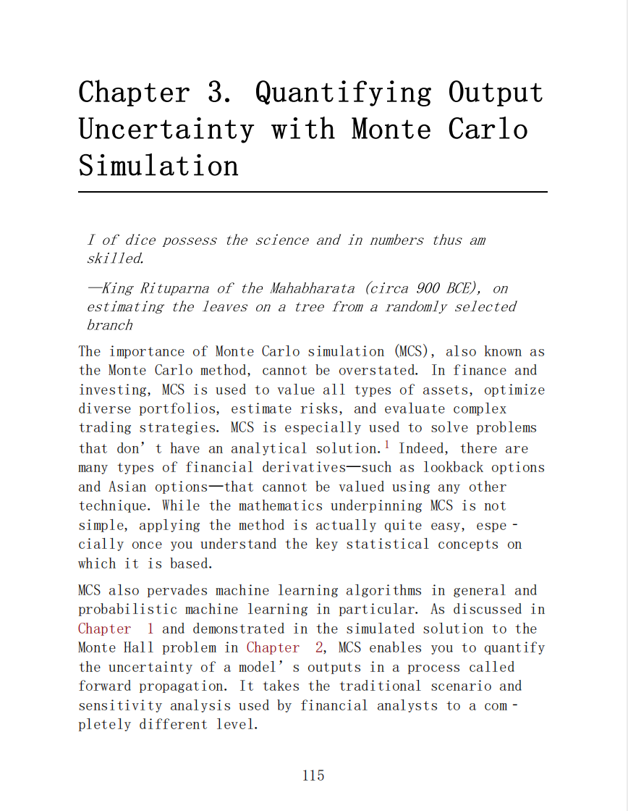
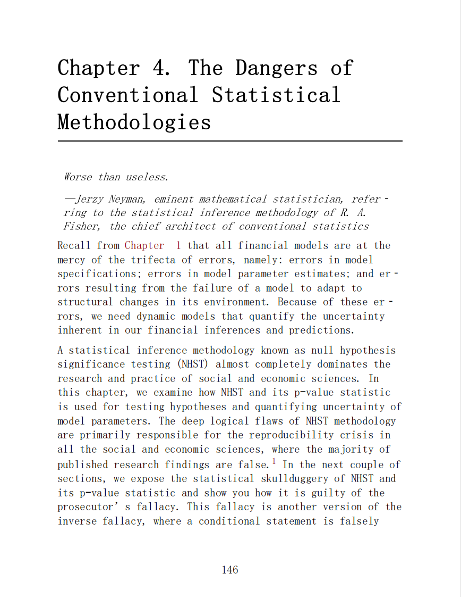
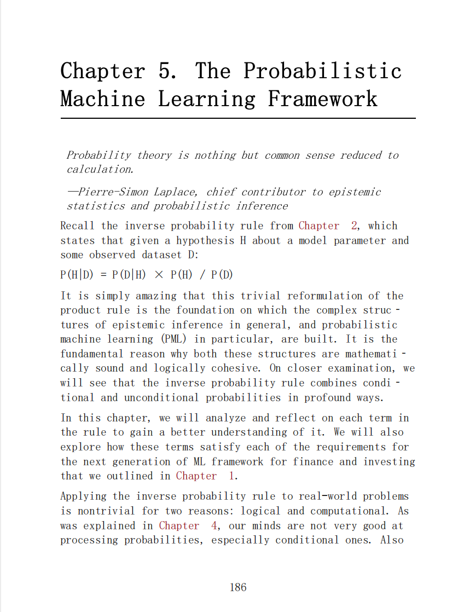
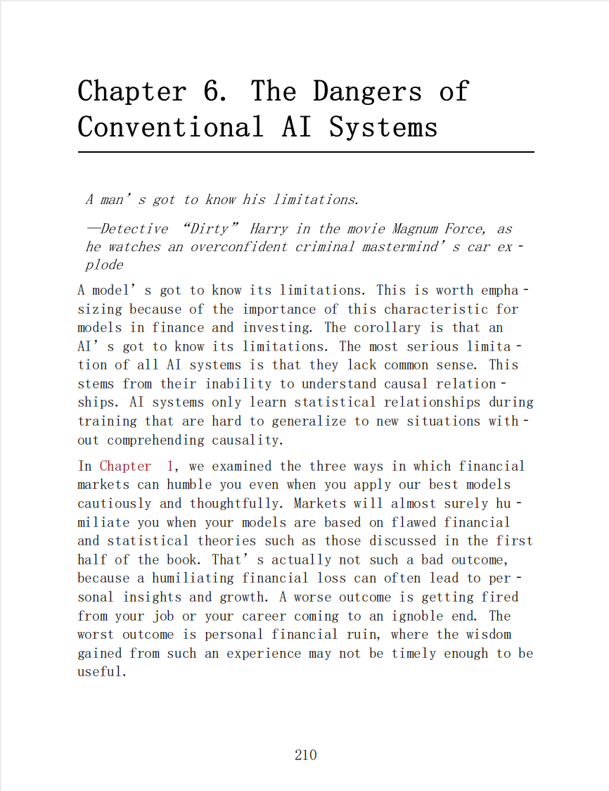
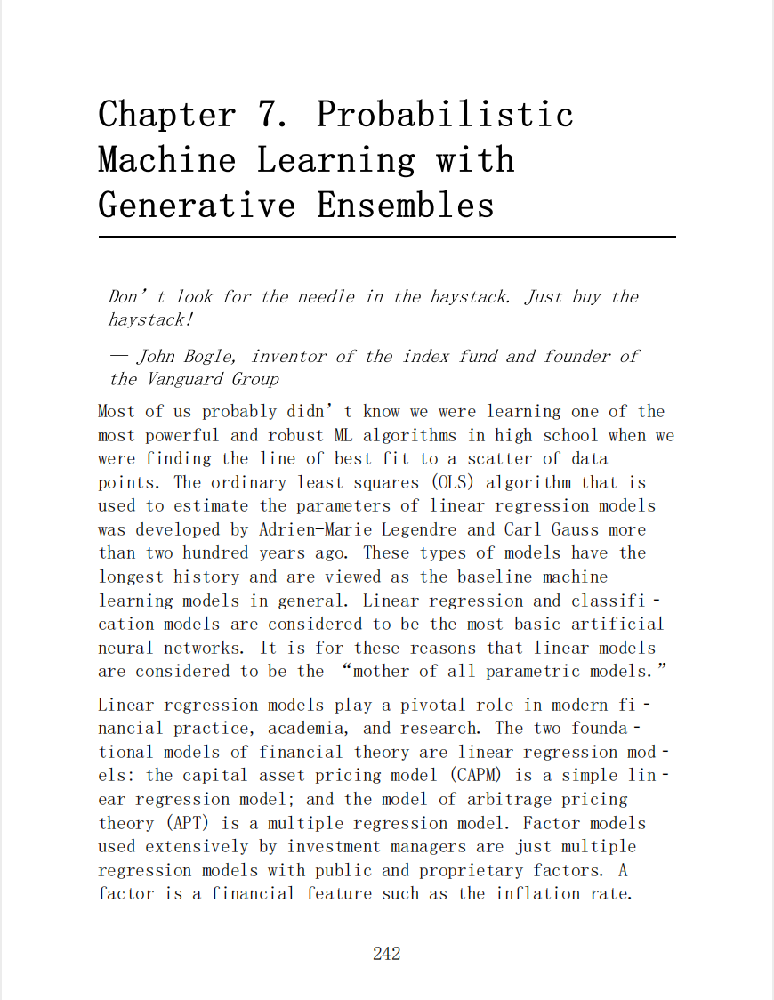
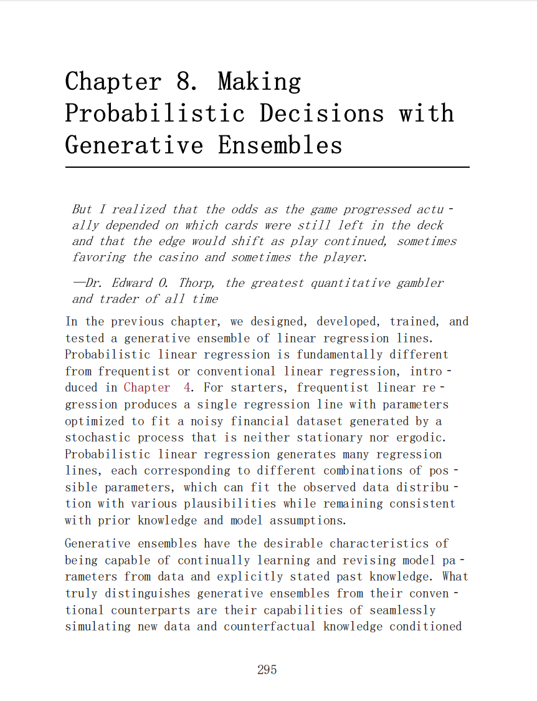

# Probabilistic Machine Learning for Finance and Investing

本书籍由[LLMQuant社区](https://llmquant.com/)整理, 并提供PDF下载, 只供学习交流使用, 版权归原作者所有。

- **作者**: Deepak K. Kanungo
- **出版社**: O'Reilly Media
- **出版年份**: 2023
- **难度**: ⭐⭐⭐⭐
- **推荐指数**: ⭐⭐⭐⭐⭐
- **PDF下载**: [点击下载](https://asset.quant-wiki.com/pdf/Probabilistic%20Machine%20Learning%20for%20Finance%20and%20Investing.pdf)

### 内容简介

Probabilistic Machine Learning for Finance and Investing 是一本关于量化金融的专业书籍，涵盖了概率机器学习在金融和投资领域的应用，并作为生成式AI的入门指南。本书深入探讨了概率机器学习系统如何将金融系统中的不确定性和错误视为特征而非缺陷，并通过概率分布而非点估计来量化不确定性。它强调了这些系统能够提供现实的金融推断和预测，对于决策制定和风险管理至关重要。

本书旨在引导读者摆脱有缺陷的传统统计方法和对概率的限制性观点，转而采用一种将概率视为逻辑的直观视角，并在公理化的统计框架内全面且成功地量化不确定性。书中涵盖的主要数学技术包括概率论、蒙特卡洛模拟、以及生成式集成学习（Generative Ensembles）等，并详细阐述了它们在金融领域的应用，如不确定性分析、风险管理和资本配置决策.

### 核心章节

以下是本书的主要章节预览：

### 主要特点

- 理论与实践结合
- 包含详细示例
- 配套代码和资源
- 适合实际应用

### 适合人群

- 量化分析师
- 算法交易员
- 金融工程师
- 数据科学家

### 配套资源

- 示例代码
- 数据集
- 在线补充材料