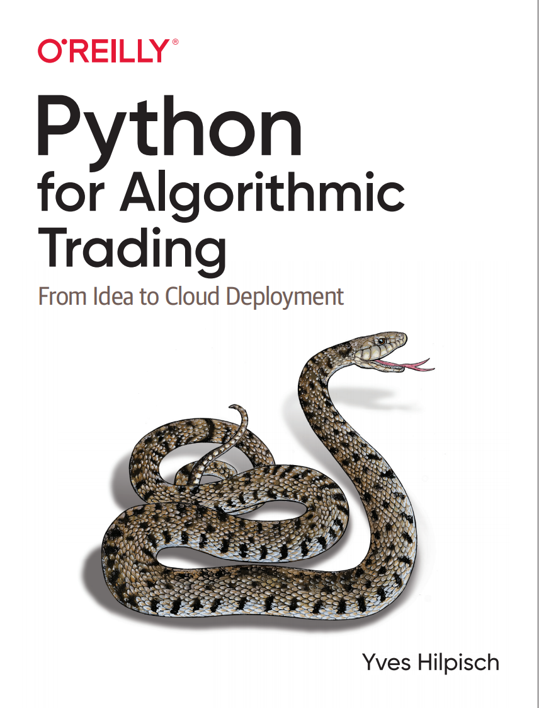
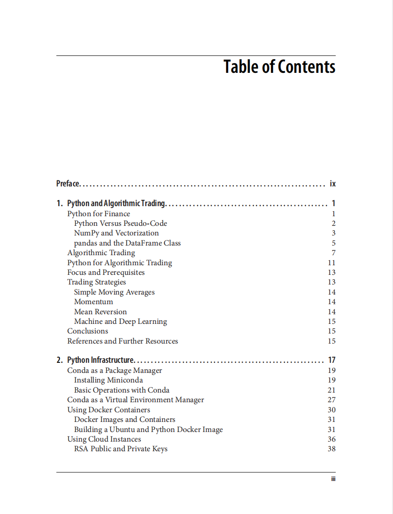
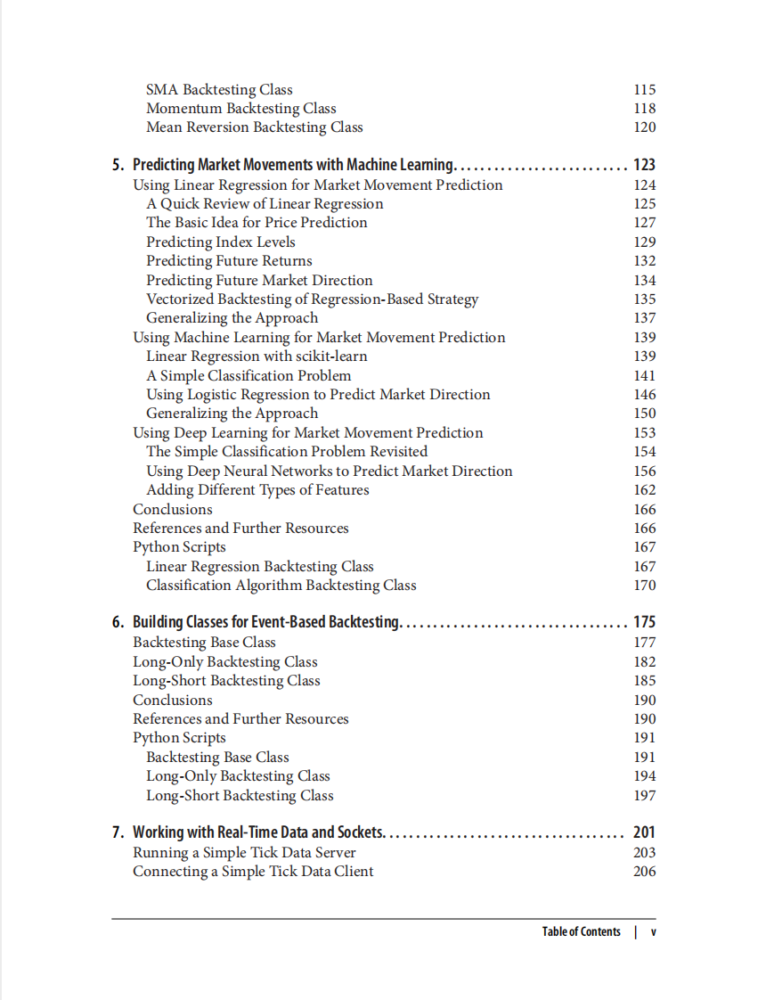
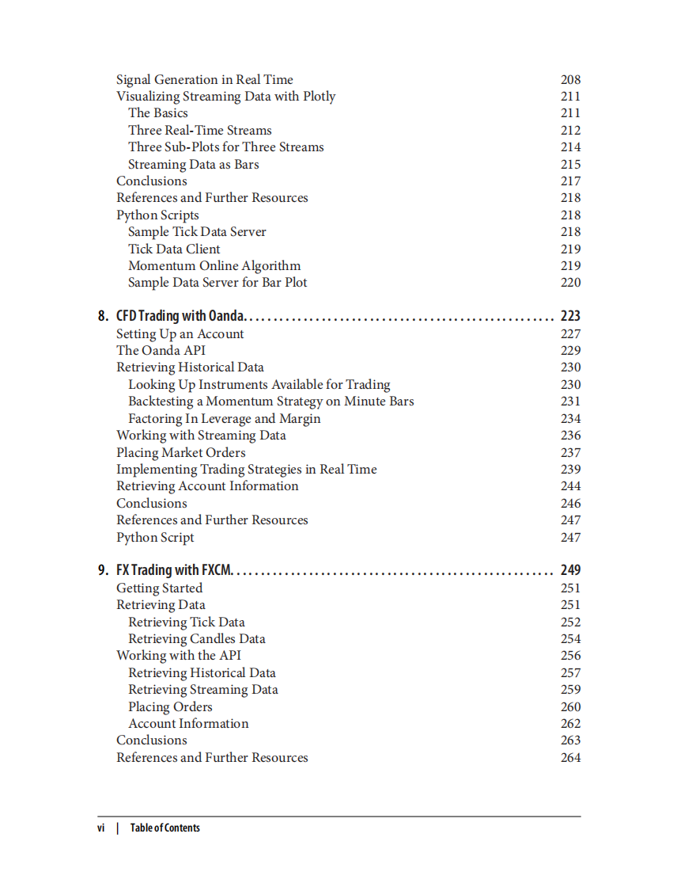
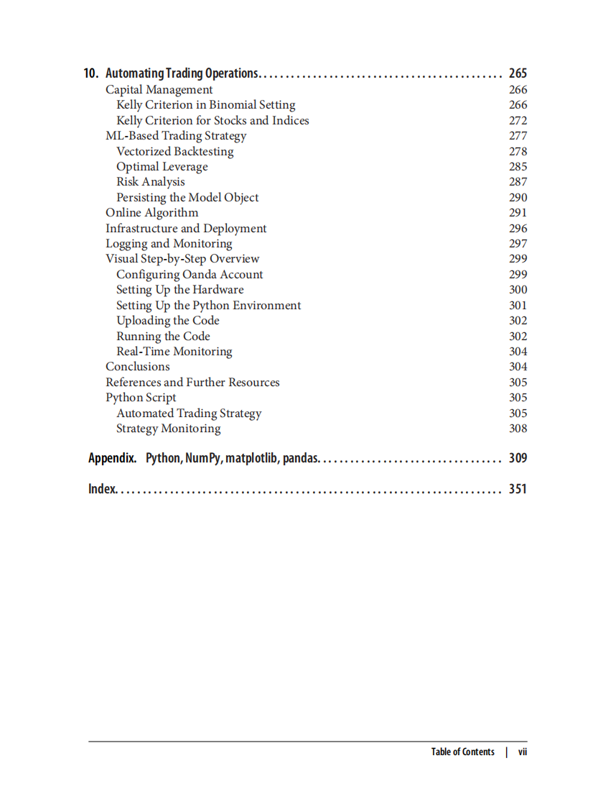

# Python for Algorithmic Trading

本书籍由[LLMQuant社区](https://llmquant.com/)整理, 并提供PDF下载, 只供学习交流使用, 版权归原作者所有。

- **作者**: Yves Hilpisch
- **出版社**: O'Reilly Media
- **出版年份**: 2020
- **难度**: ⭐⭐⭐⭐
- **推荐指数**: ⭐⭐⭐⭐⭐
- **PDF下载**: [点击下载](https://github.com/LLMQuant/asset/blob/main/Python for Algorithmic Trading_ From Idea to Cloud Deployment.pdf)

### 内容简介

Python for Algorithmic Trading 是一本关于量化金融的专业书籍，涵盖了如何利用Python及其强大的生态系统进行算法交易。本书旨在帮助学生、学者和从业者掌握在算法交易领域应用Python的多种方法。内容包括搭建Python交易环境、从公共和专有数据源获取金融数据、使用NumPy和pandas进行金融数据分析的向量化技术、掌握不同算法交易策略的向量化回测、利用机器学习和深度学习生成市场预测，以及使用套接字编程工具处理流式实时数据。此外，本书还指导读者如何通过OANDA和FXCM等交易平台实现自动化算法交易策略，从而系统地构建和部署自动化算法交易策略。

### 核心章节

以下是本书的主要章节预览：

### 主要特点

- 理论与实践结合
- 包含详细示例
- 配套代码和资源
- 适合实际应用

### 适合人群

- 量化分析师
- 算法交易员
- 金融工程师
- 数据科学家

### 配套资源

- 示例代码
- 数据集
- 在线补充材料