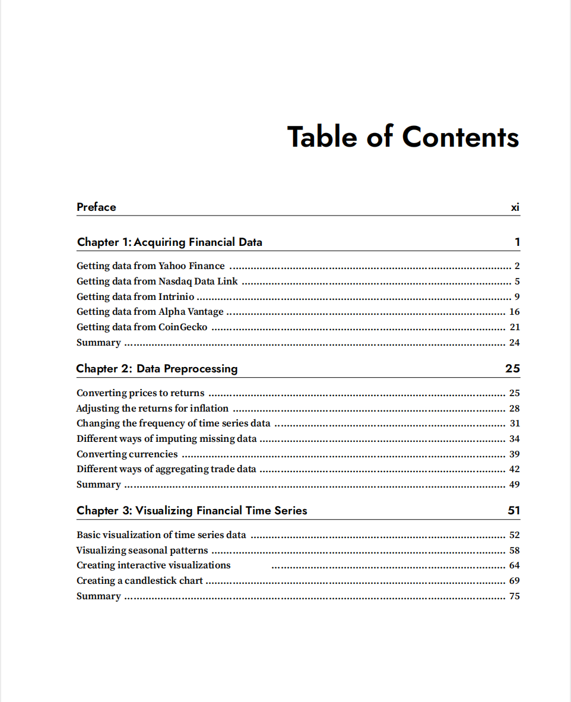

# Python for Finance Cookbook

本书籍由[LLMQuant社区](https://llmquant.com/)整理, 并提供PDF下载, 只供学习交流使用, 版权归原作者所有。

- **作者**: Eryk Lewinson
- **出版社**: Packt Publishing
- **出版年份**: 2022
- **难度**: ⭐⭐⭐⭐
- **推荐指数**: ⭐⭐⭐⭐⭐
- **PDF下载**: [点击下载](https://github.com/LLMQuant/asset/blob/main/Python for Finance Cookbook_ Over 80 powerful recipes for effective financial data analysis, 2nd Edition.pdf)

### 内容简介

Python for Finance Cookbook 是一本关于量化金融的专业书籍，涵盖了使用Python进行金融数据分析的80多个实用技巧。本书旨在帮助读者掌握金融数据处理、分析和可视化的技能，并深入探讨经典量化金融方法，如GARCH、CAPM和因子模型，以及现代机器学习和深度学习解决方案。

书中详细介绍了时间序列分析与预测（包括统计模型如ARIMA、指数平滑法，以及机器学习和深度学习方法如Prophet、DeepAR、NeuralProphet）、蒙特卡洛模拟在衍生品估值和风险评估中的应用、波动率建模（如GARCH模型）以及资产配置（包括现代投资组合理论和有效前沿）。此外，本书还涉及技术分析、构建交互式仪表板（使用Streamlit）和回测交易策略，并通过信用违约预测的实例展示了机器学习项目在金融领域的实际应用。本书强调理论与实践结合，提供详细示例和配套代码，适合量化分析师、算法交易员、金融工程师和数据科学家等专业人士。

### 核心章节

以下是本书的主要章节预览：

### 主要特点

- 理论与实践结合
- 包含详细示例
- 配套代码和资源
- 适合实际应用

### 适合人群

- 量化分析师
- 算法交易员
- 金融工程师
- 数据科学家

### 配套资源

- 示例代码
- 数据集
- 在线补充材料