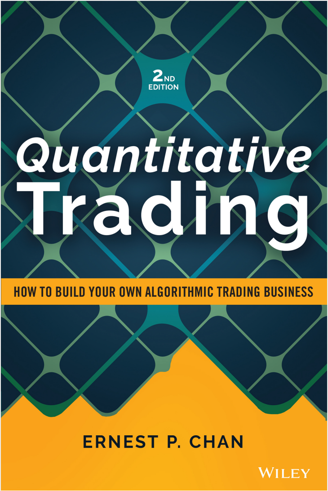
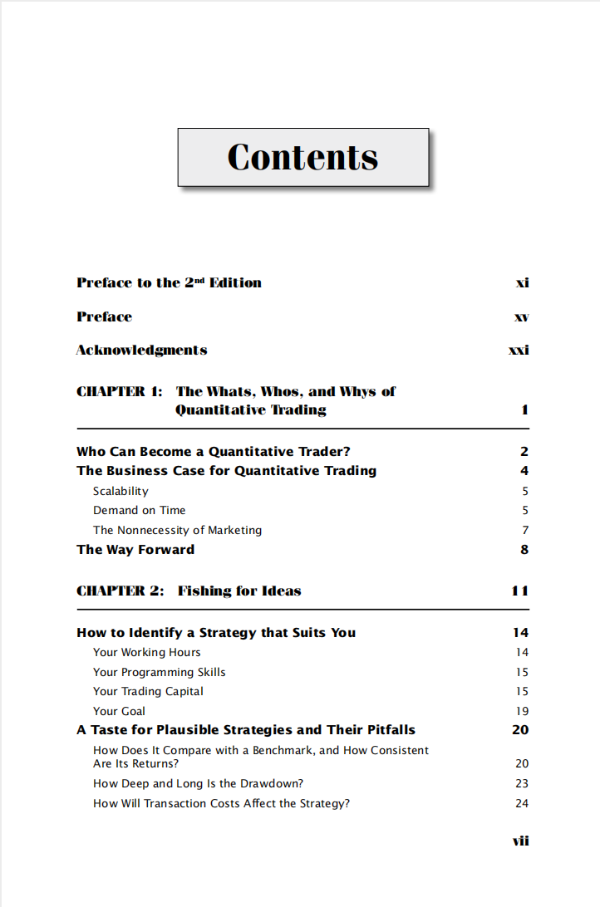
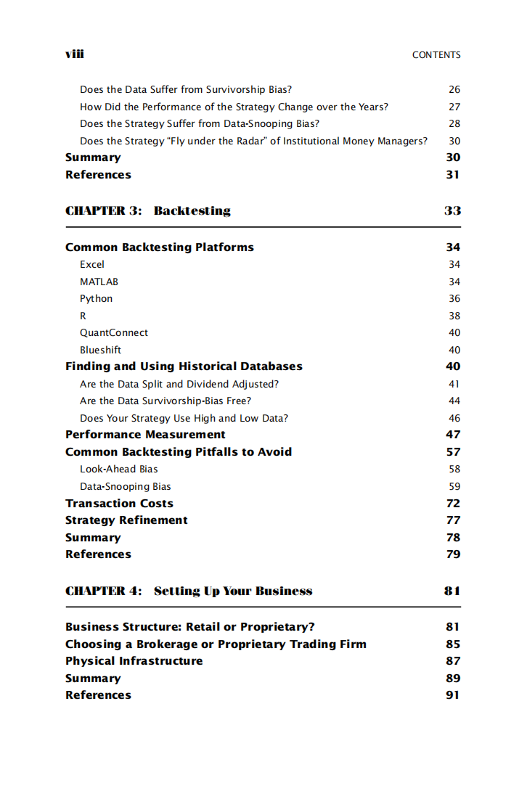
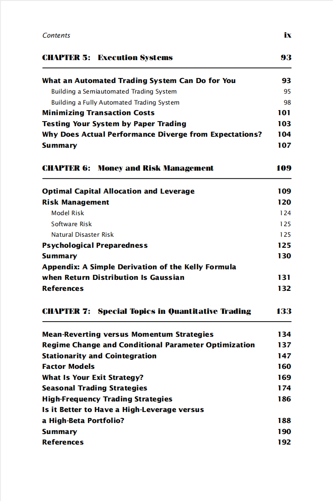
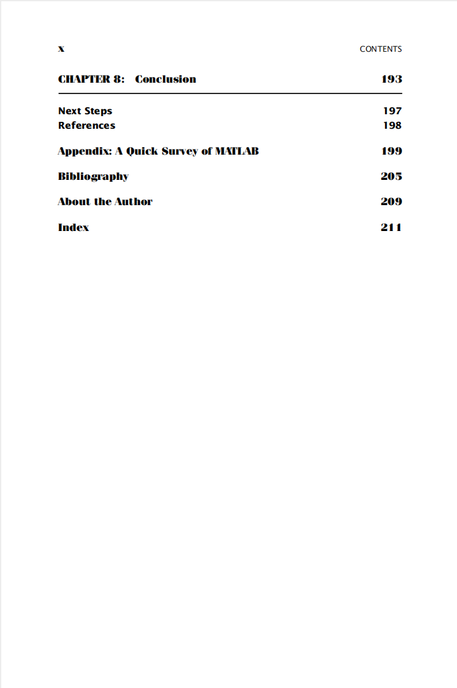

# Quantitative Trading- How to Build Your Own Algorithmic Trading Business

本书籍由[LLMQuant社区](https://llmquant.com/)整理, 并提供PDF下载, 只供学习交流使用, 版权归原作者所有。

- **作者**: Ernest P. Chan
- **出版社**: Wiley
- **出版年份**: 2021
- **难度**: ⭐⭐⭐⭐
- **推荐指数**: ⭐⭐⭐⭐⭐
- **PDF下载**: [点击下载](https://github.com/LLMQuant/asset/blob/main/Quantitative Trading_ How to Build Your Own Algorithmic Trading Business (Wiley Trading) (2021, Wiley).pdf)

### 内容简介

Quantitative Trading- How to Build Your Own Algorithmic Trading Business 是一本关于量化金融的专业书籍，涵盖了从零开始构建量化交易业务的全面指南。本书旨在帮助读者掌握量化交易的精髓，并将其应用于建立或改进自己的交易公司。书中详细介绍了量化交易的数学基础、编程技能（包括Python和R语言示例）、数据获取与管理、回测与优化策略、风险管理以及交易系统的构建与执行。此外，本书还探讨了时间序列分析、统计套利、均值回归、趋势跟踪等多种交易策略，并融入了最新的机器学习投资技术和案例研究。它不仅提供了理论概念，更侧重于实践操作，为独立零售交易者或有志于在金融机构从事量化交易的个人提供了实用的指导和可操作的步骤。

### 核心章节

以下是本书的主要章节预览：

### 主要特点

- 理论与实践结合
- 包含详细示例
- 配套代码和资源
- 适合实际应用

### 适合人群

- 量化分析师
- 算法交易员
- 金融工程师
- 数据科学家

### 配套资源

- 示例代码
- 数据集
- 在线补充材料