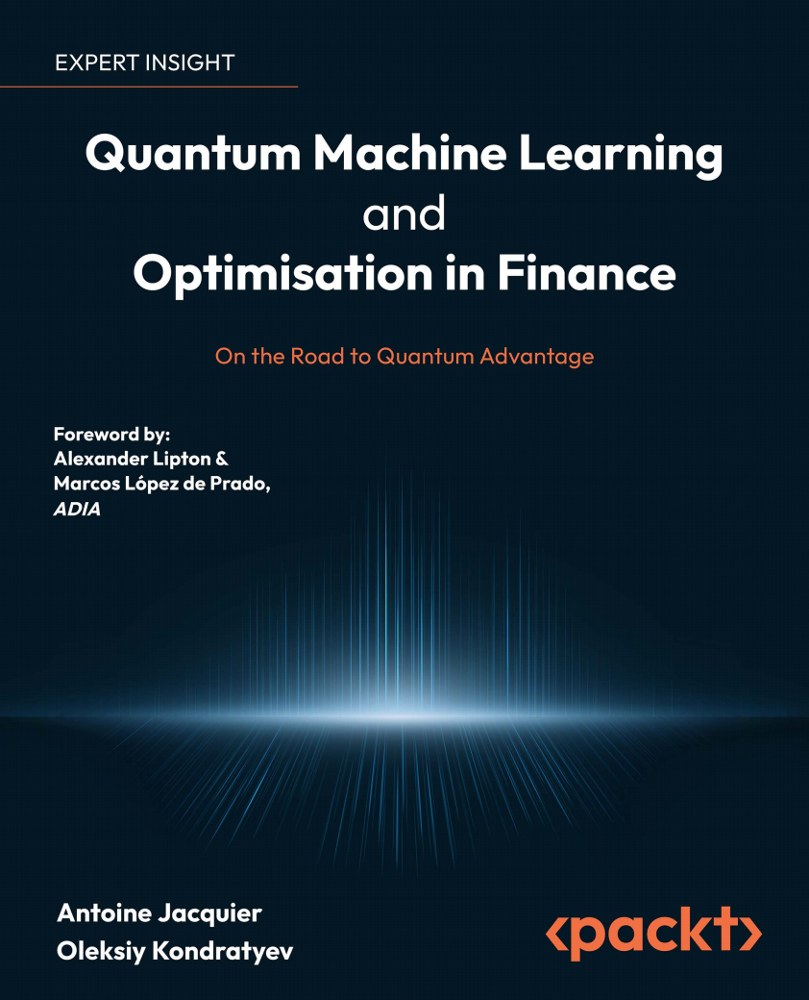
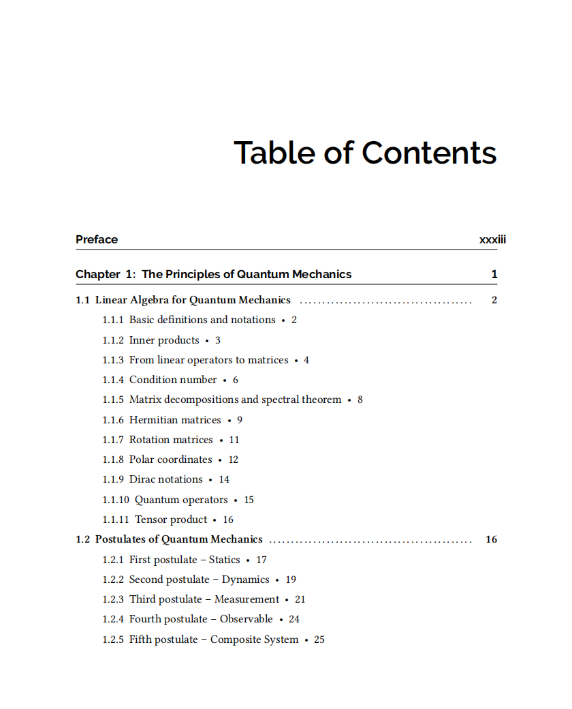
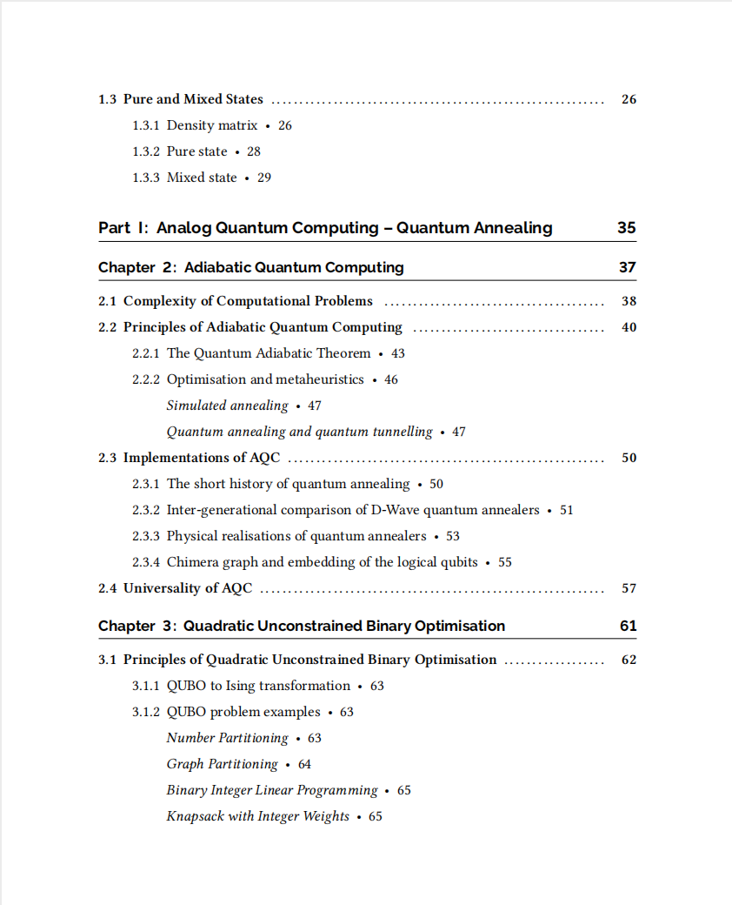
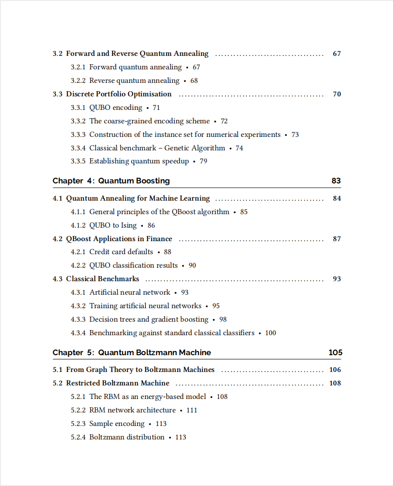
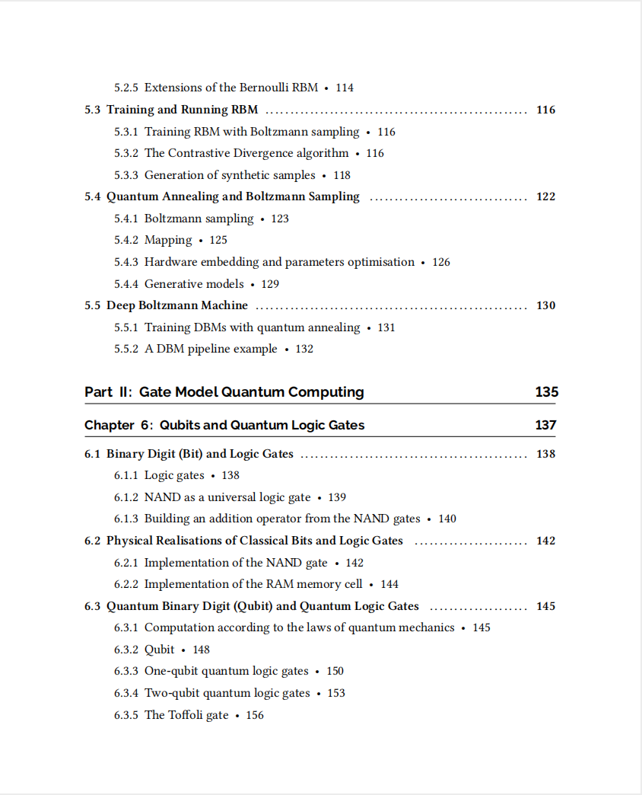
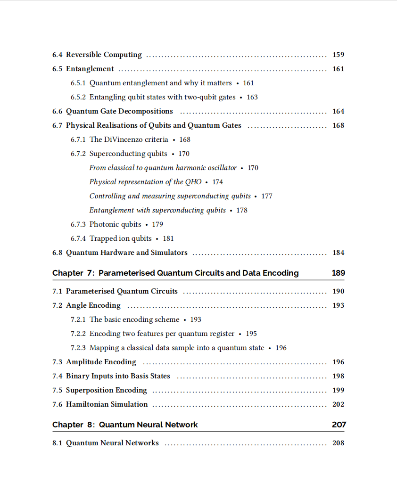
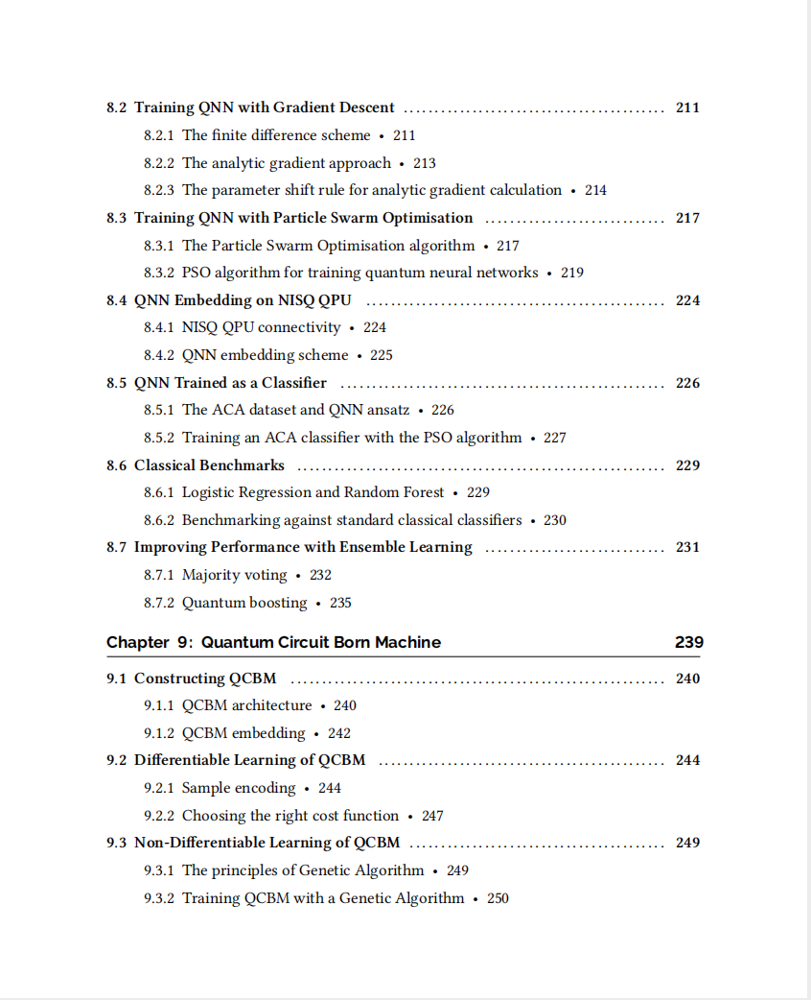
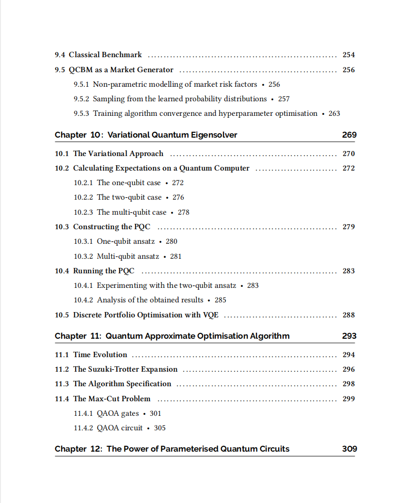
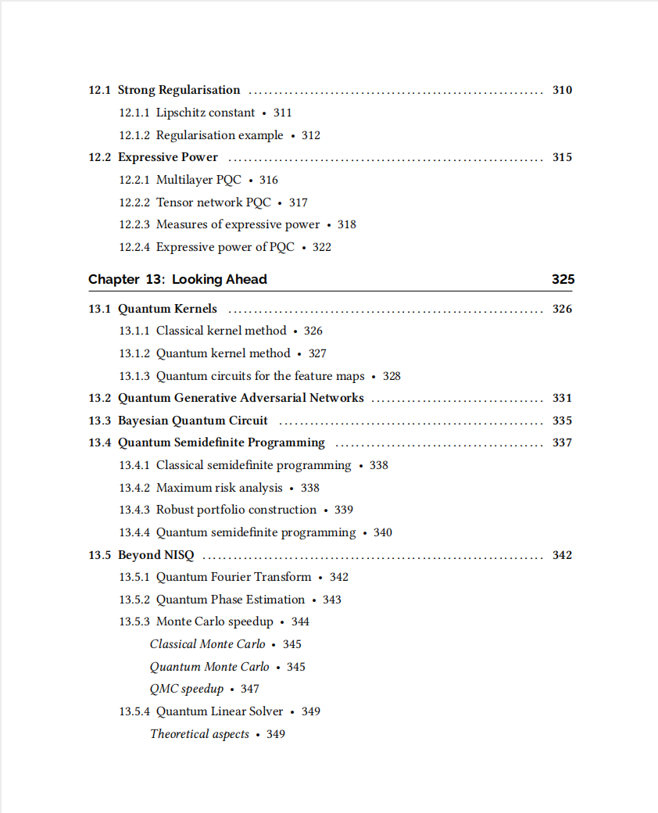

# Quantum Machine Learning and Optimisation in Finance- On the Road to Quantum Advantage

本书籍由[LLMQuant社区](https://llmquant.com/)整理, 并提供PDF下载, 只供学习交流使用, 版权归原作者所有。

- **作者**: Antoine Jacquier, Oleksiy Kondratyev, Alexander Lipton, Marcos López de Prado
- **出版社**: Packt Publishing
- **出版年份**: 2022
- **难度**: ⭐⭐⭐⭐
- **推荐指数**: ⭐⭐⭐⭐⭐
- **PDF下载**: [点击下载](https://github.com/LLMQuant/asset/blob/main/Quantum Machine Learning and Optimisation in Finance_ On the Road to Quantum Advantage.pdf)

### 内容简介

Quantum Machine Learning and Optimisation in Finance- On the Road to Quantum Advantage 是一本关于量化金融的专业书籍，涵盖了量子机器学习和优化在金融领域的应用。本书深入探讨了如何利用噪声中等规模量子（NISQ）硬件创建混合量子-经典机器学习和优化模型，以期在金融应用中实现量子优势。书中详细介绍了可应用于现有NISQ设备的各种主要量子计算算法，并强调了量子计算范式在金融领域的实际应用潜力。

本书内容分为两大部分：第一部分聚焦于模拟量子计算，特别是量子退火，涵盖了绝热量子计算、二次无约束二元优化（QUBO）、量子提升和量子玻尔兹曼机等主题。第二部分则侧重于门模型量子计算，包括量子比特与量子逻辑门、参数化量子电路与数据编码、量子神经网络、量子电路玻尔兹曼机、变分量子本征求解器（VQE）以及量子近似优化算法（QAOA）等。本书旨在帮助读者掌握量子机器学习的原理，并将其应用于解决金融中的复杂优化问题，例如训练参数化量子电路作为生成模型，以及利用量子提升技术。

### 核心章节

以下是本书的主要章节预览：

### 主要特点

- 理论与实践结合
- 包含详细示例
- 配套代码和资源
- 适合实际应用

### 适合人群

- 量化分析师
- 算法交易员
- 金融工程师
- 数据科学家

### 配套资源

- 示例代码
- 数据集
- 在线补充材料