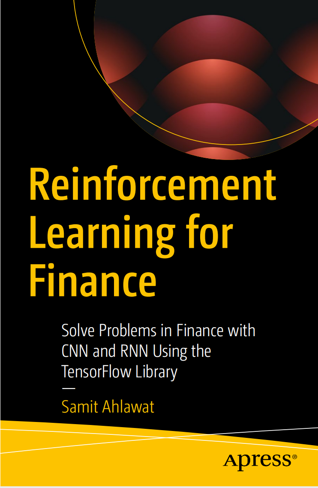
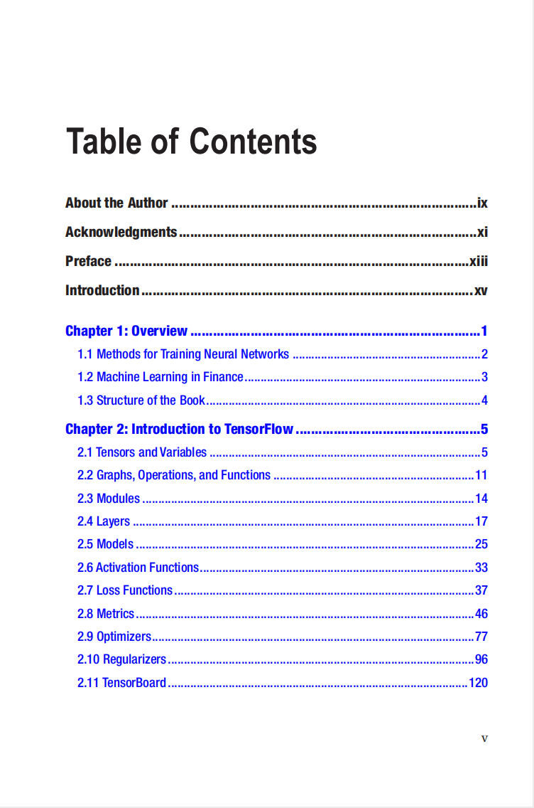
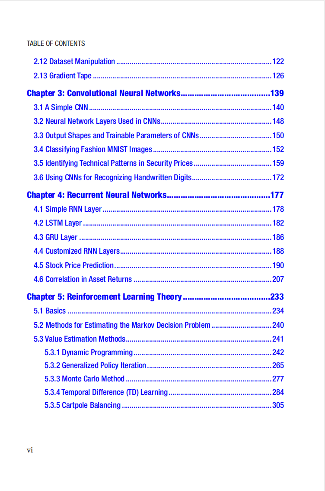
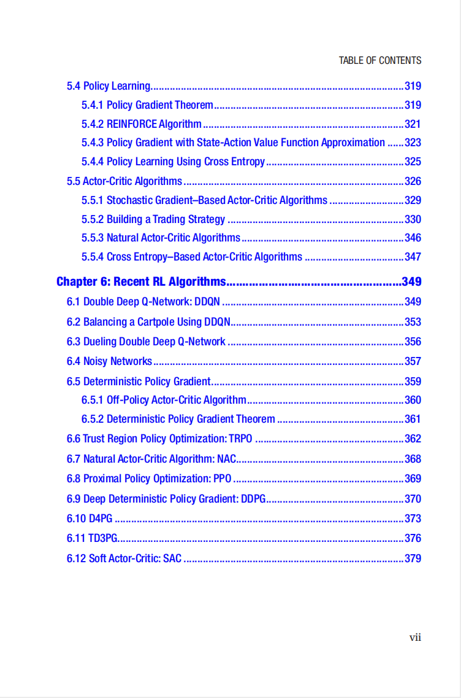

# Reinforcement Learning for Finance

本书籍由[LLMQuant社区](https://llmquant.com/)整理, 并提供PDF下载, 只供学习交流使用, 版权归原作者所有。

- **作者**:Samit Ahlawat
- **出版社**:Apress (part of Springer Nature) 
- **难度**: ⭐⭐⭐⭐
- **推荐指数**: ⭐⭐⭐⭐⭐
- **PDF下载**: [点击下载](https://asset.quant-wiki.com/pdf/Reinforcement%20Learning%20for%20Finance_%20Solve%20Problems%20in%20Finance%20with%20CNN%20and%20RNN%20Using%20the%20TensorFlow%20Library.pdf)

### 内容简介

本书介绍了强化学习的数学理论和来自量化金融的实际应用案例，使用TensorFlow库进行实现。《金融强化学习》首先描述了训练神经网络的方法，然后讨论了CNN和RNN——两种在强化学习中用作深度学习网络的神经网络。此外，本书深入探讨了强化学习理论，解释了马尔可夫决策过程、价值函数、策略和策略梯度，以及它们的数学公式和学习算法。

### 核心章节

以下是本书的主要章节预览：

### 主要特点

- 理论与实践结合
- 包含详细示例
- 配套代码和资源
- 适合实际应用

### 适合人群

- 量化分析师
- 算法交易员
- 金融工程师
- 数据科学家

### 配套资源

- 示例代码
- 数据集
- 在线补充材料
