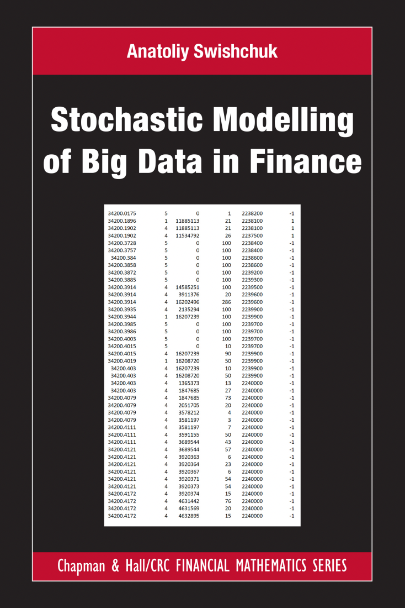

# Stochastic Modelling of Big Data in Finance

本书籍由[LLMQuant社区](https://llmquant.com/)整理, 并提供PDF下载, 只供学习交流使用, 版权归原作者所有。

- **作者**: Anatoliy Swishchuk
- **出版社**: Taylor & Francis Ltd
- **出版年份**: 2022
- **难度**: ⭐⭐⭐⭐
- **推荐指数**: ⭐⭐⭐⭐⭐
- **PDF下载**: [点击下载](https://asset.quant-wiki.com/pdf/Stochastic%20Modelling%20of%20Big%20Data%20in%20Finance_compressed.pdf)

### 内容简介

Stochastic Modelling of Big Data in Finance 是一本关于量化金融的专业书籍，涵盖了金融领域大数据随机建模的严谨概述和深入探索。本书详细介绍了各种随机模型，包括多元模型，以应对金融大数据挑战，特别是在高频和算法交易中的限价订单簿（LOB）数据。书中探讨了随机过程、机器学习在金融中的应用，以及高频数据和市场微观结构。此外，本书还深入讲解了随机波动率模型和跳跃扩散模型等关键数学技术，并展示了机器学习在期权定价和对冲中的应用。本书旨在帮助读者理解如何将这些模型应用于不同的数据集，以描述限价订单簿的动态，并为特定的数据集选择最佳模型。书中的研究成果可用于解决金融中的资产获取、清算、做市以及其他优化问题。

### 核心章节

以下是本书的主要章节预览：

### 主要特点

- 理论与实践结合
- 包含详细示例
- 配套代码和资源
- 适合实际应用

### 适合人群

- 量化分析师
- 算法交易员
- 金融工程师
- 数据科学家

### 配套资源

- 示例代码
- 数据集
- 在线补充材料