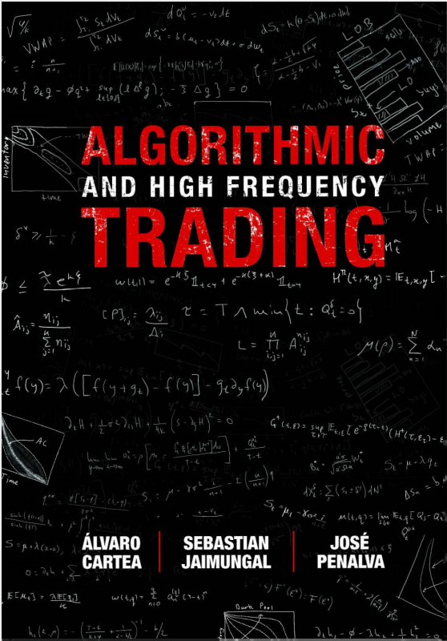
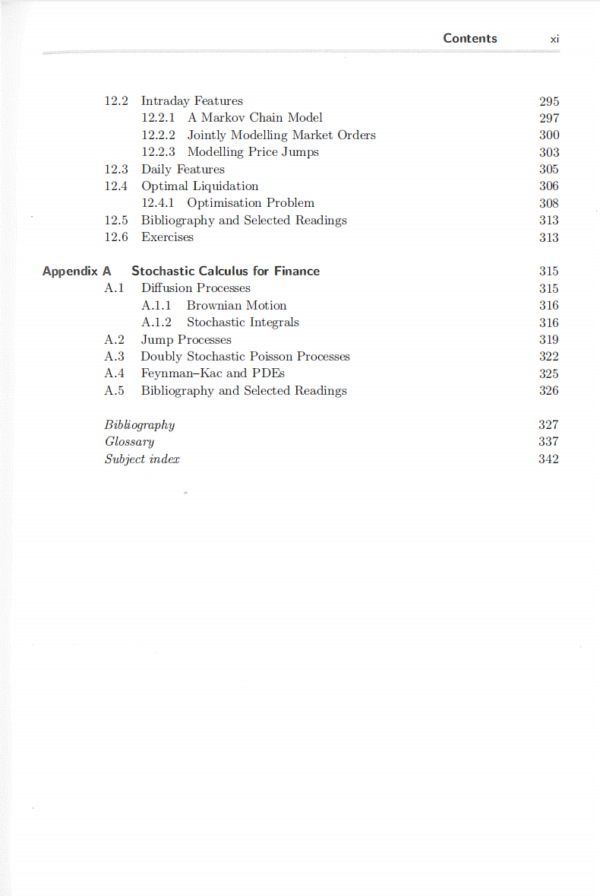

# algorithmic-and-high-frequency-trading-pdf-free

本书籍由[LLMQuant社区](https://llmquant.com/)整理, 并提供PDF下载, 只供学习交流使用, 版权归原作者所有。

- **作者**: Álvaro Cartea, Sebastian Jaimungal, José Penalva
- **出版社**: Cambridge University Press
- **出版年份**: 2015
- **难度**: ⭐⭐⭐⭐
- **推荐指数**: ⭐⭐⭐⭐⭐
- **PDF下载**: [点击下载](https://github.com/LLMQuant/asset/blob/main/algorithmic-and-high-frequency-trading-pdf-free.pdf)

### 内容简介

algorithmic-and-high-frequency-trading-pdf-free 是一本关于量化金融的专业书籍，涵盖了算法交易和高频交易的复杂数学模型、实证事实和金融经济学原理。本书深入探讨了现代电子市场如何运作，以及如何设计和实施交易算法。内容包括但不限于最优交易策略、市场微观结构、订单簿动态、做市、统计套利（如配对交易和均值回归）以及交易执行中的市场影响和交易成本。

在数学技术方面，本书详细介绍了随机最优控制、动态规划、Hamilton-Jacobi-Bellman (HJB) 偏微分方程、蒙特卡洛方法、数值方法以及随机微积分（包括伊藤引理和Black-Scholes模型）。 此外，它还涵盖了时间序列分析（如ARIMA和GARCH模型）、卡尔曼滤波、小波分析、傅里叶分析、主成分分析、因子模型以及各种优化技术（如线性规划、二次规划和凸优化）。

在金融应用方面，本书将这些数学工具应用于实际的交易场景，例如大宗订单执行、VWAP（成交量加权平均价格）目标交易、暗池交易、衍生品定价、期权策略、固定收益和信用风险管理。 书中还探讨了机器学习（包括强化学习和深度学习）在交易中的应用，以及大数据、云计算和GPU计算等技术在低延迟交易环境中的作用。 此外，本书也讨论了监管环境、合规性、风险管理、回溯测试和绩效衡量等重要实践问题。

### 核心章节

以下是本书的主要章节预览：

### 主要特点

- 理论与实践结合
- 包含详细示例
- 配套代码和资源
- 适合实际应用

### 适合人群

- 量化分析师
- 算法交易员
- 金融工程师
- 数据科学家

### 配套资源

- 示例代码
- 数据集
- 在线补充材料