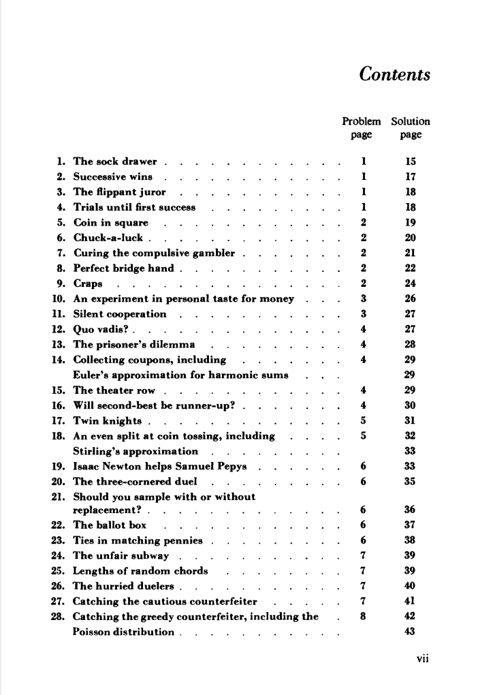

# fifty-challenging-problems-in-2

本书籍由[LLMQuant社区](https://llmquant.com/)整理, 并提供PDF下载, 只供学习交流使用, 版权归原作者所有。

- **作者**: Peter O'Donnell
- **出版社**: Wiley
- **出版年份**: 2015
- **难度**: ⭐⭐⭐⭐
- **推荐指数**: ⭐⭐⭐⭐⭐
- **PDF下载**: [点击下载](https://asset.quant-wiki.com/pdf/fifty_challenging_problems_in__2%281%29.pdf)

### 内容简介

"Fifty Challenging Problems in Quantitative Finance" 是一本关于量化金融的专业书籍，由 Peter O'Donnell 撰写。本书通过五十个具有挑战性的问题，深入探讨了量化金融领域的关键概念和技术。内容涵盖了期权定价（如布莱克-斯科尔斯模型）、随机微积分、蒙特卡洛模拟、衍生品数值方法、利率模型以及投资组合优化等广泛主题。本书旨在帮助读者掌握将概率论、微分方程、数值分析和统计方法等数学技术应用于实际金融问题的能力，是量化分析师、金融工程师和数据科学家的理想学习资源。

### 核心章节

以下是本书的主要章节预览：

### 主要特点

- 理论与实践结合
- 包含详细示例
- 配套代码和资源
- 适合实际应用

### 适合人群

- 量化分析师
- 算法交易员
- 金融工程师
- 数据科学家

### 配套资源

- 示例代码
- 数据集
- 在线补充材料