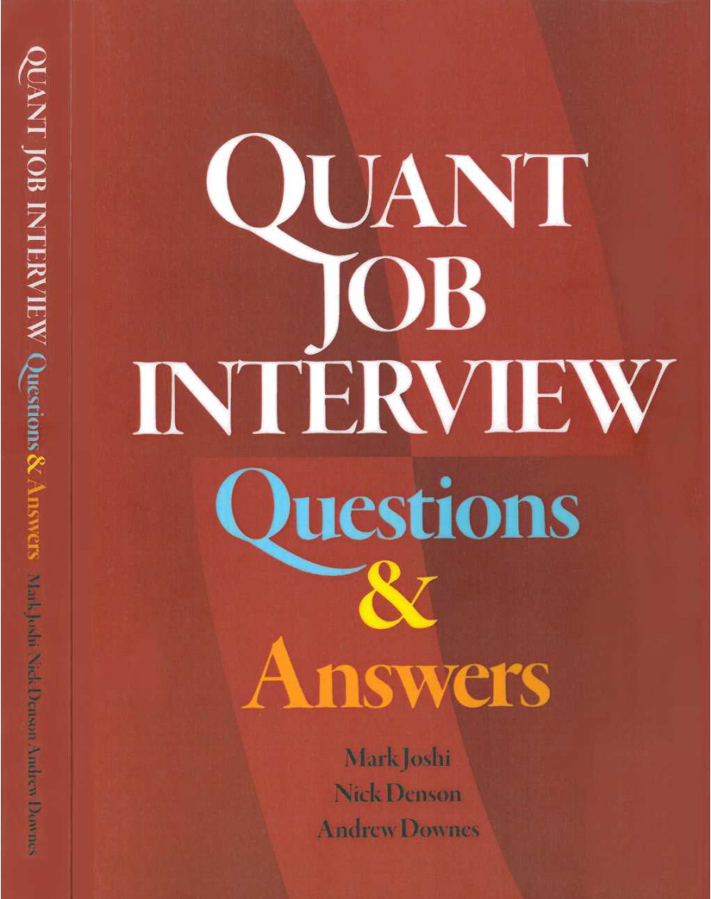
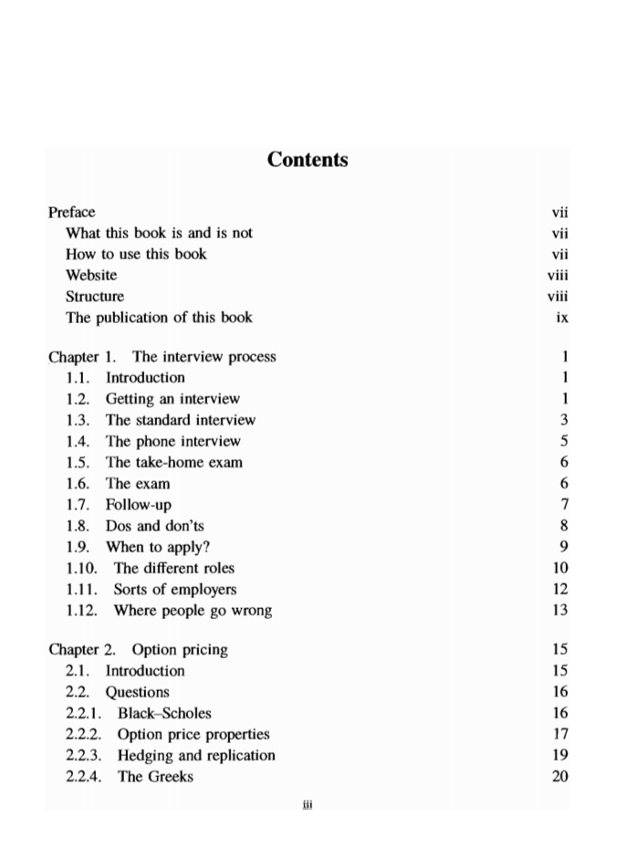
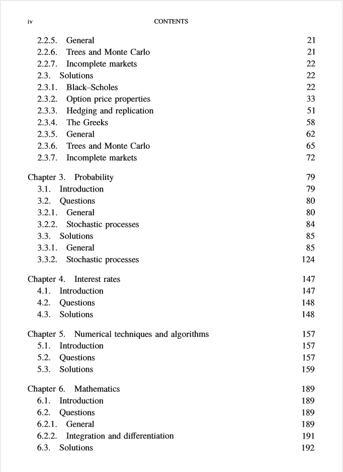
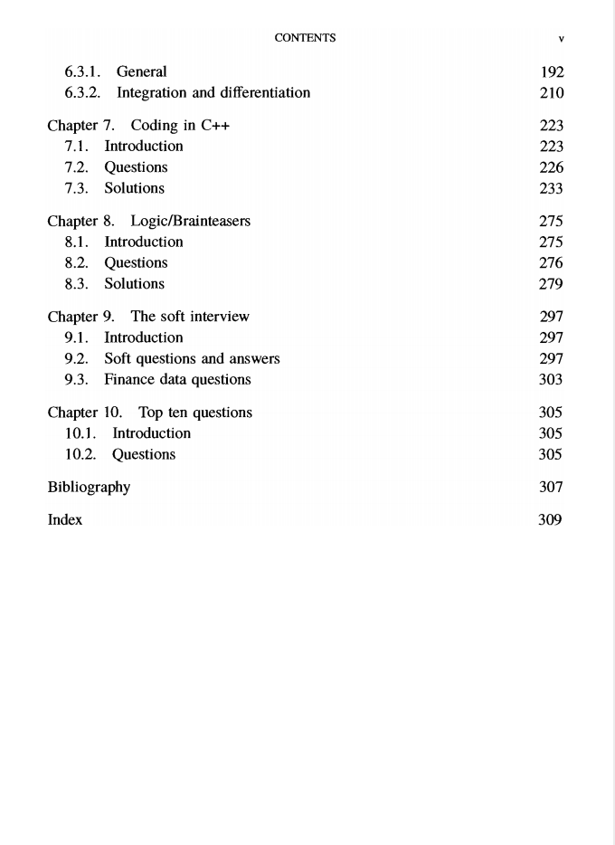

# quant job interview questions and answers

本书籍由[LLMQuant社区](https://llmquant.com/)整理, 并提供PDF下载, 只供学习交流使用, 版权归原作者所有。

- **作者**: Mark Joshi, Nick Denson, Andrew Downes
- **出版社**: Pilot Whale Press
- **出版年份**: 2013
- **难度**: ⭐⭐⭐⭐
- **推荐指数**: ⭐⭐⭐⭐⭐
- **PDF下载**: [点击下载](https://asset.quant-wiki.com/pdf/quant%20job%20interview%20questions%20and%20answers.pdf)

### 内容简介

quant job interview questions and answers 是一本关于量化金融的专业书籍，涵盖了量化金融面试中常见的各类问题与解答。本书旨在帮助求职者为竞争激烈的量化金融职位做好充分准备，提供了来自伦敦金融城和华尔街实际面试的300多个问题。每个问题都附有详细的解决方案、面试官的考察意图以及可能的追问。

本书涵盖的主要数学技术和在金融领域的应用包括：期权定价、概率论、数学基础、数值算法和C++编程。此外，还深入探讨了随机微积分与金融建模（如伊藤引理、随机微分方程、布莱克-斯科尔斯模型、风险管理）、统计推断、回归分析和时间序列分析等核心概念。本书不仅关注技术问题，也讨论了面试流程和非技术性面试技巧，是量化分析师、算法交易员、金融工程师和数据科学家等职业的理想参考资料。

### 核心章节

以下是本书的主要章节预览：

### 主要特点

- 理论与实践结合
- 包含详细示例
- 配套代码和资源
- 适合实际应用

### 适合人群

- 量化分析师
- 算法交易员
- 金融工程师
- 数据科学家

### 配套资源

- 示例代码
- 数据集
- 在线补充材料