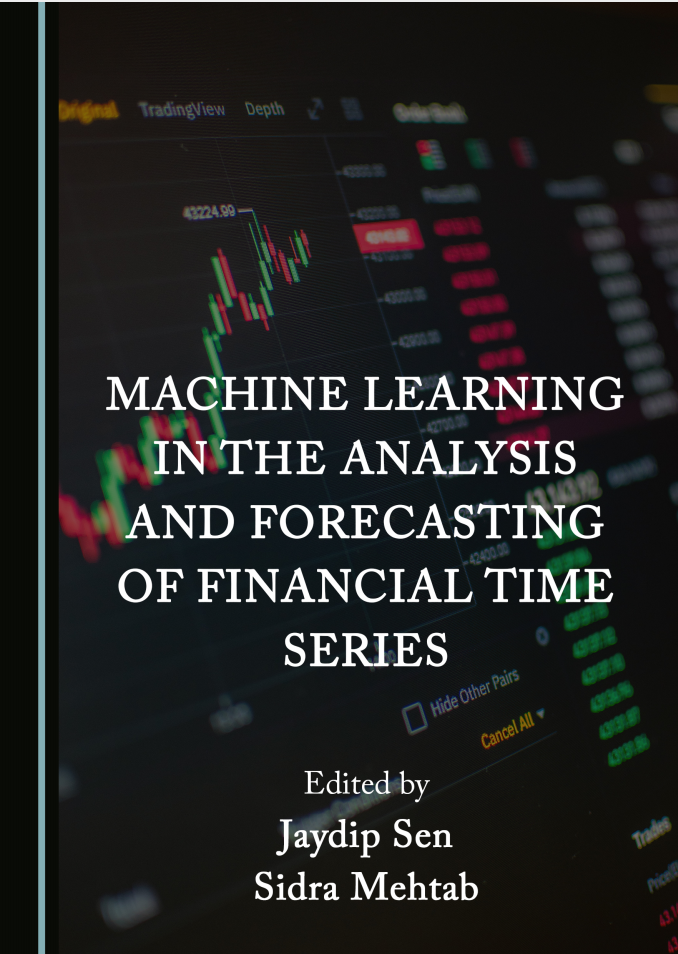
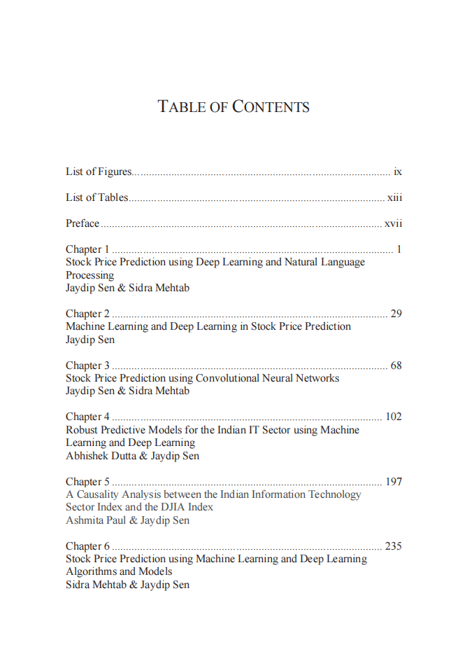
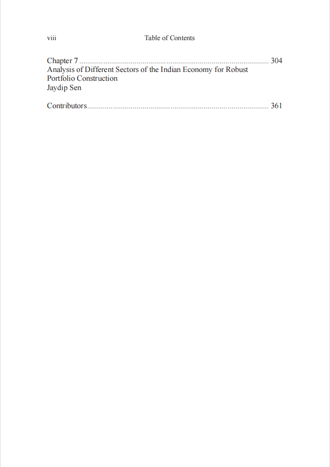

# 机器学习在金融时间序列分析与预测中的应用，385页pdf

本书籍由[LLMQuant社区](https://llmquant.com/)整理, 并提供PDF下载, 只供学习交流使用, 版权归原作者所有。

- **作者**: 暂无公开信息
- **出版社**: 暂无公开信息
- **出版年份**: 2022
- **难度**: ⭐⭐⭐⭐
- **推荐指数**: ⭐⭐⭐⭐⭐
- **PDF下载**: [点击下载](https://asset.quant-wiki.com/pdf/%E3%80%902022%E6%96%B0%E4%B9%A6%E3%80%91%E6%9C%BA%E5%99%A8%E5%AD%A6%E4%B9%A0%E5%9C%A8%E9%87%91%E8%9E%8D%E6%97%B6%E9%97%B4%E5%BA%8F%E5%88%97%E5%88%86%E6%9E%90%E4%B8%8E%E9%A2%84%E6%B5%8B%E4%B8%AD%E7%9A%84%E5%BA%94%E7%94%A8%EF%BC%8C385%E9%A1%B5pdf.pdf)

### 内容简介

《机器学习在金融时间序列分析与预测中的应用》是一本关于量化金融的专业书籍，旨在帮助读者处理复杂且波动的金融时间序列数据，以更好地理解其历史行为并对其未来走势进行可靠预测。本书深入探讨了如何将统计学、计量经济学、机器学习和深度学习的概念与技术应用于构建稳健的预测模型，并利用这些模型构建有利可图的投资组合。

本书内容涵盖了时间序列分析的基础知识，包括随机过程、平稳性、自相关与偏自相关函数、白噪声以及ARIMA模型和季节性模型等传统预测方法。同时，本书也详细介绍了机器学习的基础理论，如监督学习、无监督学习，以及线性回归、逻辑回归、决策树、支持向量机（SVM）和人工神经网络等核心算法。

在高级应用方面，本书特别强调了深度学习在金融时间序列预测中的应用，包括卷积神经网络（CNN）和长短期记忆（LSTM）网络架构。书中还涵盖了指数平滑、Holt和Winter趋势与季节性方法、格兰杰因果分析、多元线性回归、多元自适应回归样条曲线（MARS）等统计和计量建模方法。 机器学习预测模型则包括k近邻、Bagging、自适应增强、极端梯度增强和随机森林等集成方法。 书中所有概念和方法均通过R和Python语言在TensorFlow和Keras框架上实现，并利用印度国家证券交易所（NSE）和孟买证券交易所（BSE）上市股票的日、月指数值历史数据进行实证分析，为读者提供了丰富的实践案例和有益的行业行为洞察。

### 核心章节

以下是本书的主要章节预览：

### 主要特点

- 理论与实践结合
- 包含详细示例
- 配套代码和资源
- 适合实际应用

### 适合人群

- 量化分析师
- 算法交易员
- 金融工程师
- 数据科学家

### 配套资源

- 示例代码
- 数据集
- 在线补充材料