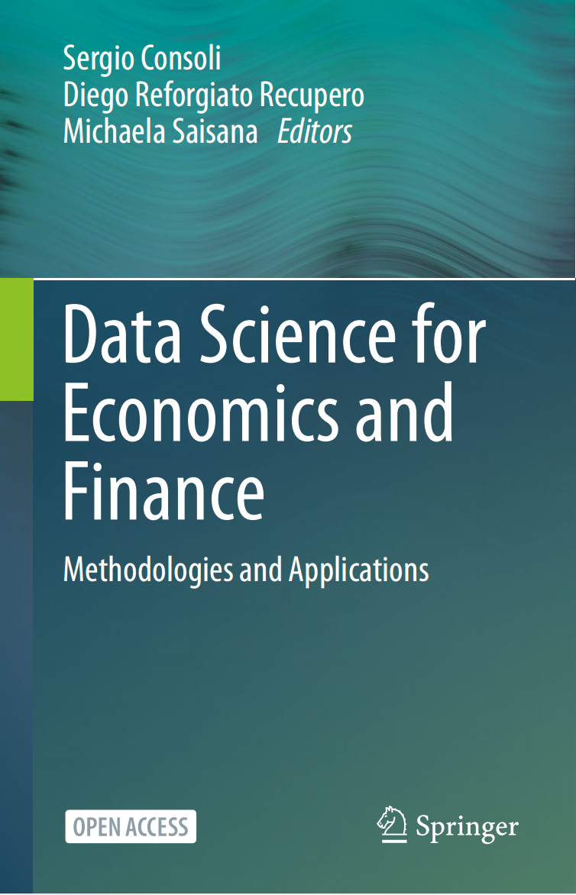
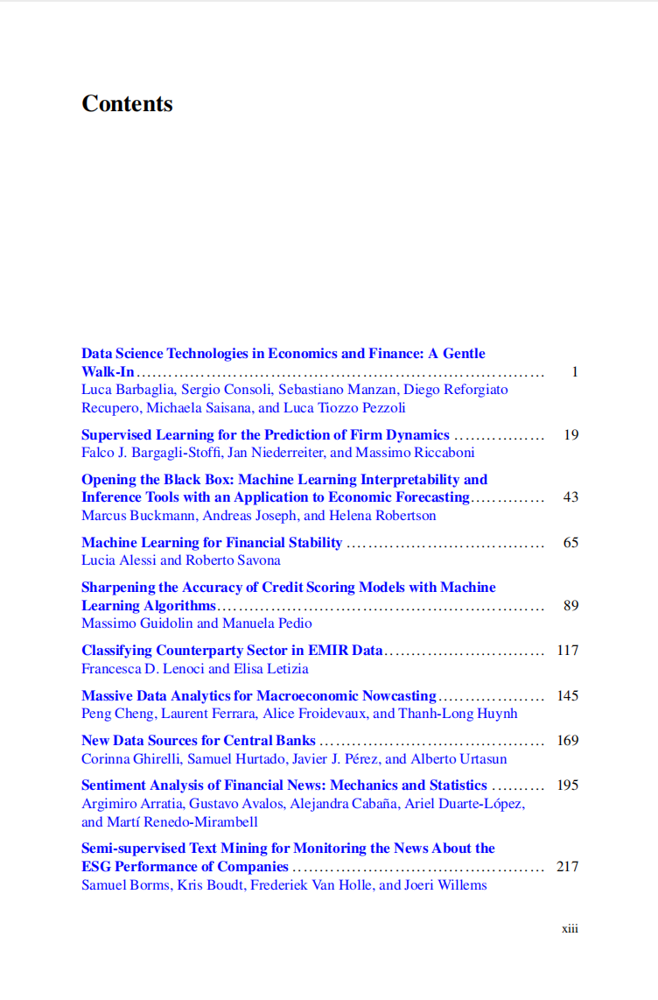
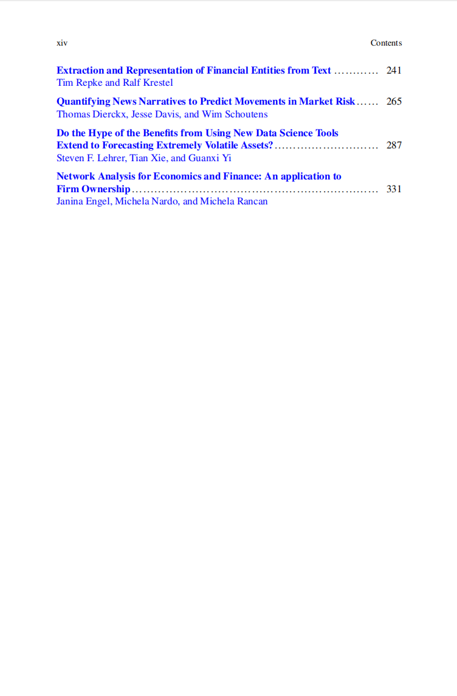

# 经济与金融数据科学

本书籍由[LLMQuant社区](https://llmquant.com/)整理, 并提供PDF下载, 只供学习交流使用, 版权归原作者所有。

- **作者**: LLMQuant社区
- **出版社**: LLMQuant社区
- **出版年份**: 2024
- **难度**: ⭐⭐⭐⭐
- **推荐指数**: ⭐⭐⭐⭐⭐
- **PDF下载**: [点击下载](https://asset.quant-wiki.com/pdf/%E3%80%90%E5%BC%80%E6%94%BE%E4%B9%A6%E3%80%91%E7%BB%8F%E6%B5%8E%E4%B8%8E%E9%87%91%E8%9E%8D%E6%95%B0%E6%8D%AE%E7%A7%91%E5%AD%A6.pdf)

### 内容简介

《经济与金融数据科学》是一本专注于量化金融领域的专业书籍，旨在深入探讨数据科学在经济与金融领域的应用。本书系统地介绍了在经济与金融数据分析中常用的数学和统计技术，特别是**线性回归**和**时间序列分析**等核心方法。通过理论与实践相结合的方式，本书详细阐述了如何运用这些技术进行金融数据建模、预测和分析，例如**资产定价、风险管理、投资组合优化**以及**市场行为分析**。书中包含丰富的示例和配套代码资源，适合量化分析师、算法交易员、金融工程师和数据科学家等希望将数据科学方法应用于金融实践的专业人士和学生。

### 核心章节

以下是本书的主要章节预览：

### 主要特点

- 理论与实践结合
- 包含详细示例
- 配套代码和资源
- 适合实际应用

### 适合人群

- 量化分析师
- 算法交易员
- 金融工程师
- 数据科学家

### 配套资源

- 示例代码
- 数据集
- 在线补充材料