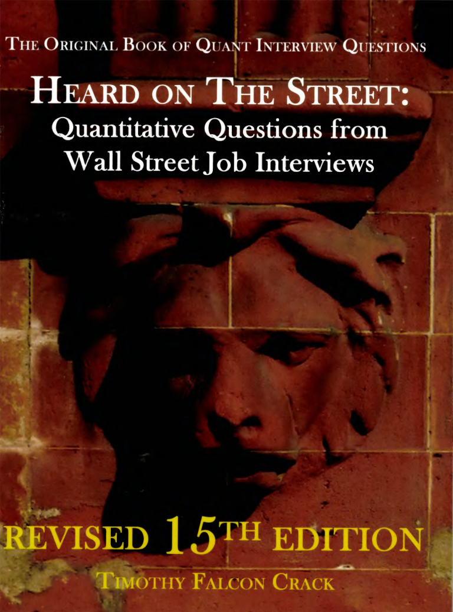
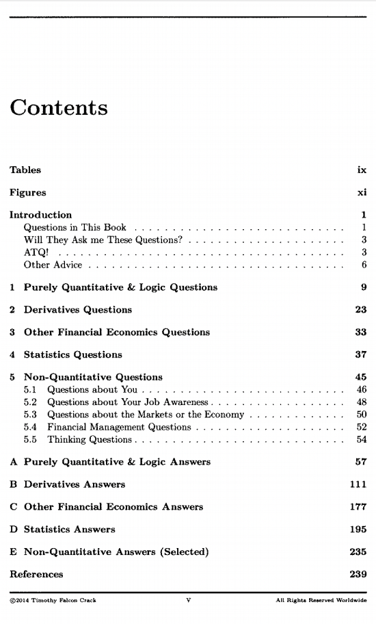
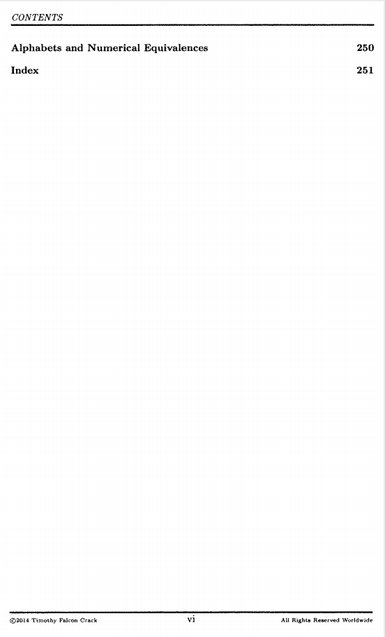

# Heard）Heard On The Street Quantitative Questions From Wall Street Job Interviews

本书籍由[LLMQuant社区](https://llmquant.com/)整理, 并提供PDF下载, 只供学习交流使用, 版权归原作者所有。

- **作者**: Timothy Falcon Crack
- **出版社**: Timothy Falcon Crack
- **出版年份**: 2003
- **难度**: ⭐⭐⭐⭐
- **推荐指数**: ⭐⭐⭐⭐⭐
- **PDF下载**: [点击下载](https://asset.quant-wiki.com/pdf/（I4-Heard）Heard On The Street Quantitative Questions From Wall Street Job Interviews.pdf)

### 内容简介

Heard）Heard On The Street Quantitative Questions From Wall Street Job Interviews 是一本关于量化金融的专业书籍，涵盖了从华尔街金融机构面试中收集的量化问题。本书旨在帮助求职者准备投资银行、投资管理和期权交易等领域的量化职位面试。书中包含了大量的量化问题，并提供详细的解答，涵盖了纯粹的量化和逻辑问题、衍生品、其他金融经济学以及统计学等核心数学技术及其在金融领域的应用。它旨在弥合典型金融教育与成功应对华尔街量化面试所需知识之间的差距。

### 核心章节

以下是本书的主要章节预览：

### 主要特点

- 理论与实践结合
- 包含详细示例
- 配套代码和资源
- 适合实际应用

### 适合人群

- 量化分析师
- 算法交易员
- 金融工程师
- 数据科学家

### 配套资源

- 示例代码
- 数据集
- 在线补充材料