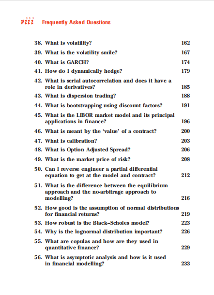

# 黄皮书）Frequently Asked Questions In Quantitative Finance

本书籍由[LLMQuant社区](https://llmquant.com/)整理, 并提供PDF下载, 只供学习交流使用, 版权归原作者所有。

- **作者**: Paul Wilmott
- **出版社**: John Wiley & Sons
- **出版年份**: 2007
- **难度**: ⭐⭐⭐⭐
- **推荐指数**: ⭐⭐⭐⭐⭐
- **PDF下载**: [点击下载](https://asset.quant-wiki.com/pdf/%EF%BC%88I5-%E9%BB%84%E7%9A%AE%E4%B9%A6%EF%BC%89Frequently%20Asked%20Questions%20In%20Quantitative%20Finance%281%29.pdf)

### 内容简介

黄皮书）Frequently Asked Questions In Quantitative Finance 是一本关于量化金融的专业书籍，由Paul Wilmott撰写。本书从理论和实践两个角度深入探讨了金融工程中的关键概念和技术。书中涵盖了随机微积分、期权定价、利率模型、数值方法以及风险管理等核心主题。作者强调在量化金融中平衡数学严谨性与直观理解的重要性，旨在帮助读者掌握从Black-Scholes公式推导到各种流行模型、方程、公式和概率分布的应用。此外，本书还包含了对常见量化错误的分析和金融脑筋急转弯，为量化分析师、算法交易员、金融工程师和数据科学家提供了宝贵的理论知识和实用指导.

### 核心章节

以下是本书的主要章节预览：

### 主要特点

- 理论与实践结合
- 包含详细示例
- 配套代码和资源
- 适合实际应用

### 适合人群

- 量化分析师
- 算法交易员
- 金融工程师
- 数据科学家

### 配套资源

- 示例代码
- 数据集
- 在线补充材料