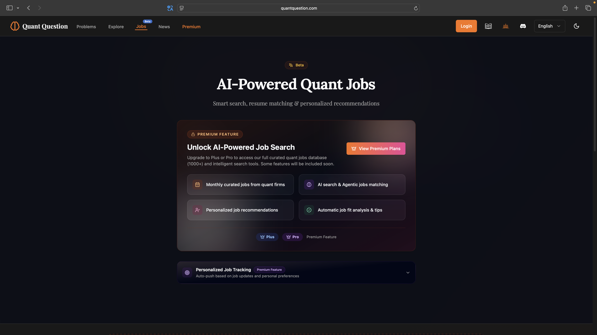
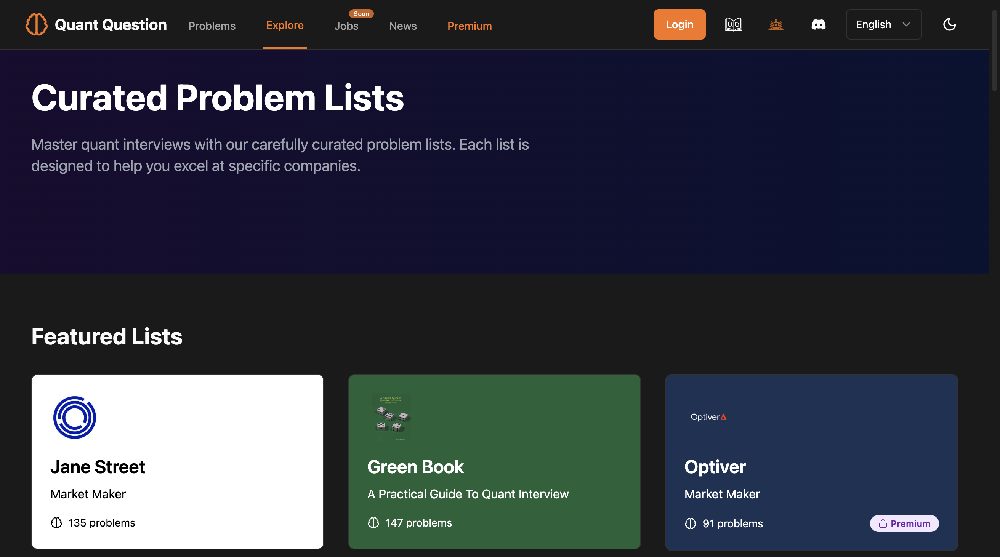
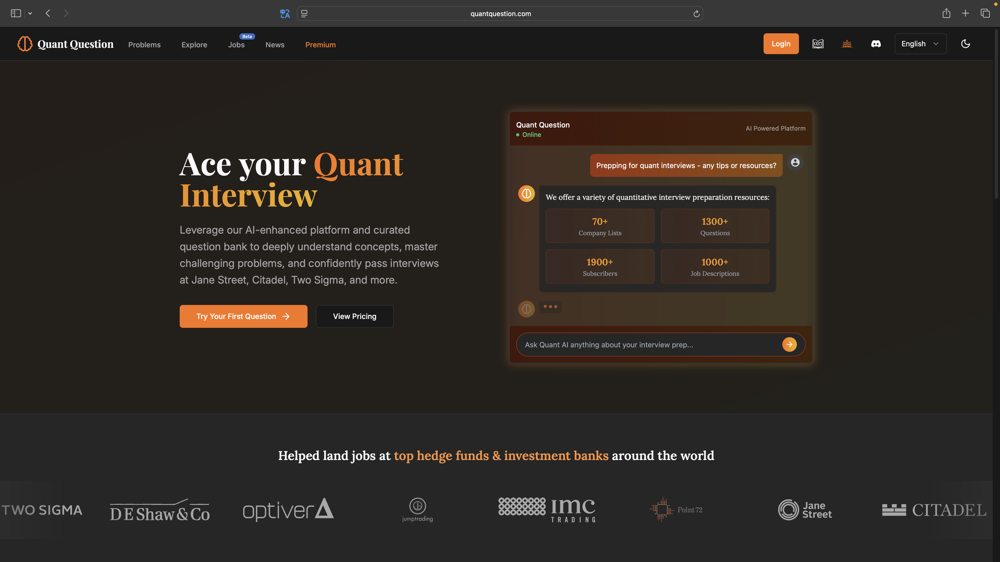
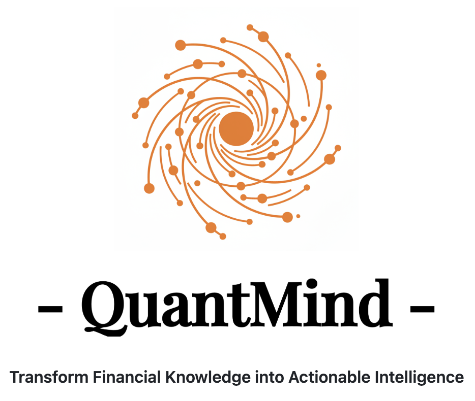
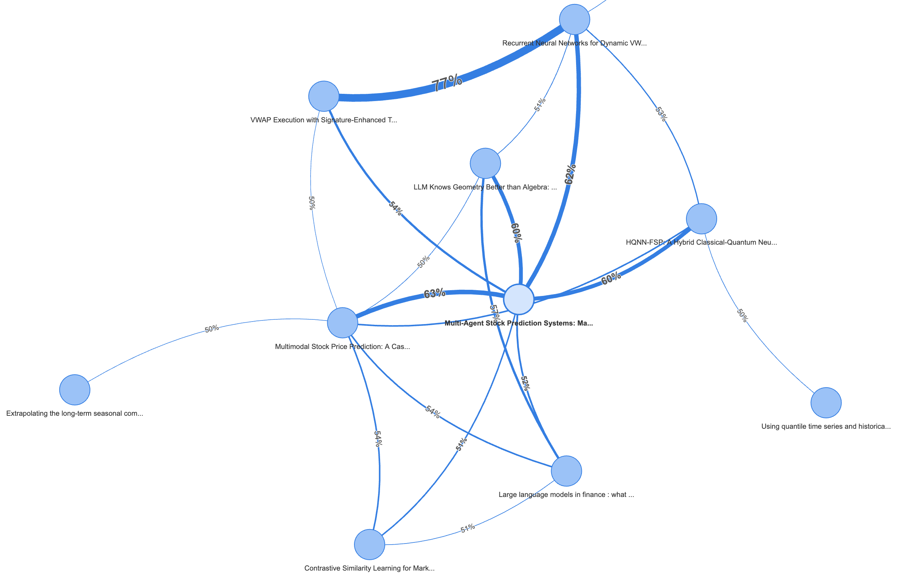

# LLMQuant 独家资源概览

欢迎了解 LLMQuant 提供的独家量化资源！我们致力于结合大型语言模型（LLM）与量化金融，为社区提供实用、前沿的工具与平台。以下是我们目前及未来计划推出的核心资源：

!!! note "我们的目标"
    LLMQuant 旨在利用 AI 的力量，降低量化研究和实践的门槛，促进知识共享与策略创新。

## **Quant Question**: 量化刷题/求职平台

??? example "Quant Question 量化求职/刷题平台"

    

    

**Quant Wiki 负责“学”，Quant Question 负责“练”。**

为了避免“纸上谈兵”，我们推荐你使用我们目前主力打造的产品 [Quant Question](https://www.quantquestion.com)。专业的 AI 驱动量化面试/求职准备平台，提供1300+量化刷题题库、1000+顶级公司量化职位、真题题单、QuantAI 实时个性化辅导和 AI 驱动的职位追踪工具，助您成功应对顶尖对冲基金公司的量化面试和求职。

我们深知学习资源的可贵，因此平台在提供高级功能的同时，坚持**开放大量免费的精选题单**。无论是巩固 Wiki 中的概率统计知识，还是刷大厂真题，你都可以这里找到对应的免费资源。

???+ success "主要特点"
    * **免费真题:** 提供来自顶级公司（如 Jane Street）的真实面试题。
    * **经典题单:** 包含量化金融领域经典的“绿皮书”等题单。
    * **Quant AI:** 基于顶级的人工智能模型提供实时的个性化辅导。
    * **职位追踪:** 基于 AI 驱动的职位追踪工具，助您成功应对顶尖对冲基金公司的量化面试和求职。

## **Quant Mind**: 量化金融智能 Agent 框架

QuantMind 是一个面向量化金融的知识提取与检索框架，帮助开发者快速构建金融领域的 AI Agent，将论文、研报、新闻等非结构化内容转化为可操作的结构化知识。

🚩欢迎访问 [GitHub 仓库](https://github.com/LLMQuant/quant-mind) 了解更多。

???+ success "主要特点"
    * **Agent 原生:** 内置 Agentic 工作流与工具集成，支持构建论文阅读、研报分析等垂直场景 Agent。
    * **Context Engineering:** 强调金融上下文的结构化处理，为 LLM 提供高质量的领域知识输入。
    * **两阶段架构:** 知识提取（Source → Parser → Knowledge Base）与智能检索（Embedding → RAG/DeepResearch）解耦设计。
    * **多源接入:** 支持 arXiv、新闻 API、金融博客等多种数据源，统一知识格式标准。
    * **开源可扩展:** MIT 协议，模块化设计，易于定制数据源、检索策略与 Agent 逻辑。

## **Quant Paper**: 量化论文知识图谱 (开发中)

Quant Paper 是一个正在运行中的 Agent 项目，旨在将量化金融领域的学术论文（未来会兼容更多领域）转化为结构化的数据，方便用户阅读、理解和利用。（以下是一个非常简单的 demo 展示）

???+ warning "当前状态与未来规划"
    * **核心功能:** 自动抓取、解析论文，并提取关键信息（如模型、数据集、结论等），形成结构化摘要。
    * **目标用户:** 论文阅读者；需要金融领域结构化文本作为 LLM Context 的 AI 应用人员。
    * **未来发展:**
        * **知识图谱:** 将结构化数据构建成知识图谱，揭示论文、作者、概念之间的关联。
        * **智能推荐:** 基于知识图谱和用户偏好，实现更精准的论文推荐。
        * **RAG 应用:** 将结构化论文数据作为 RAG (Retrieval-Augmented Generation) 的知识源，提供 API 和 MCP-Tool 等开源 Infra，提升 LLM 在量化领域的专业问答能力。

## **Quant Strategy**: 量化策略分享平台 (即将推出)

我们正在筹备一个量化策略分享平台 Quant Strategy，旨在促进社区成员之间的策略交流与学习。

???+ info "敬请期待"
    * **主要内容:** 分享量化策略的核心思想、实现逻辑、相关代码片段或完整代码。
    * **平台价值:**
        * 为策略开发者提供展示和交流的平台。
        * 帮助初学者和进阶者学习、借鉴不同的策略思路。
        * 促进社区共同构建和完善量化策略库。
    * **形式:** 可能包括策略文章、代码仓库链接、回测结果展示等。

我们相信这些工具将为量化社区带来独特的价值。欢迎您关注 LLMQuant 的进展，并参与到我们的开源项目中来！
